# BE_PROJECT_STATUS.md — Trạng thái Backend dự án B2C

> **Tài liệu này được tạo bằng cách đọc TOÀN BỘ source code backend hiện tại.**
> Nguồn: 121 file trong `B2C/src` (115 file Java + 3 SQL migration + 3 properties), `build.gradle`, `settings.gradle`, `run-local.ps1`.
> Ưu tiên source code hiện tại hơn mọi tài liệu cũ. Không có thông tin nào trong đây được suy đoán.
> Quy ước ghi chú: **Đã implement** / **Partial (đang làm dở)** / **Chưa implement** / **Chưa xác định**.

**Ngày audit:** 28/09/2026
**Phạm vi:** `d:\b2c-srouse\B2C` (không bao gồm `B2C-fe`)

---

## MỤC LỤC

| # | Mục | Nội dung |
|---|-----|----------|
| 1 | [Project Overview](#1-project-overview) | Công nghệ, build, chạy local, config |
| 2 | [Folder Structure](#2-backend-folder-structure) | Cấu trúc + phân loại module |
| 3 | [Architecture](#3-architecture) | Modular monolith, layer, dependency |
| 4 | [Database](#4-database) | 21 bảng, ERD, đối chiếu Entity |
| 5 | [API Inventory](#5-api-inventory) | 22 endpoint |
| 6 | [Chi tiết từng API](#6-chi-tiết-từng-api) | Request/response/flow từng API |
| 7 | [Request/Response Standard](#7-request--response-standard) | Chuẩn response chung |
| 8 | [Auth & Authorization](#8-authentication--authorization) | JWT, security config |
| 9 | [Module Status](#9-module-status) | 17 module |
| 10 | [Product / Category](#10-product--category) | Phân tích chi tiết |
| 11 | [Cart / Order / Payment](#11-cart--order--payment) | Schema có, nghiệp vụ chưa |
| 12 | [AI](#12-ai) | Spring AI |
| 13 | [Search](#13-search) | Cơ chế search |
| 14 | [WebSocket](#14-websocket--realtime) | Chưa có |
| 15 | [File / Image Storage](#15-file--image-storage) | Chưa có |
| 16 | [Validation & Error](#16-validation--error-handling) | Annotation + handler |
| 17 | [Pagination / Filter / Sort](#17-pagination--filter--sort) | Chi tiết param |
| 18 | [Transaction](#18-transaction--data-consistency) | Boundary + locking |
| 19 | [Configuration](#19-configuration) | File config |
| 20 | [Dependencies](#20-dependencies) | 19 dependency + mức sử dụng |
| 21 | [Test](#21-test) | 17 test |
| 22 | [API Documentation](#22-api-documentation) | Swagger |
| 23 | [Security Issues](#23-security--potential-issues) | HIGH/MEDIUM/LOW |
| 24 | [TODO / Incomplete](#24-todo--incomplete-features) | Bảng thiếu |
| 25 | [Current Status](#25-current-implementation-status) | Bảng tổng quan |
| 26 | [Backend Flow](#26-backend-flow) | Flow nghiệp vụ |
| 27 | [Frontend Integration](#27-frontend-integration-requirements) | Yêu cầu cho FE |
| 28 | [AI Handoff](#28-ai-handoff-summary) | Bàn giao cho AI khác |
| 29 | [Important Files](#29-important-files) | 28 file quan trọng |
| 30 | [Final Summary](#30-final-backend-status) | Kết luận |

---

# 1. PROJECT OVERVIEW

## 1.1 Tên project & mục đích

- **Group/artifact:** `com.example:B2C` version `0.0.1-SNAPSHOT` (`build.gradle:7-8`)
- **Spring application name:** `B2C` (`application.properties:1`)
- **Mục đích:** Nền tảng marketplace B2C (buyer ↔ seller) — mô tả trong `OpenApiConfig.java:22`: *"REST API for B2C e-commerce platform - catalog, orders, payments, chat"*
- **Phạm vi nghiệp vụ đã có:** xác thực người dùng, hồ sơ + địa chỉ, duyệt danh mục/sản phẩm, trợ lý AI
- **Phạm vi mới chỉ có trên schema, chưa có code:** giỏ hàng, đơn hàng, thanh toán, vận chuyển, khuyến mãi, đánh giá, ký nhà bán, chat

## 1.2 Công nghệ đang sử dụng (đọc từ `build.gradle` + xác minh usage trong code)

| Công nghệ | Version | Có thực sự dùng? | Bằng chứng trong source |
|-----------|---------|------------------|------------------------|
| Java | **21** | ✅ | `build.gradle:11-12` `sourceCompatibility/targetCompatibility = VERSION_21` |
| Spring Boot | **4.1.1** | ✅ | `build.gradle:3` plugin `org.springframework.boot` |
| Spring MVC / WebMVC | theo Boot BOM | ✅ | `spring-boot-starter-webmvc`; 7 `@RestController` |
| Spring Data JPA | theo Boot BOM | ✅ | `spring-boot-starter-data-jpa`; 21 entity, 9 repository |
| Hibernate | theo Boot BOM | ✅ | `application.properties:13` `hibernate.dialect=PostgreSQLDialect` |
| Spring Security | theo Boot BOM | ✅ | `spring-boot-starter-security`; `SecurityConfig`, 6 class trong `security/` |
| Spring Security OAuth2 Client | theo Boot BOM | ⚠️ **Có trên classpath nhưng KHÔNG dùng** | Không có `oauth2Login()`/`oauth2ResourceServer()` trong `SecurityConfig.java`. Không có property `spring.security.oauth2.*` trong bất kỳ properties file nào |
| Spring AI | **BOM 2.0.1** | ✅ | `build.gradle:21`; `spring-ai-starter-model-openai`; `SpringAiConfig`, `ChatClient` |
| JJWT | **0.12.6** | ✅ | `build.gradle:35-37`; `JwtTokenProvider` dùng `Jwts.SIG.HS256` |
| Flyway | theo Boot BOM | ✅ | `build.gradle:39-41`; 3 file migration trong `db/migration` |
| PostgreSQL driver | theo Boot BOM | ✅ | `build.gradle:47`; URL `jdbc:postgresql://...supabase.co` |
| H2 | theo Boot BOM | ✅ | `build.gradle:48`; profile `mock` + `test` |
| springdoc-openapi | **2.8.6** | ✅ | `build.gradle:45`; `OpenApiConfig`, annotation `@Operation`/`@Tag` trên controller |
| Lombok | theo Boot BOM | ✅ | `build.gradle:51-52`; dùng ở hầu hết class |
| Validation (jakarta) | theo Boot BOM | ✅ | `spring-boot-starter-validation`; `@Valid` trong controller |
| spring-dotenv | **4.0.0** | ✅ | `build.gradle:43`; nạp `.env` |
| spring-boot-devtools | theo Boot BOM | ⚠️ Chỉ `developmentOnly` | `build.gradle:49` |

## 1.3 Công nghệ KHÔNG có trong project (xác nhận bằng cách đọc `build.gradle` + grep source)

Đã kiểm tra và **không tìm thấy** trong source code:

- ❌ Redis / Spring Data Redis / Spring Cache
- ❌ WebSocket / STOMP / SockJS / SSE
- ❌ Cloudinary / Supabase Storage / multipart upload / storage abstraction
- ❌ Elasticsearch / Meilisearch
- ❌ Flyway không phải nguồn schema duy nhất — nhưng Hibernate chỉ `validate`, không tạo bảng
- ❌ Kafka / RabbitMQ / message queue
- ❌ Thymeleaf / server-side rendering
- ❌ MapStruct / Dozer (mapping thủ công bằng Lombok builder)
- ❌ Testcontainers
- ❌ SonarQube / SpotBugs / Checkstyle
- ❌ Multi-module Gradle (project là single-module)

## 1.4 Build tool

- **Gradle** (không phải Maven) — **không có** `pom.xml`
- Gradle wrapper: **8.14.2** (`gradle/wrapper/gradle-wrapper.properties`)
- Spring Boot plugin: `4.1.1`; dependency-management plugin: `1.1.6`
- Không có `gradle/libs.versions.toml` (không dùng version catalog)
- `settings.gradle` — project root tên `B2C`
- Root project: `d:\b2c-srouse\B2C`

## 1.5 Cách chạy Backend local

**Cách chính thức trong repo** — `run-local.ps1`:

```powershell
powershell -ExecutionPolicy Bypass -File run-local.ps1
```

Script thực hiện: đọc file `.env` ở thư mục gốc → set từng biến vào process environment (in ra giá trị đã che dạng `*** (length=N)`) → chạy `gradlew.bat bootRun --no-daemon`.

**Cách trực tiếp (phụ thuộc biến môi trường đã được set):**

```powershell
# Profile production/default — dùng Supabase + Flyway
.\gradlew.bat bootRun

# Profile mock — H2 in-memory, không cần DB ngoài, AI trả mock
.\gradlew.bat bootRun --args="--spring.profiles.active=mock"

# Chạy test
.\gradlew.bat test
```

## 1.6 Port & profile

| Profile | File | DB | `ddl-auto` | Flyway | AI | Port |
|---------|------|----|-----------|--------|-----|------|
| `default` | `application.properties` | PostgreSQL (Supabase) | `validate` | bật | thật nếu có key | **8080** (không khai báo → mặc định Boot) |
| `mock` | `application-mock.properties` | H2 in-memory `b2c_mock` | `create-drop` | **tắt** | **mock** | 8080 (khai báo tường minh) |
| `test` | `application-test.properties` | H2 in-memory `b2c_test` | `none` | tắt | key giả `test-key` | — |

Lưu ý: `application.properties` **không** khai báo `server.port` → dùng mặc định 8080. Chỉ `application-mock.properties:33` khai báo tường minh `server.port=8080`.

## 1.7 Environment variable quan trọng (CHỈ ghi tên, không ghi giá trị)

| Biến | Nơi dùng | Mục đích | Bắt buộc? |
|------|----------|---------|-----------|
| `DB_PASSWORD` | `application.properties:6` — `${DB_PASSWORD:...}` | Mật khẩu PostgreSQL/Supabase | **Bắt buộc** khi chạy profile default (có giá trị fallback placeholder) |
| `JWT_SECRET_KEY` | `application.properties:25` — `${JWT_SECRET_KEY:...}` | Khóa ký HS256 (Base64) | **Bắt buộc** khi chạy production — nếu không có, dùng fallback hardcode trong file (xem mục 23, HIGH-3) |
| `OPENAI_API_KEY` | `application.properties:30` — `${OPENAI_API_KEY:}` | Khóa OpenAI cho Spring AI | Không. Nếu rỗng → tự động chuyển sang `MockAiResponder` |

File `.env` ở gốc project chứa đúng **2 biến**: `DB_PASSWORD`, `JWT_SECRET_KEY`.
Ghi chú bảo mật: `.env` không nằm trong `application.properties`; nó được nạp bởi `run-local.ps1` (và `spring-dotenv` nhúng sẵn trong build).

**Giá trị mặc định hardcode đáng chú ý** (tồn tại trong file, nêu ở đây nhưng KHÔNG dùng lại): `application.properties:25` chứa một chuỗi hex fallback cho `JWT_SECRET_KEY`. Xem mục 23.

---

# 2. BACKEND FOLDER STRUCTURE

## 2.1 Cây thư mục thực tế

```
B2C/
├── build.gradle                      # Build script (Gradle)
├── settings.gradle                    # Root project name
├── gradle/wrapper/                   # Gradle wrapper 8.14.2
├── gradlew / gradlew.bat
├── run-local.ps1                      # Script nạp .env rồi bootRun
├── .env                               # DB_PASSWORD, JWT_SECRET_KEY (KHÔNG commit)
├── HELP.md                            # File mặc định từ Spring Initializr
├── 200, 401                           # File rác sinh từ curl khi test API
│
└── src/
    ├── main/
    │   ├── java/com/example/B2C/
    │   │   ├── B2CApplication.java            # @SpringBootApplication
    │   │   │
    │   │   ├── common/                        # Hạ tầng dùng chung
    │   │   │   ├── controller/DebugController.java
    │   │   │   ├── entity/BaseEntity.java
    │   │   │   ├── exception/                 # 5 custom exception + GlobalExceptionHandler
    │   │   │   ├── repository/BaseRepository.java
    │   │   │   └── response/                  # ApiResponse, ErrorResponse, FieldError, PageResponse
    │   │   │
    │   │   ├── config/                        # OpenApiConfig
    │   │   │
    │   │   ├── security/                      # 6 class — JWT + Security
    │   │   │
    │   │   └── modules/                       # 13 module nghiệp vụ
    │   │       ├── ai/         → config, controller×2, dto×3, service×5   ✅ CÓ NGHIỆP VỤ
    │   │       ├── auth/       → controller, dto×4, service×2              ✅ CÓ NGHIỆP VỤ
    │   │       ├── catalog/    → controller×2, dto×8, entity×7,
    │   │       │                  repository×6, service×4                  ✅ CÓ NGHIỆP VỤ
    │   │       ├── user/       → controller, dto×5, entity×6,
    │   │       │                  repository×3, service×4                  ✅ CÓ NGHIỆP VỤ
    │   │       ├── cart/       → entity×2                                  ⚠️ CHỈ CÓ ENTITY
    │   │       ├── chat/       → entity×4                                  ⚠️ CHỈ CÓ ENTITY
    │   │       ├── order/      → entity×3 + enum×2                         ⚠️ CHỈ CÓ ENTITY
    │   │       ├── payment/    → entity×1 + enum×1                         ⚠️ CHỈ CÓ ENTITY
    │   │       ├── promotion/  → entity×1 + enum×3                         ⚠️ CHỈ CÓ ENTITY
    │   │       ├── review/     → entity×1 + enum×1                         ⚠️ CHỈ CÓ ENTITY
    │   │       ├── seller/     → entity×1 + enum×2                         ⚠️ CHỈ CÓ ENTITY
    │   │       └── shipment/   → entity×1 + enum×2                         ⚠️ CHỈ CÓ ENTITY
    │   │
    │   └── resources/
    │       ├── application.properties
    │       ├── application-mock.properties
    │       └── db/migration/
    │           ├── V1__init_schema.sql        (21 bảng + 22 index)
    │           ├── V2__seed_sample_data.sql   (user demo, shop, category, 3 sản phẩm)
    │           └── V3__fix_seed_passwords.sql
    │
    └── test/
        ├── java/com/example/B2C/
        │   ├── B2CApplicationTests.java
        │   └── modules/catalog/
        │       ├── controller/ProductControllerTest.java   (5 test)
        │       └── service/ProductServiceImplTest.java    (11 test)
        └── resources/application-test.properties
```

## 2.2 Giải thích từng package

### `common/` — Hạ tầng dùng chung (ĐÃ IMPLEMENT)

| File | Vai trò |
|------|---------|
| `response/ApiResponse.java` | Envelope response thành công. 4 field: `code`, `message`, `data`, `timestamp`. Có factory `success(data)`, `success(message, data)`, `created(data)`, `error(code, message)` |
| `response/ErrorResponse.java` | Envelope lỗi. 5 field: `code`, `message`, `errors`, `timestamp`, `path`. Có `@JsonInclude(NON_NULL)` nên `errors` bị ẩn khi null |
| `response/FieldError.java` | Cặp `field` + `message` cho validation error. Có static factory `of(BindingResult)` |
| `response/PageResponse.java` | Wrapper cho Spring `Page<T>`. 7 field: `content`, `page`, `size`, `totalElements`, `totalPages`, `first`, `last` |
| `exception/GlobalExceptionHandler.java` | `@RestControllerAdvice` — map 13 loại exception sang HTTP status. Xem mục 16 |
| `exception/ResourceNotFoundException.java` | 404 — có constructor `(resource, identifier)` sinh message |
| `exception/BadRequestException.java` | 400 |
| `exception/UnauthorizedException.java` | 401 |
| `exception/ForbiddenException.java` | 403 |
| `exception/ConflictException.java` | 409 |
| `entity/BaseEntity.java` | `@MappedSuperclass` — `created_at` (updatable=false) + `updated_at`, tự set qua `@PrePersist`/`@PreUpdate` |
| `repository/BaseRepository.java` | Interface marker `@NoRepositoryBean` extends `JpaRepository<T, ID>` — chưa thêm method nào |
| `controller/DebugController.java` | ⚠️ **Endpoint debug công khai** — xem mục 23 HIGH-1 |

### `config/` — Cấu hình (ĐÃ IMPLEMENT)
- `OpenApiConfig.java` — định nghĩa OpenAPI bean: title "B2C E-commerce API", version 1.0.0, 2 server (`localhost:8080`, `https://api.b2c.example.com`). **Không** khai báo SecurityScheme

### `security/` — Bảo mật (ĐÃ IMPLEMENT)

| File | Vai trò |
|------|---------|
| `SecurityConfig.java` | `@EnableWebSecurity` + `@EnableMethodSecurity`. FilterChain, CORS, DaoAuthenticationProvider, AuthenticationManager |
| `JwtTokenProvider.java` | Sinh/verify JWT HS256. `generateToken`, `generateRefreshToken`, `extractUsername`, `isTokenValid` |
| `JwtAuthenticationFilter.java` | `OncePerRequestFilter` — đọc `Authorization: Bearer`, set `SecurityContext` |
| `CustomUserDetails.java` | Wrapper `User` → `UserDetails`. Authority = `ROLE_<code>` |
| `CustomUserDetailsService.java` | `loadUserByUsername` → `UserRepository.findByEmailWithRole` (JPQL JOIN FETCH) |
| `PasswordEncoderConfig.java` | Bean `BCryptPasswordEncoder()` (strength mặc định = 10) |

### `modules/ai/` — AI (ĐÃ IMPLEMENT, mức cơ bản)
- `config/SpringAiConfig.java` — tạo `ChatClient` bean chỉ khi có `spring.ai.openai.api-key` (`@ConditionalOnProperty`) + `ApplicationRunner` in banner cảnh báo
- `controller/AiAssistantController.java` — 1 endpoint chat
- `controller/AiContentGeneratorController.java` — 1 endpoint sinh mô tả sản phẩm
- `service/AiChatService` + `Impl`, `AiContentGeneratorService` + `Impl`, `MockAiResponder` (5 file)
- `dto/AiChatRequest`, `AiChatResponse`, `ProductDescriptionGenRequest`
- **Không có** repository trong module này

### `modules/auth/` — Xác thực (ĐÃ IMPLEMENT)
- `controller/AuthController.java` — 3 endpoint
- `service/AuthService` + `AuthServiceImpl` — register / login / refreshToken
- `dto/`: `LoginRequest`, `RegisterRequest`, `RefreshTokenRequest`, `AuthResponse`

### `modules/catalog/` — Danh mục & sản phẩm (ĐÃ IMPLEMENT, read-only)
- `controller/ProductController.java` (4 endpoint), `CategoryController.java` (4 endpoint)
- `service/`: `ProductService`+Impl, `CategoryService`+Impl
- `repository/`: 6 repository
- `entity/`: `Product`, `Category`, `ProductVariant`, `ProductImage`, `ProductOption`, `ProductOptionValue`, `VariantOptionValue` + `VariantOptionValueId` + `ProductStatus`
- `dto/`: 8 class
- ⚠️ **Không có API tạo/sửa/xoá** — module này hoàn toàn read-only

### `modules/user/` — Người dùng (ĐÃ IMPLEMENT)
- `controller/UserController.java` — 8 endpoint
- `service/`: `UserService`+Impl, `AddressService`+Impl
- `repository/`: `UserRepository`, `RoleRepository`, `AddressRepository`
- `entity/`: `User`, `Role`, `Address` + enum `Gender`, `UserStatus`, `AddressType`
- `dto/`: `UserProfileDto`, `UpdateProfileRequest`, `ChangePasswordRequest`, `AddressDto`, `AddressRequest`

### Các module CHỈ CÓ ENTITY (⚠️ schema-only)

| Module | File entity | Có repository? | Có service? | Có controller? |
|--------|-------------|----------------|-------------|----------------|
| `cart` | `Cart`, `CartItem` | ❌ | ❌ | ❌ |
| `order` | `Order`, `OrderItem`, `OrderStatus`, `PaymentMethod`, `PaymentStatus` | ❌ | ❌ | ❌ |
| `payment` | `Payment`, `PaymentTransactionStatus` | ❌ | ❌ | ❌ |
| `promotion` | `Promotion`, `DiscountType`, `PromotionApplyScope`, `PromotionStatus` | ❌ | ❌ | ❌ |
| `review` | `Review`, `ReviewStatus` | ❌ | ❌ | ❌ |
| `seller` | `Seller`, `BusinessType`, `SellerStatus` | ❌ | ❌ | ❌ |
| `shipment` | `Shipment`, `ShipmentServiceType`, `ShipmentStatus` | ❌ | ❌ | ❌ |
| `chat` | `Conversation`, `Message`, `MessageType`, `SenderType` | ❌ | ❌ | ❌ |

Xem mục 4 và mục 9 để biết chi tiết các entity này định nghĩa những gì.

### Package KHÔNG tồn tại (đã kiểm tra)
❌ `mapper` ❌ `validation` (custom validator) ❌ `admin` ❌ `inventory` ❌ `notification` ❌ `websocket` ❌ `payment/controller` ❌ `order/controller` ❌ `cart/controller` — các package này **không có trong source code**.

---

# 3. ARCHITECTURE

## 3.1 Loại kiến trúc: Modular Monolith (ĐÃ IMPLEMENT — nhưng mới 4/13 module)

Project dùng **Modular Monolith** theo package `com.example.B2C.modules.<domain>`, mỗi module tự chứa đủ `controller / service / repository / entity / dto`. Chưa tách service riêng, chưa có module `common` dùng chung cho nghiệp vụ (chỉ có `common` cho hạ tầng kỹ thuật).

Tuy nhiên mức độ "modular" hiện tại **rất không đồng đều**:

| Nhóm | Module | Mức độ |
|------|--------|--------|
| Hoàn chỉnh (Controller→Service→Repo→Entity) | `auth`, `user`, `catalog`, `ai` | 4 module |
| Chỉ có entity | `cart`, `order`, `payment`, `promotion`, `review`, `seller`, `shipment`, `chat` | 8 module |

## 3.2 Layering thực tế

Project dùng **Controller → Service → Repository → Entity** (không có Controller gọi thẳng Repository).

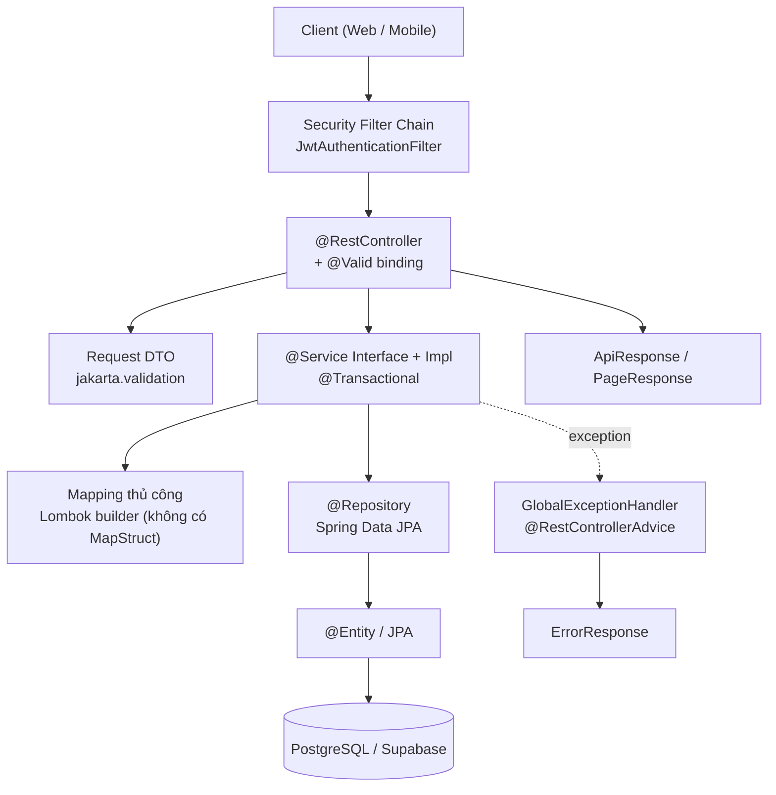

**Ghi nhận điểm đáng chú ý:** Không tồn tại lớp Mapper riêng. Mọi chuyển đổi Entity → DTO được viết tay bằng `XxxDto.builder()...` ngay trong Service impl (`ProductServiceImpl.toDetailDto()` dài ~83 dòng, `ProductServiceImpl.toSummaryDto()`).

## 3.3 Dependency giữa các module

Đọc từ `import` thực tế trong source:

| Module | Phụ thuộc vào | Bằng chứng |
|--------|---------------|-----------|
| `auth` | `user` (entity `User`, `Role`, `UserStatus`; repository `UserRepository`, `RoleRepository`), `security` (`JwtTokenProvider`, `CustomUserDetails`, `CustomUserDetailsService`), `common` | `AuthServiceImpl.java:12-17` |
| `user` | `security` (`CustomUserDetails`), `common` | `UserController.java:11` |
| `catalog` | `user`? ❌ Không import trực tiếp — nhưng dùng `Seller` (module `seller`) và `Category`/`Product` | `ProductServiceImpl.java:4-8` |
| `catalog` | `seller` (entity `Seller`) | `Product.java` import `com.example.B2C.modules.seller.entity.Seller` |
| `ai` | `common` | `AiChatServiceImpl.java` không import module nghiệp vụ nào — **AI không đọc dữ liệu catalog** |
| `security` | `user` (entity `User`, `UserStatus`) | `CustomUserDetails.java:3-4` |
| `order` | `user`, `seller` | `Order.java:3-4` (entity mồ côi) |
| `chat` | `user`, `seller` | `Conversation.java:3-4` (entity mồ côi) |
| `cart` | `user`, `catalog` | `CartItem` tham chiếu `Cart` + `ProductVariant` (entity mồ côi) |

**Quan sát quan trọng về coupling:**
- Module `catalog` **phụ thuộc vào entity của module `seller`** — nhưng `seller` lại là module mồ côi (không có repository/service/controller). Điều này có nghĩa: module catalog đang đọc entity mà không có module nào quản lý vòng đời.
- Module `auth` phụ thuộc trực tiếp vào `security` (cụ thể `JwtTokenProvider`) — tầng `auth` và tầng `security` đang lẫn vào nhau.

## 3.4 Cross-cutting concern (đã implement)

| Concern | Cách thực hiện | Bằng chứng |
|---------|---------------|-----------|
| **Dependency Injection** | Constructor injection qua Lombok `@RequiredArgsConstructor` + `final` field. Không dùng `@Autowired` field injection | `ProductServiceImpl.java:23-32` |
| **Global Exception Handling** | `@RestControllerAdvice` + 13 `@ExceptionHandler` | `GlobalExceptionHandler.java:22-117` |
| **Validation** | `jakarta.validation` annotation trên DTO + `@Valid` ở controller. **Không có** custom validator | Xem mục 16 |
| **Logging** | Lombok `@Slf4j`. `GlobalExceptionHandler` log ở mức `warn`/`error`. **Không có** logging framework cụ thể nào (không logback config, không MDC, không audit log) | `GlobalExceptionHandler.java:23` |
| **Transaction** | `@Transactional` cấp class (`readOnly = true`) + ghi đè cấp method cho method ghi. Xem mục 18 | `ProductServiceImpl.java:25,113` |
| **Authentication** | JWT HS256 + filter. Xem mục 8 | `JwtAuthenticationFilter.java` |
| **Authorization** | ⚠️ **Chỉ có xác thực, chưa có phân quyền thực sự.** `@EnableMethodSecurity` đã bật nhưng **không có bất kỳ `@PreAuthorize` nào trong toàn bộ source**. Mọi endpoint đăng nhập đều chỉ kiểm tra "đã xác thực", không kiểm tra role | Grep `@PreAuthorize` → 0 kết quả |
| **DTO Mapping** | Thủ công bằng Lombok builder trong Service. Dùng cả 2 chiền: DTO có static factory `from(Entity)` (`UserProfileDto.from`, `AddressDto.from`) và builder trong service | `UserServiceImpl`, `AddressServiceImpl`, `ProductServiceImpl` |
| **Pagination** | Spring Data `Pageable`/`Page` → wrap bằng `PageResponse.of()`. Xem mục 17 | `ProductServiceImpl.java:49-75` |
| **Sorting** | `Sort.by()` với map `sortBy → tên field` allowlist. Xem mục 17 | `ProductServiceImpl.java:34-40,225-231` |
| **Filtering** | JPQL với điều kiện nullable `(:x IS NULL OR ...)` trong `@Query`. Xem mục 13 | `ProductRepository.java:27-58` |
| **Specification API** | ❌ **KHÔNG dùng.** Không có `Specification<T>` nào trong source. Không dùng Criteria API | Grep `Specification<` → 0 kết quả |
| **MapStruct** | ❌ Không dùng | `build.gradle` không có dependency |
| **Soft delete** | ⚠️ Cột `deleted_at` tồn tại trên `users` và `product` nhưng **không có `@SQLDelete` hay `@Where`** ở bất kỳ entity nào. Query lọc thủ công bằng `deletedAt IS NULL` | `User.java`, `Product.java`; `ProductRepository.java:29,49` |

---

# 4. DATABASE

## 4.1 Nguồn schema

- **Flyway** là nguồn schema duy nhất. Profile default: `spring.jpa.hibernate.ddl-auto=validate` → Hibernate **chỉ kiểm tra** schema khớp entity, **không tạo bảng**.
- 3 file migration: `V1__init_schema.sql` (tạo 21 bảng + 22 index), `V2__seed_sample_data.sql` (dữ liệu demo), `V3__fix_seed_passwords.sql` (sửa hash seed).
- Cấu hình: `spring.flyway.locations=classpath:db/migration`, `baseline-on-migrate=true`, `validate-on-migrate=false`, `spring.sql.init.mode=never`.

## 4.2 Danh sách đầy đủ 21 bảng

| # | Table | Purpose | Primary Key | Important Columns | Relationships | Status |
|---|-------|---------|-------------|-------------------|---------------|--------|
| 1 | `role` | Vai trò người dùng | `id BIGSERIAL` | `code VARCHAR(30) UNIQUE NOT NULL`, `name VARCHAR(100) NOT NULL`, `description TEXT`, `created_at` | 1 role → N users | **ĐÃ DÙNG** |
| 2 | `users` | Tài khoản người dùng | `id BIGSERIAL` | `role_id BIGINT NOT NULL`, `email VARCHAR(255) UNIQUE NOT NULL`, `phone VARCHAR(20) UNIQUE`, `password_hash VARCHAR(255) NOT NULL`, `full_name VARCHAR(150) NOT NULL`, `avatar_url TEXT`, `gender VARCHAR(20)`, `date_of_birth DATE`, `status VARCHAR(20) DEFAULT 'ACTIVE'`, `email_verified_at`, `phone_verified_at`, `last_login_at`, `deleted_at` | N user → 1 role; 1 user → N address | **ĐÃ DÙNG** |
| 3 | `address` | Địa chỉ giao hàng | `id BIGSERIAL` | `user_id BIGINT NOT NULL`, `recipient_name VARCHAR(150) NOT NULL`, `phone VARCHAR(20) NOT NULL`, `province_code/district_code/ward_code VARCHAR(20)`, `street_detail VARCHAR(255) NOT NULL`, `full_address TEXT NOT NULL`, `type VARCHAR(20) DEFAULT 'HOME'`, `is_default BOOLEAN DEFAULT FALSE`, `latitude/longitude DECIMAL(10,7)` | N address → 1 user | **ĐÃ DÙNG** |
| 4 | `seller` | Hồ sơ ký nhà bán | `id BIGSERIAL` | `user_id BIGINT UNIQUE NOT NULL`, `shop_name VARCHAR(150) NOT NULL`, `slug VARCHAR(200) UNIQUE NOT NULL`, `logo_url/banner_url TEXT`, `description TEXT`, `business_type VARCHAR(20) NOT NULL`, `tax_code`, `id_card_number`, `pickup_address_id BIGINT`, `rating_avg DECIMAL(3,2) DEFAULT 0`, `rating_count/follower_count/total_product INTEGER DEFAULT 0`, `status VARCHAR(20) DEFAULT 'PENDING'`, `approved_at` | 1 seller → 1 user; N seller → 1 address (pickup) | ⚠️ **CHƯA DÙNG** (chỉ đọc qua `Product`) |
| 5 | `category` | Cây danh mục | `id BIGSERIAL` | `parent_id BIGINT` (self-ref), `name VARCHAR(150) NOT NULL`, `slug VARCHAR(200) UNIQUE NOT NULL`, `icon_url TEXT`, `level INTEGER DEFAULT 1`, `path VARCHAR(500)`, `sort_order INTEGER DEFAULT 0`, `is_active BOOLEAN DEFAULT TRUE` | 1 category → N category (parent) | **ĐÃ DÙNG** |
| 6 | `product` | Sản phẩm | `id BIGSERIAL` | `seller_id BIGINT NOT NULL`, `category_id BIGINT NOT NULL`, `name VARCHAR(255) NOT NULL`, `slug VARCHAR(300) UNIQUE NOT NULL`, `description TEXT`, `brand VARCHAR(150)`, `thumbnail_url TEXT`, `min_price/max_price DECIMAL(15,2) DEFAULT 0`, `status VARCHAR(20) DEFAULT 'DRAFT'`, `rating_avg DECIMAL(3,2) DEFAULT 0`, `rating_count/sold_count INTEGER DEFAULT 0`, `view_count BIGINT DEFAULT 0`, `weight_gram INTEGER`, `length/width/height_cm DECIMAL(10,2)`, `deleted_at` | N product → 1 seller, 1 category | **ĐÃ DÙNG** |
| 7 | `product_variant` | Biến thể (SKU) | `id BIGSERIAL` | `product_id BIGINT NOT NULL`, `sku VARCHAR(100) UNIQUE NOT NULL`, `variant_name VARCHAR(255) NOT NULL`, `price DECIMAL(15,2) NOT NULL`, `sale_price DECIMAL(15,2)`, `stock_quantity INTEGER DEFAULT 0`, `reserved_quantity INTEGER DEFAULT 0`, `sold_count INTEGER DEFAULT 0`, `image_url TEXT`, `weight_gram`, `barcode`, `is_active BOOLEAN DEFAULT TRUE` | N variant → 1 product | **ĐÃ DÙNG** (chỉ đọc) |
| 8 | `product_option` | Thuộc tính (vd: "Màu sắc") | `id BIGSERIAL` | `product_id BIGINT NOT NULL`, `name VARCHAR(100) NOT NULL`, `sort_order INTEGER DEFAULT 0`. UNIQUE `(product_id, name)` | N option → 1 product | **ĐÃ DÙNG** (chỉ đọc) |
| 9 | `product_option_value` | Giá trị thuộc tính (vd: "Đỏ") | `id BIGSERIAL` | `option_id BIGINT NOT NULL`, `value VARCHAR(100) NOT NULL`, `image_url TEXT`, `sort_order INTEGER DEFAULT 0`. UNIQUE `(option_id, value)` | N value → 1 option | **ĐÃ DÙNG** (chỉ đọc) |
| 10 | `product_image` | Ảnh sản phẩm | `id BIGSERIAL` | `product_id BIGINT NOT NULL`, `image_url TEXT NOT NULL`, `alt_text VARCHAR(255)`, `sort_order INTEGER DEFAULT 0`, `is_thumbnail BOOLEAN DEFAULT FALSE`. **Không có `created_at`/`updated_at`** | N image → 1 product | **ĐÃ DÙNG** (chỉ đọc) |
| 11 | `variant_option_value` | Bảng nối variant ↔ option value | `(variant_id, option_value_id)` composite | `variant_id BIGINT NOT NULL`, `option_value_id BIGINT NOT NULL` | N:N giữa variant và option value | ⚠️ **CHƯA DÙNG** (không repository, không query) |
| 12 | `cart` | Giỏ hàng | `id BIGSERIAL` | `user_id BIGINT UNIQUE NOT NULL` (1 giỏ / 1 user) | 1 cart → 1 user; 1 cart → N cart_item | ⚠️ **CHƯA DÙNG** |
| 13 | `cart_item` | Dòng giỏ hàng | `id BIGSERIAL` | `cart_id BIGINT NOT NULL`, `variant_id BIGINT NOT NULL`, `quantity INTEGER DEFAULT 1`, `price_snapshot DECIMAL(15,2) NOT NULL`, `is_selected BOOLEAN DEFAULT TRUE`, `added_at`. UNIQUE `(cart_id, variant_id)`, CHECK `quantity > 0` | N item → 1 cart, 1 variant | ⚠️ **CHƯA DÙNG** |
| 14 | `orders` | Đơn hàng | `id BIGSERIAL` | `order_code VARCHAR(50) UNIQUE NOT NULL`, `buyer_id BIGINT NOT NULL`, `seller_id BIGINT NOT NULL`, `receiver_name/phone/shipping_address` (snapshot), `subtotal/shipping_fee/discount_amount/platform_discount/total_amount DECIMAL(15,2)`, `payment_method VARCHAR(20)`, `payment_status VARCHAR(20) DEFAULT 'UNPAID'`, `status VARCHAR(20) DEFAULT 'PENDING'`, `note`, `cancel_reason`, `cancelled_by BIGINT`, 5 mốc thời gian (`confirmed_at`…`cancelled_at`) | N order → 1 user (buyer), 1 seller, 1 user (cancelled_by) | ⚠️ **CHƯA DÙNG** |
| 15 | `order_item` | Dòng đơn hàng | `id BIGSERIAL` | `order_id`, `variant_id`, `product_id`, `product_name/variant_name/image_url` (snapshot), `unit_price DECIMAL(15,2)`, `quantity INTEGER`, `discount DECIMAL(15,2) DEFAULT 0`, `total_price DECIMAL(15,2)`, `is_reviewed BOOLEAN DEFAULT FALSE`. **Không có audit fields** | N item → 1 order, 1 variant, 1 product | ⚠️ **CHƯA DÙNG** |
| 16 | `payment` | Giao dịch thanh toán | `id BIGSERIAL` | `order_id BIGINT NOT NULL`, `method VARCHAR(20) NOT NULL`, `provider VARCHAR(50)`, `transaction_id VARCHAR(255)`, `amount DECIMAL(15,2) NOT NULL`, `currency VARCHAR(10) DEFAULT 'VND'`, `status VARCHAR(20) DEFAULT 'PENDING'`, `paid_at`, `refunded_at`, `refund_amount`, `gateway_response JSONB` | N payment → 1 order | ⚠️ **CHƯA DÙNG** |
| 17 | `shipment` | Vận chuyển | `id BIGSERIAL` | `order_id BIGINT UNIQUE NOT NULL`, `carrier_code VARCHAR(30)`, `tracking_number VARCHAR(100)`, `service_type VARCHAR(20)`, `shipping_fee/cod_amount DECIMAL(15,2) DEFAULT 0`, `from_address/to_address TEXT`, `status VARCHAR(20) DEFAULT 'PICKING'`, `estimated_delivery_date DATE`, `picked_at`, `delivered_at`, `note` | 1 shipment → 1 order | ⚠️ **CHƯA DÙNG** |
| 18 | `promotion` | Khuyến mãi / coupon | `id BIGSERIAL` | `seller_id BIGINT` (null = toàn sàn), `code VARCHAR(50) UNIQUE NOT NULL`, `name VARCHAR(150) NOT NULL`, `discount_type VARCHAR(20) NOT NULL` (PERCENT/FIXED/FREESHIP), `discount_value DECIMAL(15,2) NOT NULL`, `max_discount_amount`, `min_order_value DEFAULT 0`, `quantity INTEGER NOT NULL`, `used_count INTEGER DEFAULT 0`, `limit_per_user INTEGER DEFAULT 1`, `apply_scope VARCHAR(20) DEFAULT 'ALL'`, `start_at`/`end_at TIMESTAMP NOT NULL`, `status VARCHAR(20) DEFAULT 'ACTIVE'` | N promotion → 1 seller | ⚠️ **CHƯA DÙNG** |
| 19 | `review` | Đánh giá sản phẩm | `id BIGSERIAL` | `order_item_id BIGINT UNIQUE NOT NULL` (1 review / 1 order item), `product_id`, `variant_id`, `user_id`, `seller_id`, `rating INTEGER` (CHECK 1-5), `comment TEXT`, `image_urls JSONB`, `video_url TEXT`, `is_anonymous BOOLEAN DEFAULT FALSE`, `seller_reply TEXT`, `replied_at`, `like_count INTEGER DEFAULT 0`, `status VARCHAR(20) DEFAULT 'VISIBLE'` | 1 review → 1 order_item, 1 product, 1 user, 1 seller | ⚠️ **CHƯA DÙNG** |
| 20 | `conversation` | Hội thoại buyer↔seller | `id BIGSERIAL` | `buyer_id BIGINT NOT NULL`, `seller_id BIGINT NOT NULL`, `last_message TEXT`, `last_message_at`, `buyer_unread_count/seller_unread_count INTEGER DEFAULT 0`, `created_at`. UNIQUE `(buyer_id, seller_id)`. **Không có `updated_at`** | 1 conversation → 1 user, 1 seller; 1 conversation → N message | ⚠️ **CHƯA DÙNG** |
| 21 | `message` | Tin nhắn | `id BIGSERIAL` | `conversation_id BIGINT NOT NULL`, `sender_id BIGINT NOT NULL`, `sender_type VARCHAR(20)`, `content TEXT`, `message_type VARCHAR(20) DEFAULT 'TEXT'`, `attachment_url TEXT`, `ref_product_id BIGINT`, `ref_order_id BIGINT`, `is_read BOOLEAN DEFAULT FALSE`, `read_at`, `created_at`. **Không có `updated_at`** | N message → 1 conversation, 1 user (sender), 1 product, 1 order | ⚠️ **CHƯA DÙNG** |

## 4.3 Đối chiếu Entity ↔ Migration (kết quả khớp 1:1)

| Bảng | Entity class | `@Table(name=...)` | Khớp? |
|------|--------------|--------------------|-------|
| `role` | `modules.user.entity.Role` | `role` | ✅ |
| `users` | `modules.user.entity.User` | `users` | ✅ |
| `address` | `modules.user.entity.Address` | `address` | ✅ |
| `seller` | `modules.seller.entity.Seller` | `seller` | ✅ |
| `category` | `modules.catalog.entity.Category` | `category` | ✅ |
| `product` | `modules.catalog.entity.Product` | `product` | ✅ |
| `product_variant` | `modules.catalog.entity.ProductVariant` | `product_variant` | ✅ |
| `product_option` | `modules.catalog.entity.ProductOption` | `product_option` | ✅ |
| `product_option_value` | `modules.catalog.entity.ProductOptionValue` | `product_option_value` | ✅ |
| `product_image` | `modules.catalog.entity.ProductImage` | `product_image` | ✅ |
| `variant_option_value` | `modules.catalog.entity.VariantOptionValue` + `VariantOptionValueId` | `variant_option_value` | ✅ (`@EmbeddedId` khớp composite PK) |
| `cart` | `modules.cart.entity.Cart` | `cart` | ✅ |
| `cart_item` | `modules.cart.entity.CartItem` | `cart_item` | ✅ |
| `orders` | `modules.order.entity.Order` | `orders` | ✅ |
| `order_item` | `modules.order.entity.OrderItem` | `order_item` | ✅ |
| `payment` | `modules.payment.entity.Payment` | `payment` | ✅ |
| `shipment` | `modules.shipment.entity.Shipment` | `shipment` | ✅ |
| `promotion` | `modules.promotion.entity.Promotion` | `promotion` | ✅ |
| `review` | `modules.review.entity.Review` | `review` | ✅ |
| `conversation` | `modules.chat.entity.Conversation` | `conversation` | ✅ |
| `message` | `modules.chat.entity.Message` | `message` | ✅ |

**Kết luận đối chiếu:** 21 bảng ↔ 21 entity, **không có bảng thừa và không có entity thừa**. Vì `ddl-auto=validate`, mọi sai lệch schema↔entity sẽ làm app fail lúc startup — hiện tại app chạy được nghĩa là chúng đang khớp.

**Lưu ý về enum:** Tất cả enum đều dùng `@Enumerated(EnumType.STRING)` → lưu dạng VARCHAR, khớp với `CHECK` constraint trong SQL. Giá trị constant trong enum Java khớp chính xác giá trị trong `CHECK` của migration (đã đối chiếu: `ProductStatus`, `UserStatus`, `Gender`, `AddressType`, `OrderStatus`, `PaymentMethod`, `PaymentStatus`, `SellerStatus`, `BusinessType`, `ShipmentStatus`, `ShipmentServiceType`, `ReviewStatus`, `PromotionStatus`, `DiscountType`, `PromotionApplyScope`, `MessageType`, `SenderType`).

## 4.4 Index đã khai báo (trong `V1__init_schema.sql`)

22 index được tạo: `idx_address_user`, `idx_seller_status`, `idx_category_parent`, `idx_product_seller`, `idx_product_category`, `idx_product_status`, `idx_variant_product`, `idx_cart_item_cart`, `idx_order_buyer`, `idx_order_seller`, `idx_order_status`, `idx_order_created_at`, `idx_order_item_order`, `idx_payment_order`, `idx_shipment_tracking`, `idx_promotion_seller`, `idx_review_product`, `idx_review_user`, `idx_conversation_buyer`, `idx_conversation_seller`, `idx_message_conversation`, `idx_message_created_at`.

⚠️ **Không có index full-text search** (`GIN`, `tsvector`, `pg_trgm`) — xem mục 13.

## 4.5 Database Relationship (ERD)

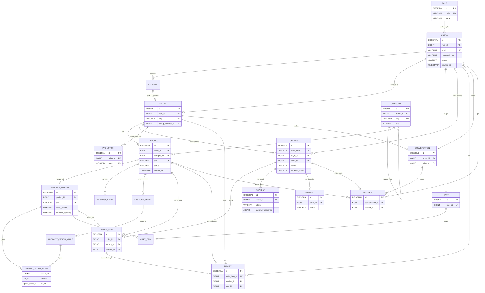

**Chú thích ERD:** 21 bảng, 35 quan hệ. Trên đó 15 quan hệ liên quan tới entity **chưa có nghiệp vụ** (cart, order, order_item, payment, shipment, promotion, review, conversation, message) — schema đã thiết kế sẵn nhưng chưa có code sử dụng.

## 4.6 Soft delete & Audit fields

| Cơ chế | Tình trạng |
|--------|-----------|
| Cột `deleted_at` | Có trên `users` và `product` |
| `@SQLDelete` / `@Where` | ❌ **KHÔNG có trên bất kỳ entity nào** |
| Lọc soft-delete trong query | Thủ công: `p.deletedAt IS NULL` trong `ProductRepository`; `findBySlugAndDeletedAtIsNull` |
| Hệ quả | Xoá user/product KHÔNG thực sự bị ẩn — chỉ có 1 số query chủ động lọc. Không có API nào set `deletedAt` |
| Audit `created_at`/`updated_at` | Có ở 15/21 bảng. Thiếu ở: `product_option`, `product_option_value`, `product_image`, `variant_option_value`, `order_item`, `message`. `conversation` chỉ có `created_at` |
| `@Version` (optimistic lock) | ❌ **KHÔNG có entity nào** |
| Pessimistic lock (`@Lock`, `FOR UPDATE`) | ❌ Không có |
| Auto-update `updated_at` | Tự động qua `BaseEntity.@PreUpdate` cho entity extends `BaseEntity` |

---

# 5. API INVENTORY

**Tổng: 22 endpoint trong 7 controller.** Được lấy từ grep tất cả `@RestController` + `@RequestMapping` + `@*Mapping` trong toàn bộ source.

| # | Method | Endpoint | Controller | Purpose | Auth Required | Status |
|---|--------|----------|------------|---------|---------------|--------|
| 1 | POST | `/api/v1/auth/register` | AuthController | Đăng ký tài khoản mới | No | **Implemented** |
| 2 | POST | `/api/v1/auth/login` | AuthController | Đăng nhập, trả JWT | No | **Implemented** |
| 3 | POST | `/api/v1/auth/refresh-token` | AuthController | Làm mới access + refresh token | No | **Partial** — xem mục 8.3 |
| 4 | GET | `/api/v1/products` | ProductController | Tìm kiếm + lọc + sắp xếp + phân trang sản phẩm | No | **Implemented** |
| 5 | GET | `/api/v1/products/featured` | ProductController | Sản phẩm nổi bật (sort sold desc) | No | **Implemented** |
| 6 | GET | `/api/v1/products/seller/{sellerId}` | ProductController | Sản phẩm của 1 shop | No | **Implemented** |
| 7 | GET | `/api/v1/products/{slug}` | ProductController | Chi tiết sản phẩm + variants + options + images | No | **Implemented** |
| 8 | GET | `/api/v1/categories` | CategoryController | Danh sách category phẳng (đang active) | No | **Implemented** |
| 9 | GET | `/api/v1/categories/roots` | CategoryController | Category cấp 1 | No | **Implemented** |
| 10 | GET | `/api/v1/categories/tree` | CategoryController | Cây category lồng nhau | No | **Implemented** |
| 11 | GET | `/api/v1/categories/{slug}` | CategoryController | Chi tiết 1 category + cây con | No | **Implemented** |
| 12 | GET | `/api/v1/users/me` | UserController | Hồ sơ người dùng hiện tại | **JWT** | **Implemented** |
| 13 | PUT | `/api/v1/users/me` | UserController | Cập nhật hồ sơ | **JWT** | **Implemented** |
| 14 | POST | `/api/v1/users/change-password` | UserController | Đổi mật khẩu | **JWT** | **Implemented** |
| 15 | GET | `/api/v1/users/addresses` | UserController | Danh sách địa chỉ của tôi | **JWT** | **Implemented** |
| 16 | POST | `/api/v1/users/addresses` | UserController | Tạo địa chỉ | **JWT** | **Implemented** |
| 17 | GET | `/api/v1/users/addresses/{addressId}` | UserController | Chi tiết 1 địa chỉ | **JWT** | **Implemented** |
| 18 | PUT | `/api/v1/users/addresses/{addressId}` | UserController | Sửa địa chỉ | **JWT** | **Implemented** |
| 19 | DELETE | `/api/v1/users/addresses/{addressId}` | UserController | Xoá địa chỉ | **JWT** | **Implemented** |
| 20 | PUT | `/api/v1/users/addresses/{addressId}/default` | UserController | Đặt địa chỉ mặc định | **JWT** | **Implemented** |
| 21 | POST | `/api/v1/ai/chat` | AiAssistantController | Chat với trợ lý AI | No | **Implemented (stateless)** |
| 22 | POST | `/api/v1/ai/generate-description` | AiContentGeneratorController | AI sinh mô tả sản phẩm | No | **Implemented** |
| — | GET | `/api/v1/__debug/bcrypt` | DebugController | Sinh BCrypt hash (endpoint debug) | No | ⚠️ **Cần xoá trước production** |

**Ghi chú về "Auth Required":** cột này phản ánh chính xác `SecurityConfig.java:40-46`. Cột "Role-based" là **Không** cho mọi endpoint — xem mục 3.4.

## 5.1 API CHƯA tồn tại (những gì thường được kỳ vọng nhưng không có trong source)

Đã kiểm tra toàn bộ controller — những API sau **không tồn tại**:
❌ Product CRUD (POST/PUT/DELETE product) ❌ Category CRUD ❌ Variant CRUD ❌ Seller API ❌ Cart API ❌ Order API ❌ Payment API ❌ Shipment API ❌ Promotion API ❌ Review API ❌ Chat API ❌ Notification API ❌ Upload ảnh ❌ Admin API ❌ Wishlist ❌ Tìm kiếm đơn giản (toàn hệ thống) ❌ Thống kê/dashboard ❌ Quản lý tồn kho.

---

# 6. CHI TIẾT TỪNG API

## 6.1 `POST /api/v1/auth/register`

**Purpose** — Đăng ký tài khoản mới và **tự động đăng nhập** (trả về cả access + refresh token).

**Request** — `RegisterRequest`

| Field | Type | Required | Validation | Ghi chú |
|-------|------|----------|-----------|---------|
| `email` | String | ✅ | `@NotBlank`, `@Email` | Unique, kiểm qua `existsByEmail` |
| `password` | String | ✅ | `@NotBlank`, `@Size(min=8, max=100)` | BCrypt encode trước khi lưu |
| `fullName` | String | ✅ | `@NotBlank`, `@Size(max=150)` | |
| `phone` | String | ❌ | *(không có validation)* | Nếu có, kiểm unique qua `existsByPhone` |
| `roleCode` | String | ❌ | *(không có validation)* | ⚠️ Default `"BUYER"`, `.toUpperCase()` — xem mục 23 HIGH-4 |

```json
{
  "email": "buyer@example.com",
  "password": "password123",
  "fullName": "Nguyen Van A",
  "phone": "0901234567",
  "roleCode": "BUYER"
}
```

**Response** — HTTP **201 CREATED**, `AuthResponse`

| Field | Type | Ghi chú |
|-------|------|---------|
| `accessToken` | String | JWT, hạn 24h |
| `refreshToken` | String | JWT, hạn 7 ngày |
| `tokenType` | String | Luôn là `"Bearer"` |
| `userId` | Long | |
| `email` | String | |
| `fullName` | String | |
| `role` | String | Code của role |

**Authentication** — Public (permitAll).

**Flow**
```
AuthController.register(@Valid @RequestBody RegisterRequest)
  → AuthServiceImpl.register()  [@Transactional]
    → UserRepository.existsByEmail(email)          [SELECT]
    → UserRepository.existsByPhone(phone)          [SELECT, chỉ khi phone != null]
    → RoleRepository.findByCode(code)               [SELECT]
       └─ nếu rỗng → RoleRepository.save(Role)     [INSERT]  ⚠️ tự tạo role
    → PasswordEncoder.encode(password)              [BCrypt]
    → UserRepository.save(user)                    [INSERT vào bảng users]
    → JwtTokenProvider.generateToken()              [ký HS256]
    → JwtTokenProvider.generateRefreshToken()
  → ApiResponse.created(AuthResponse)
```

**Related files** — `AuthController.java:22-26`, `AuthServiceImpl.java:37-83`, `RegisterRequest.java`, `AuthResponse.java`, `UserRepository.java`, `RoleRepository.java`

**Status** — **Implemented** (kèm lỗ hổng role tự tạo, xem mục 23)

---

## 6.2 `POST /api/v1/auth/login`

**Purpose** — Xác thực email/password, trả JWT.

**Request** — `LoginRequest`

| Field | Type | Required | Validation |
|-------|------|----------|-----------|
| `email` | String | ✅ | `@NotBlank`, `@Email` |
| `password` | String | ✅ | `@NotBlank` |

**Response** — HTTP **200 OK**, `AuthResponse` (cùng cấu trúc 6.1)

**Authentication** — Public.

**Flow**
```
AuthController.login(@Valid @RequestBody LoginRequest)
  → AuthServiceImpl.login()  [@Transactional(readOnly=true)]
    → AuthenticationManager.authenticate(UsernamePasswordAuthenticationToken)
       → DaoAuthenticationProvider
         → CustomUserDetailsService.loadUserByUsername(email)
           → UserRepository.findByEmailWithRole(email)
              JPQL: SELECT u FROM User u JOIN FETCH u.role WHERE u.email = :email
         → PasswordEncoder.matches(raw, hash)   → BadCredentialsException nếu sai
    → JwtTokenProvider.generateToken() + generateRefreshToken()
  → ApiResponse.success(AuthResponse)
```

⚠️ **Lưu ý:** `login()` **không** cập nhật `User.lastLoginAt` dù cột này tồn tại trong DB và entity.

**Related files** — `AuthController.java:28-32`, `AuthServiceImpl.java:85-110`, `CustomUserDetailsService.java`, `DaoAuthenticationProvider` (trong `SecurityConfig.java:72-76`)

**Status** — **Implemented**

---

## 6.3 `POST /api/v1/auth/refresh-token`

**Purpose** — Đổi refresh token lấy cặp token mới.

**Request** — `RefreshTokenRequest`

| Field | Type | Required | Validation |
|-------|------|----------|-----------|
| `refreshToken` | String | ✅ | `@NotBlank` |

**Response** — HTTP **200 OK**, `AuthResponse` (mới hoàn toàn, gồm cả refresh token mới)

**Authentication** — Public (không cần access token).

**Flow**
```
AuthController.refreshToken(@Valid @RequestBody RefreshTokenRequest)
  → AuthServiceImpl.refreshToken()  [@Transactional(readOnly=true)]
    → JwtTokenProvider.extractUsername(token)          [parse + verify signature]
    → CustomUserDetailsService.loadUserByUsername(email)
       → UserRepository.findByEmailWithRole(email)     [SELECT]
    → JwtTokenProvider.isTokenValid(token, userDetails)
       → so sánh subject + kiểm tra expiration
       → nếu sai → UnauthorizedException (401)
    → generateToken() + generateRefreshToken()          [cả 2 token mới]
  → ApiResponse.success(AuthResponse)
```

⚠️ **Hạn chế:** Token cũ **không bị thu hồi**. Không có bảng/token store nào lưu refresh token. Xem mục 8.3.

**Related files** — `AuthController.java:34-38`, `AuthServiceImpl.java:112-137`, `JwtTokenProvider.java`, `RefreshTokenRequest.java`

**Status** — **Partial** (hoạt động đúng chức năng, nhưng thiếu cơ chế thu hồi token cũ)

---

## 6.4 `GET /api/v1/products`

**Purpose** — Tìm kiếm danh sách sản phẩm ACTIVE, có lọc, sắp xếp, phân trang.

**Request** — Query parameters (không có request body)

| Param | Type | Required | Default | Ghi chú |
|-------|------|----------|---------|---------|
| `categoryId` | Long | ❌ | — | Lọc theo danh mục |
| `sellerId` | Long | ❌ | — | Lọc theo shop |
| `minPrice` | BigDecimal | ❌ | — | `p.minPrice >= minPrice` |
| `maxPrice` | BigDecimal | ❌ | — | `p.maxPrice <= maxPrice` |
| `q` | String | ❌ | — | Keyword — map sang `keyword`, `.trim()` |
| `sortBy` | String | ❌ | `created` | `price`\|`sold`\|`rating`\|`created`\|`name`. Giá trị khác → fallback `createdAt` |
| `sortDir` | String | ❌ | `desc` | Chỉ `"asc"` → ASC; mọi giá trị khác → DESC |
| `page` | int | ❌ | `0` | 0-based. Âm → 0 |
| `size` | int | ❌ | `20` | `<=0` → 20; `>100` → 100 |

**Response** — HTTP **200 OK**, `ApiResponse<PageResponse<ProductSummaryDto>>`

`ProductSummaryDto` (14 field):

| Field | Type |
|-------|------|
| `id` | Long |
| `slug` | String |
| `name` | String |
| `minPrice` | BigDecimal |
| `maxPrice` | BigDecimal |
| `thumbnailUrl` | String |
| `brand` | String |
| `ratingAvg` | BigDecimal |
| `ratingCount` | Integer |
| `soldCount` | Integer |
| `sellerId` | Long |
| `shopName` | String |
| `categoryId` | Long |
| `categoryName` | String |
| `createdAt` | LocalDateTime |

Lưu ý: DTO dùng `PageResponse` của Spring `Page` → có thêm `page`, `size`, `totalElements`, `totalPages`, `first`, `last`.

**Authentication** — Public.

**Flow**
```
ProductController.searchProducts(...)
  → ProductServiceImpl.searchProducts(ProductSearchRequest)  [@Transactional(readOnly=true)]
    → validatePriceRange()      → BadRequestException nếu minPrice > maxPrice (400)
    → buildPageable()           → map sortBy → tên field, clamp size
    → ProductRepository.searchProductsWithoutKeyword(...)   [SELECT, JPQL, Page]
       hoặc searchProductsWithKeyword(...)                  [SELECT, JPQL, Page]
  → PageResponse.of(page.map(this::toSummaryDto))
  → ApiResponse.success(result)
```

**Related files** — `ProductController.java:27-61`, `ProductServiceImpl.java:42-76`, `ProductRepository.java:27-58`, `ProductSearchRequest.java`, `ProductSummaryDto.java`

**Status** — **Implemented**

---

## 6.5 `GET /api/v1/products/featured`

**Purpose** — Sản phẩm nổi bật, sort `soldCount DESC` (trong JPQL có thêm `ratingAvg DESC`).

**Request** — `page` (int, default 0), `size` (int, default 20, clamp 1–100)

**Response** — HTTP 200, `ApiResponse<PageResponse<ProductSummaryDto>>`

**Authentication** — Public.

**Flow**
```
ProductController.getFeaturedProducts(page, size)
  → ProductServiceImpl.getFeaturedProducts()  [@Transactional(readOnly=true)]
    → PageRequest.of(max(page,0), clampSize(size), Sort.by(DESC, "soldCount"))
    → ProductRepository.findFeatured(pageable)
       JPQL: WHERE p.deletedAt IS NULL AND p.status = ProductStatus.ACTIVE
             ORDER BY p.soldCount DESC, p.ratingAvg DESC
  → ApiResponse.success(PageResponse.of(...))
```

**Related files** — `ProductController.java:63-71`, `ProductServiceImpl.java:90-99`, `ProductRepository.java:70-75`

**Status** — **Implemented**

---

## 6.6 `GET /api/v1/products/seller/{sellerId}`

**Purpose** — Danh sách sản phẩm ACTIVE của một shop.

**Request** — `sellerId` (Long, path variable), `page` (int, default 0), `size` (int, default 20)

**Response** — HTTP 200, `ApiResponse<PageResponse<ProductSummaryDto>>`

**Authentication** — Public.

⚠️ **Ghi nhận:** Không kiểm tra seller có tồn tại hay không. `sellerId` không hợp lệ → trả về page rỗng, **không phải 404**.

**Flow**
```
ProductController.getProductsBySeller(sellerId, page, size)
  → ProductServiceImpl.getProductsBySeller()  [@Transactional(readOnly=true)]
    → PageRequest.of(..., Sort.by(DESC, "createdAt"))
    → ProductRepository.findActiveBySeller(sellerId, pageable)
       JPQL: WHERE p.deletedAt IS NULL AND p.status = ACTIVE AND p.seller.id = :sellerId
  → ApiResponse.success(...)
```

**Related files** — `ProductController.java:73-82`, `ProductServiceImpl.java:101-110`, `ProductRepository.java:78-84`

**Status** — **Implemented**

---

## 6.7 `GET /api/v1/products/{slug}`

**Purpose** — Chi tiết sản phẩm đầy đủ: ảnh, biến thể, thuộc tính + giá trị. Đồng thời **tăng view count**.

**Request** — `slug` (String, path variable)

**Response** — HTTP 200, `ApiResponse<ProductDetailDto>`

`ProductDetailDto` (29 field):

| Field | Type | Nguồn |
|-------|------|-------|
| `id` | Long | `product.id` |
| `slug` | String | `product.slug` |
| `name` | String | `product.name` |
| `description` | String | `product.description` |
| `brand` | String | `product.brand` |
| `sellerId` | Long | `product.seller.id` |
| `shopName` | String | `product.seller.shopName` |
| `shopSlug` | String | `product.seller.slug` |
| `sellerRatingAvg` | BigDecimal | `product.seller.ratingAvg` |
| `categoryId` | Long | `product.category.id` |
| `categoryName` | String | `product.category.name` |
| `categorySlug` | String | `product.category.slug` |
| `minPrice` / `maxPrice` | BigDecimal | `product` |
| `thumbnailUrl` | String | `product.thumbnailUrl` |
| `images` | `List<ProductImageDto>` | **4 query riêng** ↓ |
| `variants` | `List<ProductVariantDto>` | |
| `options` | `List<ProductOptionDto>` (chứa `values`) | |
| `ratingAvg` | BigDecimal | `product.ratingAvg` |
| `ratingCount` | Integer | `product.ratingCount` |
| `soldCount` | Integer | `product.soldCount` |
| `viewCount` | Long | `product.viewCount` |
| `weightGram` | Integer | `product.weightGram` |
| `lengthCm`/`widthCm`/`heightCm` | BigDecimal | `product` |
| `status` | String | `product.status.name()` |
| `createdAt` / `updatedAt` | LocalDateTime | `product` |

**Lưu ý quan trọng:** `viewCount` trả về là giá trị **trước** khi tăng, vì `incrementViewCount()` được gọi **sau** khi DTO đã map.

**Authentication** — Public.

**Flow**
```
ProductController.getProductDetail(slug)
  → ProductServiceImpl.getProductDetail(slug)  [@Transactional(readOnly=true)]
    → ProductRepository.findBySlugAndDeletedAtIsNull(slug)   [SELECT]
       └─ rỗng → ResourceNotFoundException (404)
    → nếu product.status != ACTIVE → ResourceNotFoundException (404)
    → ProductImageRepository.findByProductIdOrderBySortOrder(id)      [SELECT]
    → ProductVariantRepository.findAllByProductId(id)                  [SELECT]
    → ProductOptionRepository.findByProductIdOrderBySortOrder(id)     [SELECT]
    → ProductOptionValueRepository.findByOptionIds(list)              [SELECT, chỉ khi có options]
    → map sang ProductDetailDto
  → ProductServiceImpl.incrementViewCount(id)  [@Transactional]
    → ProductRepository.findById(id) → setViewCount(+1) → save()    [SELECT + UPDATE]
```

Tổng cộng: **5-6 câu SELECT + 1 UPDATE cho mỗi lần xem chi tiết sản phẩm**.

**Related files** — `ProductController.java:84-97`, `ProductServiceImpl.java:78-88` và `112-119` và `121-203`, `ProductRepository.java`, `ProductVariantRepository.java`, `ProductImageRepository.java`, `ProductOptionRepository.java`, `ProductOptionValueRepository.java`

**Status** — **Implemented** (⚠️ vấn đề N+1 và mất update, xem mục 23)

---

## 6.8 `GET /api/v1/categories`

**Purpose** — Danh sách tất cả category đang active, dạng phẳng.

**Request** — Không có param.

**Response** — HTTP 200, `ApiResponse<List<CategoryDto>>`

`CategoryDto` (8 field): `id` (Long), `name` (String), `slug` (String), `iconUrl` (String), `level` (Integer), `path` (String), `parentId` (Long), `children` (`List<CategoryDto>`)

⚠️ Với endpoint này `children` **luôn null** vì dùng `toDto()` (không đệ quy).

**Authentication** — Public.

**Flow**
```
CategoryController.getAllCategories()
  → CategoryServiceImpl.getAllActiveCategories()  [@Transactional(readOnly=true)]
    → CategoryRepository.findAllActive()   [JPQL, không ORDER BY]
    → map CategoryServiceImpl.toDto()
```

**Related files** — `CategoryController.java:22-26`, `CategoryServiceImpl.java:21-26`, `CategoryRepository.java`

**Status** — **Implemented**

---

## 6.9 `GET /api/v1/categories/roots`

**Purpose** — Category cấp 1 (không có parent), đang active.

**Response** — HTTP 200, `ApiResponse<List<CategoryDto>>`, `children` luôn null.

**Authentication** — Public.

**Flow**
```
CategoryController.getRootCategories()
  → CategoryServiceImpl.getRootCategories()
    → CategoryRepository.findByParentIsNullAndIsActiveTrueOrderBySortOrderAsc()
    → map toDto()
```

**Related files** — `CategoryController.java:28-32`, `CategoryServiceImpl.java:28-33`

**Status** — **Implemented**

---

## 6.10 `GET /api/v1/categories/tree`

**Purpose** — Cây category đầy đủ, lồng nhau qua `children`.

**Response** — HTTP 200, `ApiResponse<List<CategoryDto>>`, mỗi node có `children` đã đệ quy.

**Authentication** — Public.

**Flow**
```
CategoryController.getCategoryTree()
  → CategoryServiceImpl.getCategoryTree()
    → CategoryRepository.findByParentIsNullAndIsActiveTrueOrderBySortOrderAsc()   [SELECT 1]
    → đệ quy toDtoWithChildren():
        → findByParentIdAndIsActiveTrueOrderBySortOrderAsc(id)   [SELECT N]
        → đệ quy tiếp...
```

⚠️ **N+1 query**: 1 câu SELECT cho mỗi node trong cây. Xem mục 23.

**Related files** — `CategoryController.java:34-38`, `CategoryServiceImpl.java:35-41` và `62-71`

**Status** — **Implemented** (⚠️ hiệu năng kém với cây lớn)

---

## 6.11 `GET /api/v1/categories/{slug}`

**Purpose** — Chi tiết 1 category kèm cây con đệ quy.

**Request** — `slug` (String, path)

**Response** — HTTP 200, `ApiResponse<CategoryDto>`. Không tồn tại → **404**.

**Authentication** — Public.

⚠️ **Không lọc `isActive`**: `CategoryRepository.findBySlug(slug)` không kiểm tra active. Category đã ẩn vẫn trả về. Nhưng các node **con** thì được lọc `isActive` qua `findByParentIdAndIsActiveTrue...`.

**Flow**
```
CategoryController.getCategoryBySlug(slug)
  → CategoryServiceImpl.getCategoryBySlug()
    → CategoryRepository.findBySlug(slug)   → Optional
       └─ rỗng → ResourceNotFoundException (404)
    → toDtoWithChildren()  [đệ quy, N+1]
```

**Related files** — `CategoryController.java:40-44`, `CategoryServiceImpl.java:43-48`

**Status** — **Implemented**

---

## 6.12 `GET /api/v1/users/me`

**Purpose** — Lấy hồ sơ người dùng hiện tại (lấy từ JWT).

**Response** — HTTP 200, `ApiResponse<UserProfileDto>`

`UserProfileDto` (14 field): `id`, `email`, `phone`, `fullName`, `avatarUrl`, `gender` (Gender), `dateOfBirth` (LocalDate), `role` (String), `status` (UserStatus), `emailVerifiedAt`, `phoneVerifiedAt`, `lastLoginAt`, `createdAt`, `updatedAt`

⚠️ **KHÔNG có `passwordHash`** trong DTO — an toàn.

**Authentication** — **JWT bắt buộc**.

**Flow**
```
SecurityConfig: anyRequest().authenticated()
  → JwtAuthenticationFilter đọc Bearer token → SecurityContext
  → UserController.getMyProfile()
    → currentUserId()   đọc SecurityContextHolder → CustomUserDetails.getUser().getId()
    → UserServiceImpl.getCurrentUserProfile(userId)
      → UserRepository.findById(userId)
         └─ rỗng → ResourceNotFoundException (404)
      → UserProfileDto.from(user)
```

**Related files** — `UserController.java:37-46` và `114-120`, `UserServiceImpl.java`, `UserProfileDto.java`

**Status** — **Implemented**

---

## 6.13 `PUT /api/v1/users/me`

**Purpose** — Cập nhật hồ sơ (partial update: chỉ set field không null).

**Request** — `UpdateProfileRequest`

| Field | Type | Required | Validation |
|-------|------|----------|-----------|
| `fullName` | String | ❌ | `@Size(min=1, max=150)` |
| `phone` | String | ❌ | `@Size(max=20)` — kiểm unique, `ConflictException` nếu trùng |
| `avatarUrl` | String | ❌ | `@Size(max=500)` — ⚠️ không kiểm tra định dạng URL |
| `gender` | Gender | ❌ | Enum: `MALE`\|`FEMALE`\|`OTHER` |
| `dateOfBirth` | LocalDate | ❌ | `@Past` |

**Response** — HTTP 200, `ApiResponse<UserProfileDto>`, `message = "Profile updated"`

**Authentication** — **JWT bắt buộc**.

⚠️ **Không cho sửa `email`** (không có field trong DTO). Không cho sửa `role` hay `status`.

**Flow**
```
UserController.updateMyProfile(@Valid @RequestBody UpdateProfileRequest)
  → currentUserId()
  → UserServiceImpl.updateProfile(userId, request)  [@Transactional]
    → UserRepository.findById(userId)
    → if fullName != null → set
    → if phone != null → existsByPhone(phone) → ConflictException nếu trùng → set
    → if avatarUrl != null → set
    → if gender != null → set
    → if dateOfBirth != null → set
    → UserRepository.save(user)
  → ApiResponse.success("Profile updated", dto)
```

**Related files** — `UserController.java:48-53`, `UserServiceImpl.java`, `UpdateProfileRequest.java`

**Status** — **Implemented**

---

## 6.14 `POST /api/v1/users/change-password`

**Purpose** — Đổi mật khẩu (có xác minh mật khẩu cũ).

**Request** — `ChangePasswordRequest`

| Field | Type | Required | Validation |
|-------|------|----------|-----------|
| `currentPassword` | String | ✅ | `@NotBlank` |
| `newPassword` | String | ✅ | `@NotBlank`, `@Size(min=8, max=100)` |
| `confirmPassword` | String | ✅ | `@NotBlank` |

**Response** — HTTP 200, `ApiResponse<Void>`, `message = "Password changed successfully"`, `data = null`

**Authentication** — **JWT bắt buộc**.

**Validation trong service** (thứ tự kiểm tra):
1. `newPassword != confirmPassword` → `BadRequestException` (400)
2. `currentPassword == newPassword` → `BadRequestException` (400)
3. `passwordEncoder.matches(currentPassword, hash)` sai → `BadRequestException` (400)
4. Encode + save

⚠️ **Không thu hồi các JWT đang có.** Sau khi đổi mật khẩu, mọi access/refresh token cũ vẫn dùng được đến khi hết hạn.

**Related files** — `UserController.java:55-65`, `UserServiceImpl.java`, `ChangePasswordRequest.java`

**Status** — **Implemented**

---

## 6.15 `GET /api/v1/users/addresses`

**Purpose** — Danh sách địa chỉ của người dùng hiện tại, mặc định sắp trước.

**Response** — HTTP 200, `ApiResponse<List<AddressDto>>`

`AddressDto` (14 field): `id`, `userId`, `recipientName`, `phone`, `provinceCode`, `districtCode`, `wardCode`, `streetDetail`, `fullAddress`, `type` (AddressType), `isDefault` (Boolean), `latitude` (BigDecimal), `longitude` (BigDecimal), `createdAt`, `updatedAt`

**Authentication** — **JWT bắt buộc**.

⚠️ **N+1**: `AddressDto.from()` đọc `address.getUser().getId()` với `User` là LAZY → 1 query mỗi address. Xem mục 23.

**Flow**
```
UserController.getMyAddresses()
  → currentUserId()
  → AddressServiceImpl.getMyAddresses(userId)
    → AddressRepository.findByUserIdOrderByIsDefaultDescUpdatedAtDesc(userId)  [SELECT]
    → map AddressDto.from(address)  ⚠️ N+1 do lazy load User
```

**Related files** — `UserController.java:67-72`, `AddressServiceImpl.java`, `AddressRepository.java`, `AddressDto.java`

**Status** — **Implemented** (⚠️ N+1)

---

## 6.16 `POST /api/v1/users/addresses`

**Purpose** — Tạo địa chỉ mới. Địa chỉ đầu tiên tự động thành mặc định.

**Request** — `AddressRequest`

| Field | Type | Required | Validation | Default |
|-------|------|----------|-----------|---------|
| `recipientName` | String | ✅ | `@NotBlank`, `@Size(max=150)` | — |
| `phone` | String | ✅ | `@NotBlank`, `@Size(max=20)` | — |
| `provinceCode` | String | ❌ | `@Size(max=20)` | null |
| `districtCode` | String | ❌ | `@Size(max=20)` | null |
| `wardCode` | String | ❌ | `@Size(max=20)` | null |
| `streetDetail` | String | ✅ | `@NotBlank` | — |
| `fullAddress` | String | ✅ | `@NotBlank` | — |
| `type` | AddressType | ❌ | Enum `HOME`\|`OFFICE` | `HOME` |
| `isDefault` | Boolean | ❌ | — | `false` |
| `latitude` | BigDecimal | ❌ | — | null |
| `longitude` | BigDecimal | ❌ | — | null |

**Response** — HTTP **201 CREATED**, `ApiResponse<AddressDto>`, `message = "Created"`

**Authentication** — **JWT bắt buộc**.

**Flow**
```
UserController.createAddress(@Valid @RequestBody AddressRequest)
  → currentUserId()
  → AddressServiceImpl.createAddress(userId, request)  [@Transactional]
    → UserRepository.findById(userId)
    → shouldBeDefault = isDefault==true || AddressRepository.countByUserId(userId)==0  [SELECT COUNT]
    → nếu shouldBeDefault → AddressRepository.clearAllDefaults(userId)
         JPQL UPDATE: UPDATE Address a SET a.isDefault = false WHERE a.user.id = :userId
    → AddressRepository.save(address)   [INSERT]
  → ApiResponse.created(dto)
```

**Related files** — `UserController.java:74-80`, `AddressServiceImpl.java`, `AddressRequest.java`, `AddressRepository.java`

**Status** — **Implemented**

---

## 6.17 `GET /api/v1/users/addresses/{addressId}`

**Purpose** — Chi tiết 1 địa chỉ **của chính người gọi**.

**Request** — `addressId` (Long, path)

**Response** — HTTP 200, `ApiResponse<AddressDto>`. Không thuộc sở hữu hoặc không tồn tại → **404**.

**Authentication** — **JWT bắt buộc**.

**Flow**
```
UserController.getAddress(addressId)
  → currentUserId()
  → AddressRepository.findByIdAndUserId(addressId, userId)   [SELECT, lọc theo owner]
     └─ rỗng → ResourceNotFoundException (404)
  → AddressDto.from(address)
```

✅ **Ownership enforced tại tầng query** — không bị IDOR.

**Related files** — `UserController.java:82-88`, `AddressRepository.java`, `AddressServiceImpl.java`

**Status** — **Implemented**

---

## 6.18 `PUT /api/v1/users/addresses/{addressId}`

**Purpose** — Cập nhật địa chỉ (ghi đè toàn bộ field, kể cả field không gửi → null).

**Request** — `AddressRequest` (giống 6.16) + `addressId` path

**Response** — HTTP 200, `ApiResponse<AddressDto>`, `message = "Address updated"`

**Authentication** — **JWT bắt buộc**.

⚠️ **Khác biệt quan trọng với `PUT /users/me`**: `updateProfile` chỉ set field khác null, còn `updateAddress` **set tất cả field vô điều kiện**. Gửi body thiếu `provinceCode` → DB bị ghi `NULL`, mất dữ liệu cũ.

**Flow**
```
UserController.updateAddress(addressId, @Valid @RequestBody AddressRequest)
  → currentUserId()
  → AddressServiceImpl.updateAddress(userId, addressId, request)  [@Transactional]
    → AddressRepository.findByIdAndUserId(addressId, userId)  → 404 nếu rỗng
    → kiểm tra owner (dead code, thừa)
    → set TẤT CẢ field không điều kiện
    → nếu isDefault==true và chưa là default:
        → clearDefaultExcept(userId, addressId)   [JPQL bulk UPDATE]
    → AddressRepository.save(address)
  → ApiResponse.success("Address updated", dto)
```

**Related files** — `UserController.java:90-97`, `AddressServiceImpl.java`, `AddressRepository.java`

**Status** — **Implemented** (⚠️ semantics ghi đè toàn bộ)

---

## 6.19 `DELETE /api/v1/users/addresses/{addressId}`

**Purpose** — Xoá địa chỉ. Nếu xoá địa chỉ mặc định → tự động đặt địa chỉ còn lại mới nhất làm mặc định.

**Response** — HTTP 200, `ApiResponse<Void>`, `message = "Address deleted"`, `data = null`

**Authentication** — **JWT bắt buộc**.

**Flow**
```
UserController.deleteAddress(addressId)
  → currentUserId()
  → AddressServiceImpl.deleteAddress(userId, addressId)  [@Transactional]
    → AddressRepository.findByIdAndUserId(addressId, userId)  → 404 nếu rỗng
    → ghi nhớ wasDefault = address.getIsDefault()
    → AddressRepository.delete(address)
    → AddressRepository.flush()
    → nếu wasDefault:
        → AddressRepository.findByUserIdOrderByIsDefaultDescUpdatedAtDesc(userId)
        → nếu còn → set isDefault=true, save()
```

**Related files** — `UserController.java:99-105`, `AddressServiceImpl.java`, `AddressRepository.java`

**Status** — **Implemented** (đây là API DELETE duy nhất trong toàn hệ thống)

---

## 6.20 `PUT /api/v1/users/addresses/{addressId}/default`

**Purpose** — Đặt 1 địa chỉ làm mặc định (bỏ mặc định của các địa chỉ khác).

**Response** — HTTP 200, `ApiResponse<AddressDto>`, `message = "Default address updated"`

**Authentication** — **JWT bắt buộc**.

**Flow**
```
UserController.setDefaultAddress(addressId)
  → currentUserId()
  → AddressServiceImpl.setDefaultAddress(userId, addressId)  [@Transactional]
    → AddressRepository.findByIdAndUserId(addressId, userId)  → 404 nếu rỗng
    → nếu đã là default → return sớm (no-op)
    → AddressRepository.clearAllDefaults(userId)   [JPQL bulk UPDATE]
    → address.setIsDefault(true) → save()
  → ApiResponse.success("Default address updated", dto)
```

**Related files** — `UserController.java:107-112`, `AddressServiceImpl.java`, `AddressRepository.java`

**Status** — **Implemented**

---

## 6.21 `POST /api/v1/ai/chat`

**Purpose** — Chat với trợ lý AI mua sắm. **Hoàn toàn stateless**, không nhớ lịch sử.

**Request** — `AiChatRequest`

| Field | Type | Required | Validation |
|-------|------|----------|-----------|
| `message` | String | ❌ | ⚠️ **KHÔNG có validation** (không `@NotBlank`) |
| `conversationId` | String | ❌ | Nếu null → server tự sinh `UUID.randomUUID()` |

**Response** — HTTP 200, `AiChatResponse`

| Field | Type | Ghi chú |
|-------|------|---------|
| `reply` | String | Nội dung trả lời |
| `conversationId` | String | UUID — **không được lưu ở đâu cả**, chỉ trả về cho client tự quản lý |

**Authentication** — **Public** (`/api/v1/ai/**` permitAll).

⚠️ **Không rate limit** — endpoint công khai gọi được OpenAI, rủi ro chi phí.

**Flow**
```
AiAssistantController.chatWithAssistant(@RequestBody AiChatRequest)
  → AiChatServiceImpl.chatWithAssistant()   [KHÔNG có @Transactional]
    → conversationId = request.conversationId ?: UUID.randomUUID()
    → hasApiKey()?
       ├─ KHÔNG (rỗng) → MockAiResponder.chatReply(message)     [trả về text mô phỏng]
       └─ CÓ:
           → ChatClient lấy từ ObjectProvider, fallback = chatClientBuilder.build()
           → systemPrompt (hardcode):
             "Ban la tro ly tu van mua sam thong minh cua san thuong mai dien tu B2C. ..."
           → .prompt().system(...).user(message).call().content()
  → AiChatResponse
```

**Related files** — `AiAssistantController.java:17-...`, `AiChatServiceImpl.java`, `AiChatRequest.java`, `AiChatResponse.java`, `MockAiResponder.java`, `SpringAiConfig.java`

**Status** — **Implemented (stateless)** — chưa có lưu hội thoại, chưa RAG, chưa đọc dữ liệu sản phẩm

---

## 6.22 `POST /api/v1/ai/generate-description`

**Purpose** — AI tự động viết mô tả sản phẩm chuẩn SEO.

**Request** — `ProductDescriptionGenRequest`

| Field | Type | Required | Validation |
|-------|------|----------|-----------|
| `productName` | String | ❌ | ⚠️ Không validation |
| `categoryName` | String | ❌ | |
| `brand` | String | ❌ | |
| `keyFeatures` | `List<String>` | ❌ | |
| `targetAudience` | String | ❌ | |
| `tone` | String | ❌ | |

**Response** — HTTP 200, **`Map.of("description", String)`** — ⚠️ trả về JSON thô, **KHÔNG bọc trong `ApiResponse`**:

```json
{ "description": "..." }
```

Đây là **ngoại lệ duy nhất** về response envelope trong toàn hệ thống.

**Authentication** — **Public**.

**Flow**
```
AiContentGeneratorController.generateProductDescription(@RequestBody ProductDescriptionGenRequest)
  → AiContentGeneratorServiceImpl.generateProductDescription()
    → hasApiKey()?
       ├─ KHÔNG → MockAiResponder.productDescription(...)   [template mô phỏng]
       └─ CÓ:
           → systemPrompt (hardcode): "Ban la chuyen gia viet bai ban hang (Copywriter E-commerce) chuan SEO. ..."
           → ChatClient .prompt().system(...).user(prompt dựng từ request).call().content()
  → Map.of("description", description)
```

**Related files** — `AiContentGeneratorController.java:18-...`, `AiContentGeneratorServiceImpl.java`, `ProductDescriptionGenRequest.java`, `MockAiResponder.java`

**Status** — **Implemented**

---

## 6.23 `GET /api/v1/__debug/bcrypt` ⚠️

**Purpose** — Endpoint debug sinh BCrypt hash từ plaintext.

**Request** — `password` (String, query param, default `"password123"`)

**Response** — HTTP 200, `Map<String, String>` — **không bọc `ApiResponse`**:

```json
{ "password": "...", "hash": "$2a$10$...", "verify": "true" }
```

**Authentication** — **Public** (`/api/v1/__debug/**` permitAll).

**Status** — ⚠️ **Cần xoá / vô hiệu hoá trước khi deploy production.** Xem mục 23 HIGH-1.

---

# 7. REQUEST / RESPONSE STANDARD

## 7.1 Có chuẩn response chung không?

**CÓ** — nhưng **không hoàn toàn thống nhất**.

## 7.2 Response thành công — `ApiResponse<T>`

Định nghĩa tại `common/response/ApiResponse.java`. 4 field:

| Field | Type | Luôn có? | Ghi chú |
|-------|------|----------|---------|
| `code` | int | ✅ | Hardcode `200` hoặc `201` qua factory |
| `message` | String | ✅ | `"Success"` / `"Created"` / message tuỳ biến |
| `data` | T | ✅* | Payload — có thể `null` |
| `timestamp` | LocalDateTime | ✅ | `LocalDateTime.now()` lúc gọi factory |

```json
{
  "code": 200,
  "message": "Success",
  "data": { },
  "timestamp": "2026-09-28T23:30:00.123456"
}
```

Các factory có sẵn: `success(data)`, `success(message, data)`, `created(data)`, `error(code, message)`.

⚠️ **`code` trong body KHÔNG phải HTTP status thực tế.** Ví dụ `ApiResponse.success(...)` luôn ghi `code: 200` dù response là 200. Nhưng nếu một controller trả `ApiResponse.created(...)` với HTTP status khác 201 thì `code` vẫn là 201 — **tiền tố bất biến theo factory, không tự suy ra từ HTTP status**.

## 7.3 Response lỗi — `ErrorResponse`

Định nghĩa tại `common/response/ErrorResponse.java`. Có `@JsonInclude(NON_NULL)`.

| Field | Type | Luôn có? | Ghi chú |
|-------|------|----------|---------|
| `code` | int | ✅ | **Trùng với HTTP status** (`buildError` dùng `status.value()`) |
| `message` | String | ✅ | |
| `errors` | `List<FieldError>` | ❌ | Chỉ có khi validation lỗi |
| `timestamp` | LocalDateTime | ✅ | |
| `path` | String | ✅ | `request.getRequestURI()` |

`FieldError`: `{ "field": String, "message": String }`

**Ví dụ thực tế — lỗi 404:**
```json
{
  "code": 404,
  "message": "Product not found with slug: abc",
  "timestamp": "2026-09-28T23:30:00.123456",
  "path": "/api/v1/products/abc"
}
```

**Ví dụ thực tế — lỗi validation 400:**
```json
{
  "code": 400,
  "message": "Validation failed",
  "errors": [
    { "field": "email", "message": "must be a well-formed email address" },
    { "field": "password", "message": "size must be between 8 and 100" }
  ],
  "timestamp": "2026-09-28T23:30:00.123456",
  "path": "/api/v1/auth/register"
}
```

⚠️ **Lưu ý cho Frontend:** `ApiResponse` và `ErrorResponse` **không cùng shape**. Success dùng `data`, error dùng `errors` + `path`. Không có field `success` boolean.

## 7.4 Pagination — `PageResponse<T>`

Định nghĩa tại `common/response/PageResponse.java`, factory `of(Page<T>)`:

| Field | Type |
|-------|------|
| `content` | `List<T>` |
| `page` | int (0-based) |
| `size` | int |
| `totalElements` | long |
| `totalPages` | int |
| `first` | boolean |
| `last` | boolean |

**Lưu ý:** `PageResponse` nằm **bên trong** `ApiResponse.data`:
```json
{
  "code": 200,
  "message": "Success",
  "data": {
    "content": [ { }, { } ],
    "page": 0,
    "size": 20,
    "totalElements": 42,
    "totalPages": 3,
    "first": true,
    "last": false
  },
  "timestamp": "..."
}
```

## 7.5 HTTP status conventions

| Tình huống | HTTP status | Nguồn |
|-----------|-----------|-------|
| Thành công đọc | 200 | `ResponseEntity.ok(...)` |
| Tạo mới | 201 | `ResponseEntity.status(HttpStatus.CREATED)` (chỉ `POST /users/addresses` và `POST /auth/register`) |
| Lỗi nghiệp vụ | 400/401/403/404/409 | `GlobalExceptionHandler` |
| Lỗi không lường trước | 500 | `Exception` handler |

⚠️ **Không nhất quán:** `DELETE /users/addresses/{id}` trả **200** chứ không phải 204. `POST /users/change-password` trả 200 chứ không phải 201/204.

⚠️ **Hai endpoint trả về JSON thô, không bọc envelope**: `POST /api/v1/ai/generate-description` và `GET /api/v1/__debug/bcrypt`.

## 7.6 Error code

❌ **Không có hệ thống error code dạng chuỗi** (kiểu `"USER_NOT_FOUND"`). Chỉ có HTTP status dạng số.
`ResourceNotFoundException` có constructor `(String resource, String identifier)` sinh message kiểu `"Product not found with slug: abc"`.

## 7.7 Exception → HTTP status mapping (từ `GlobalExceptionHandler.java`)

| Exception | HTTP | Message trả về |
|-----------|------|----------------|
| `ResourceNotFoundException` | 404 | `ex.getMessage()` |
| `BadRequestException` | 400 | `ex.getMessage()` |
| `MethodArgumentNotValidException` | 400 | `"Validation failed"` + `errors[]` |
| `MethodArgumentTypeMismatchException` | 400 | `"Invalid value for parameter '{name}'"` |
| `IllegalArgumentException` | 400 | `ex.getMessage()` |
| `UnauthorizedException` | 401 | `ex.getMessage()` |
| `BadCredentialsException` | 401 | `"Invalid email or password"` ⚠️ che thông báo gốc |
| `AuthenticationException` | 401 | `"Authentication failed"` |
| `io.jsonwebtoken.JwtException` | 401 | `"Invalid or expired token"` |
| `ForbiddenException` | 403 | `ex.getMessage()` |
| `AccessDeniedException` | 403 | `"Access denied"` |
| `ConflictException` | 409 | `ex.getMessage()` |
| `Exception` (catch-all) | 500 | `"An unexpected error occurred"` (không lộ chi tiết) |

---

# 8. AUTHENTICATION & AUTHORIZATION

## 8.1 Spring Security configuration

`security/SecurityConfig.java` — `@EnableWebSecurity` + `@EnableMethodSecurity`.

| Thiết lập | Giá trị | Dòng |
|-----------|---------|------|
| Session policy | `STATELESS` | 48-50 |
| CSRF | **Disabled** | 38 |
| CORS | Xem 8.5 | 39, 57-69 |
| Authentication provider | `DaoAuthenticationProvider(userDetailsService)` + `setPasswordEncoder` | 51, 72-76 |
| Filter | `JwtAuthenticationFilter` đặt trước `UsernamePasswordAuthenticationFilter` | 52 |

## 8.2 Phân quyền truy cập (đọc trực tiếp `SecurityConfig.java:40-46`)

**Endpoint PUBLIC (permitAll):**

| Mẫu | Mô tả |
|------|-------|
| `/api/v1/auth/**` | Toàn bộ auth |
| `GET /api/v1/products/**` | Chỉ GET — ghi/chỉnh sửa product (nếu có) sẽ bị chặn |
| `GET /api/v1/categories/**` | Chỉ GET |
| `/api/v1/ai/**` | **Toàn bộ AI** |
| `/api/v1/__debug/**` | **Endpoint debug** |
| `/v3/api-docs/**`, `/swagger-ui/**`, `/swagger-ui.html` | Swagger |

**Mọi request còn lại → `authenticated()`** (cần JWT hợp lệ).

Trong source hiện tại, request còn lại chính là **8 endpoint `/api/v1/users/**`**.

## 8.3 Authentication flow (theo đúng code)

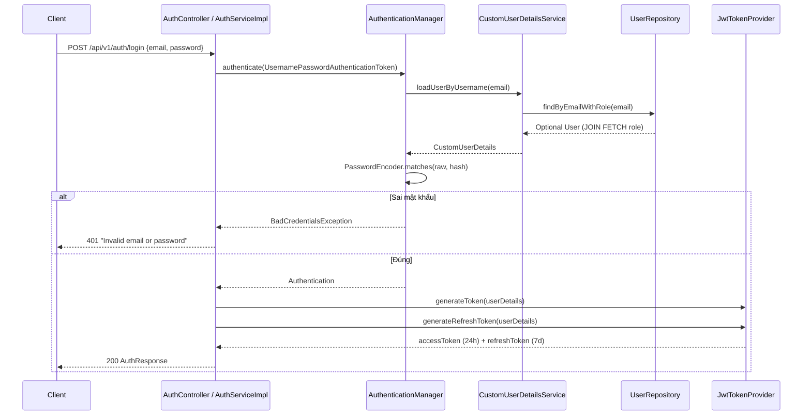

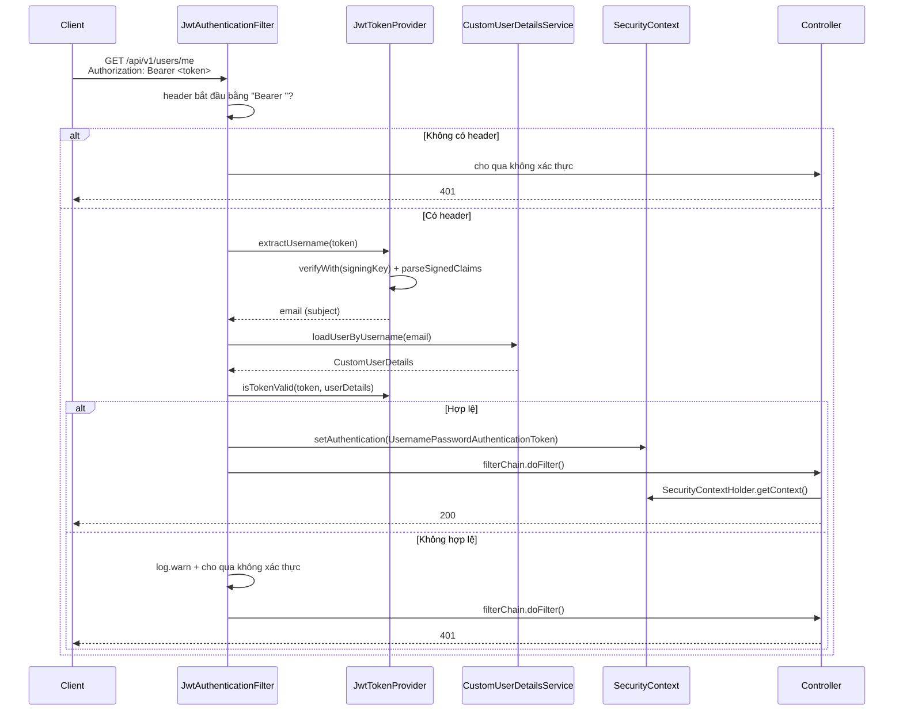

## 8.4 JWT chi tiết

`security/JwtTokenProvider.java`:

| Thuộc tính | Giá trị |
|------------|---------|
| Thuật toán | **HS256** (`Jwts.SIG.HS256`) |
| Khóa | `Decoders.BASE64.decode(secretKey)` → `Keys.hmacShaKeyFor(...)` |
| Nguồn khóa | `@Value("${application.security.jwt.secret-key}")` → biến `JWT_SECRET_KEY` |
| Subject | `userDetails.getUsername()` = **email** |
| Claims tùy chọn | **Rỗng** — `generateToken` truyền `new HashMap<>()`. Không có `userId`, `role`, `jti` |
| Access token TTL | `86400000` ms = **24 giờ** |
| Refresh token TTL | `604800000` ms = **7 ngày** |
| `isTokenValid` | So subject khớp **VÀ** chưa hết hạn |

**Hạn chế đã tìm thấy trong code:**
1. ❌ **Không có refresh token store** — không bảng, không cache, không denylist. Refresh token cũ **không bị thu hồi** sau khi dùng. Token bị đánh cắp vẫn dùng được tới khi hết 7 ngày.
2. ❌ **Không có `jti`** → không thể thu hồi từng token.
3. ❌ **Không kiểm tra token type** — access token và refresh token có cùng cấu trúc, chỉ khác `expiration`. Về lý thuyết refresh token có thể dùng như access token.
4. ❌ **Đổi mật khẩu không vô hiệu hoá token cũ.**

## 8.5 CORS

`SecurityConfig.java:57-69`:

```java
config.setAllowedOriginPatterns(List.of("*"));
config.setAllowedMethods(List.of("GET", "POST", "PUT", "PATCH", "DELETE", "OPTIONS"));
config.setAllowedHeaders(List.of("*"));
config.setAllowCredentials(true);
config.setMaxAge(3600L);
```

Áp dụng cho `/**`.

⚠️ **`allowedOriginPatterns("*")` + `allowCredentials(true)`** là cấu hình mở toàn diện — bất kỳ website nào cũng có thể gọi API bằng cookie/credential. Xem mục 23 HIGH-2.

**CORS cho Frontend:** hiện tại mọi origin đều được phép. Nhưng vì API dùng Bearer token trong header (không phải cookie), rủi ro thấp hơn so với session-cookie — tuy vẫn nên siết lại trước production.

## 8.6 CSRF

`.csrf(AbstractHttpConfigurer::disable)` — hợp lý vì API stateless dùng JWT, không dùng cookie session.

## 8.7 Password handling

| Mục | Chi tiết |
|-----|----------|
| Encoder | `BCryptPasswordEncoder()` — `PasswordEncoderConfig.java`, strength mặc định 10 |
| Nơi hash | `AuthServiceImpl.register()` — `passwordEncoder.encode(request.getPassword())` |
| Nơi verify | `DaoAuthenticationProvider` khi login; `UserServiceImpl.changePassword()` với `matches()` |
| Lưu trữ | `User.passwordHash` → cột `password_hash` |

## 8.8 Roles & Permissions

`CustomUserDetails.getAuthorities()`:

```java
String roleCode = user.getRole().getCode();
if (!roleCode.startsWith("ROLE_")) {
    roleCode = "ROLE_" + roleCode;
}
return Collections.singletonList(new SimpleGrantedAuthority(roleCode));
```

- Authority luôn ở dạng `ROLE_<code>` (VD: role `BUYER` → `ROLE_BUYER`)
- **Chỉ 1 authority duy nhất** — không có hệ thống permission chi tiết
- Role lấy từ `user.role` — quan hệ `@ManyToOne` LAZY

**Hạn chế:**
- ❌ **Không có `@PreAuthorize` nào** trong toàn bộ source → authority được nạp nhưng **không được dùng để chặn bất kỳ endpoint nào**. Mọi user đã đăng nhập đều có quyền giống nhau.
- ⚠️ Nếu role code trong DB đã có tiền tố `ROLE_` sẽ không bị nhân đôi — nhưng nếu lưu `ROLE_ADMIN` thì authority = `ROLE_ADMIN` (đúng). Rủi ro chỉ khi lưu thành `ADMIN_ROLE`.

---

# 9. MODULE STATUS

## 9.1 Bảng tổng quan 17 module

| Module | Controller | Service | Repository | Entity | API | Database | Status |
|--------|-----------|---------|------------|--------|-----|----------|--------|
| **Authentication** | ✅ AuthController (3 API) | ✅ AuthService+Impl | ✅ UserRepository, RoleRepository | ✅ User, Role | 3 | `users`, `role` | **Đã implement** (refresh token chưa có thu hồi) |
| **User Profile** | ✅ UserController (3 API) | ✅ UserService+Impl | ✅ UserRepository | ✅ User | 3 | `users` | **Đã implement** |
| **Address** | ✅ UserController (5 API) | ✅ AddressService+Impl | ✅ AddressRepository | ✅ Address | 5 | `address` | **Đã implement** |
| **Product** | ✅ ProductController (4 API) | ✅ ProductService+Impl | ✅ 6 repository | ✅ 7 entity catalog | 4 | 6 bảng catalog | **Đã implement (read-only)** — chưa có API ghi |
| **Category** | ✅ CategoryController (4 API) | ✅ CategoryService+Impl | ✅ CategoryRepository | ✅ Category | 4 | `category` | **Đã implement (read-only)** |
| **AI** | ✅ 2 AI Controller | ✅ 2 service+Impl, MockAiResponder | ❌ | ❌ | 2 | — (không dùng DB) | **Đã implement (stateless)** |
| **Seller** | ❌ | ❌ | ❌ | ✅ Seller | **0** | `seller` | ⚠️ **Chỉ có entity** |
| **Cart** | ❌ | ❌ | ❌ | ✅ Cart, CartItem | **0** | `cart`, `cart_item` | ⚠️ **Chỉ có entity** |
| **Order** | ❌ | ❌ | ❌ | ✅ Order, OrderItem | **0** | `orders`, `order_item` | ⚠️ **Chỉ có entity** |
| **Payment** | ❌ | ❌ | ❌ | ✅ Payment | **0** | `payment` | ⚠️ **Chỉ có entity** |
| **Shipment** | ❌ | ❌ | ❌ | ✅ Shipment | **0** | `shipment` | ⚠️ **Chỉ có entity** |
| **Promotion** | ❌ | ❌ | ❌ | ✅ Promotion | **0** | `promotion` | ⚠️ **Chỉ có entity** |
| **Review** | ❌ | ❌ | ❌ | ✅ Review | **0** | `review` | ⚠️ **Chỉ có entity** |
| **Inventory** | ❌ | ❌ | ❌ | ⚠️ chỉ có field `stock_quantity`/`reserved_quantity` trong `ProductVariant` | **0** | `product_variant` | ⚠️ **Chỉ là field, chưa có nghiệp vụ** |
| **Chat** | ❌ | ❌ | ❌ | ✅ Conversation, Message | **0** | `conversation`, `message` | ⚠️ **Chỉ có entity** |
| **Notification** | ❌ | ❌ | ❌ | ❌ | **0** | ❌ | ❌ **Chưa có gì** — không cả bảng DB |
| **Search** | ⚠️ chỉ là filter của product | ⚠️ dùng chung ProductService | ✅ JPQL LIKE | ✅ Product | (không có API riêng) | `product` | **Đã implement (mức cơ bản)** — xem mục 13 |
| **WebSocket** | ❌ | ❌ | ❌ | ❌ | **0** | ❌ | ❌ **Chưa có gì** |
| **Wishlist** | ❌ | ❌ | ❌ | ❌ | **0** | ❌ | ❌ **Chưa có bảng DB** |
| **File/Image Upload** | ❌ | ❌ | ❌ | ❌ | **0** | ❌ | ❌ **Chưa có gì** |

## 9.2 Chi tiết 8 module "chỉ có entity"

Đã đọc từng entity và grep toàn project để xác nhận **không có** repository/service/controller tham chiếu chúng.

### `cart` — `Cart`, `CartItem`
- `Cart`: `@Table("cart")`, PK `id` IDENTITY, `@OneToOne User` qua `user_id` (UNIQUE — 1 giỏ/1 user), extends `BaseEntity`
- `CartItem`: `@Table("cart_item", uniqueConstraints uq_cart_variant(cart_id, variant_id))`, fields `cart`, `variant` (ProductVariant), `quantity` (default 1), `priceSnapshot`, `isSelected` (default true), `addedAt`. **Không extends BaseEntity** — chỉ có `added_at`
- **Thiếu:** CartRepository, CartService, CartController, DTO, API thêm/sửa/xoá/liệt kê. Không có logic kiểm tra tồn kho khi thêm vào giỏ.

### `order` — `Order`, `OrderItem`
- `Order`: `@Table("orders")`, `orderCode` UNIQUE, `@ManyToOne User buyer`, `@ManyToOne Seller seller`, snapshot người nhận (`receiverName/Phone/shippingAddress`), 5 field tiền (`subtotal/shippingFee/discountAmount/platformDiscount/totalAmount`), enum `PaymentMethod`, `PaymentStatus` (default UNPAID), `OrderStatus` (default PENDING), `note`, `cancelReason`, `@ManyToOne User cancelledBy`, 5 mốc thời gian. extends `BaseEntity`
- `OrderItem`: `@Table("order_item")`, tham chiếu `order`/`variant`/`product`, snapshot (`productName/variantName/imageUrl`), `unitPrice`, `quantity`, `discount`, `totalPrice`, `isReviewed`. **Không extends BaseEntity**
- Enum `OrderStatus`: `PENDING, CONFIRMED, PACKED, SHIPPING, DELIVERED, COMPLETED, CANCELLED, RETURNED`
- Enum `PaymentMethod`: `COD, VNPAY, MOMO, CARD`
- Enum `PaymentStatus`: `UNPAID, PAID, REFUNDED`
- **Thiếu:** toàn bộ. Không có logic tính tổng, không có state machine chuyển trạng thái đơn, không có API checkout.

### `payment` — `Payment`
- `@Table("payment")`, `order_id` FK, `method`, `provider`, `transactionId`, `amount`, `currency` (default `"VND"`), `status` (default PENDING), `paidAt`, `refundedAt`, `refundAmount`, `gatewayResponse` kiểu **JSONB**. extends `BaseEntity`
- Enum `PaymentTransactionStatus`: `PENDING, SUCCESS, FAILED, REFUNDED`
- **Thiếu:** không có tích hợp cổng thanh toán nào (MoMo/VNPay/Stripe). Không có webhook, không có API.

### `shipment` — `Shipment`
- `@Table("shipment")`, `order_id` **UNIQUE** (1 shipment/order), `carrierCode`, `trackingNumber`, `serviceType`, `shippingFee`, `codAmount`, `fromAddress`/`toAddress` TEXT, `status` (default PICKING), `estimatedDeliveryDate`, `pickedAt`, `deliveredAt`, `note`. extends `BaseEntity`
- Enum `ShipmentServiceType`: `STANDARD, EXPRESS`
- Enum `ShipmentStatus`: `PICKING, PICKED, TRANSIT, DELIVERING, DELIVERED, FAILED, RETURNED`
- **Thiếu:** toàn bộ. Không có tích hợp đơn vị vận chuyển.

### `promotion` — `Promotion`
- `@Table("promotion")`, `seller_id` nullable (null = khuyến mãi toàn sàn), `code` UNIQUE, `discountType`, `discountValue`, `maxDiscountAmount`, `minOrderValue`, `quantity`, `usedCount`, `limitPerUser` (default 1), `applyScope` (default ALL), `startAt`/`endAt`, `status` (default ACTIVE). extends `BaseEntity`
- Enum `DiscountType`: `PERCENT, FIXED, FREESHIP`
- Enum `PromotionApplyScope`: `ALL, CATEGORY, PRODUCT`
- Enum `PromotionStatus`: `DRAFT, ACTIVE, EXPIRED, DISABLED`
- **Thiếu:** toàn bộ. Không có logic validate coupon, không có tính giảm giá.

### `review` — `Review`
- `@Table("review")`, `order_item_id` **UNIQUE** (chỉ 1 review/order item), `product_id`, `variant_id`, `user_id`, `seller_id`, `rating` (CHECK 1-5), `comment`, `imageUrls` **JSONB**, `videoUrl`, `isAnonymous`, `sellerReply`, `repliedAt`, `likeCount`, `status` (default VISIBLE). extends `BaseEntity`
- Enum `ReviewStatus`: `VISIBLE, HIDDEN`
- **Thiếu:** toàn bộ. Schema đã hỗ trợ sẵn "chỉ review được sau khi mua" (order_item UNIQUE) và "ảnh đánh giá" (JSONB) nhưng chưa có code.

### `seller` — `Seller`
- `@Table("seller")`, `user_id` **UNIQUE**, `shopName`, `slug` UNIQUE, `logoUrl`, `bannerUrl`, `description`, `businessType`, `taxCode`, `idCardNumber`, `pickup_address_id` FK → `address`, `ratingAvg`, `ratingCount`, `followerCount`, `totalProduct`, `status` (default PENDING), `approvedAt`. extends `BaseEntity`
- Enum `BusinessType`: `INDIVIDUAL, COMPANY`
- Enum `SellerStatus`: `PENDING, ACTIVE, SUSPENDED`
- **Đặc biệt:** module này **được đọc** (qua `Product.seller`) nhưng **không có API quản lý**. Không có luồng đăng ký seller, duyệt seller.

### `chat` — `Conversation`, `Message`
- `Conversation`: `@Table("conversation", uq_buyer_seller(buyer_id, seller_id))`, `buyer`, `seller`, `lastMessage`, `lastMessageAt`, `buyerUnreadCount`, `sellerUnreadCount`, `createdAt`. **Không extends BaseEntity** — chỉ `created_at`
- `Message`: `@Table("message")`, `conversation`, `sender`, `senderType` enum `BUYER|SELLER`, `content`, `messageType` enum `TEXT|IMAGE|PRODUCT|ORDER` (default TEXT), `attachmentUrl`, `refProductId`, `refOrderId`, `isRead`, `readAt`, `createdAt`. **Không extends BaseEntity**
- **Thiếu:** toàn bộ. **Quan trọng:** AI chat endpoint trả về `conversationId` (UUID tự sinh) nhưng **không liên quan** tới entity `Conversation` — id này không được lưu vào DB.

## 9.3 Module `ai` — chi tiết

| Thành phần | Trạng thái |
|-----------|-----------|
| `SpringAiConfig` | ✅ Có. Tạo `ChatClient` bean có điều kiện `@ConditionalOnProperty("spring.ai.openai.api-key")` |
| `AiChatService` + Impl | ✅ Có. Có fallback `MockAiResponder` |
| `AiContentGeneratorService` + Impl | ✅ Có. Có fallback |
| `MockAiResponder` | ✅ Có. Hardcode câu trả lời tiếng Việt, prefix `[MOCK AI #N]` |
| Model provider | OpenAI, model `gpt-4o-mini` (từ `application.properties:31`) |
| ChatClient.Builder | Inject qua constructor, dùng `ObjectProvider<ChatClient>` tránh lỗi khi thiếu key |
| Temperature / top-p | ❌ Không cấu hình — dùng mặc định của Spring AI |
| System prompt | ✅ Hardcode tiếng Việt **không dấu** trong code (không externalize ra config) |
| Lưu hội thoại | ❌ **Không.** Không có repository, không có entity dùng |
| RAG | ❌ **Không có** — grep `VectorStore`/`Embedding` → 0 kết quả |
| AI đọc dữ liệu catalog | ❌ **Không.** Module `ai` không import bất kỳ repository/entity nghiệp vụ nào |
| Rate limit / quota | ❌ Không có |

---

# 10. PRODUCT / CATEGORY

## 10.1 Product — API đã implement

| Chức năng | API | Trạng thái |
|-----------|-----|-----------|
| Danh sách + lọc + sắp xếp + phân trang | `GET /api/v1/products` | ✅ Implemented |
| Sản phẩm nổi bật | `GET /api/v1/products/featured` | ✅ Implemented |
| Sản phẩm theo shop | `GET /api/v1/products/seller/{sellerId}` | ✅ Implemented |
| Chi tiết sản phẩm | `GET /api/v1/products/{slug}` | ✅ Implemented |
| Tăng view count | (gọi nội bộ trong chi tiết) | ✅ Implemented |
| **Tạo sản phẩm** | ❌ | **Chưa implement** |
| **Sửa sản phẩm** | ❌ | **Chưa implement** |
| **Xoá sản phẩm** | ❌ | **Chưa implement** |
| **Quản lý biến thể (variant)** | ❌ | **Chưa implement** |
| **Quản lý option/value** | ❌ | **Chưa implement** |
| **Quản lý ảnh sản phẩm** | ❌ | **Chưa implement** |
| **Đổi trạng thái sản phẩm** | ❌ | **Chưa implement** |

**Kết luận:** module catalog **hoàn toàn read-only**. Có đầy đủ entity + repository để ghi (chúng khai báo `JpaRepository` nên có `save`/`delete` sẵn), nhưng **không có service method nào ghi**. Nhánh seller/admin chưa viết.

## 10.2 Lọc & sắp xếp (chi tiết hành vi thật)

| Tham số | Kiểm tra | Hành vi khi sai |
|---------|----------|-----------------|
| `minPrice > maxPrice` | ✅ Có, trong service | → `BadRequestException` **400** |
| `size <= 0` | ✅ | → dùng 20 |
| `size > 100` | ✅ | → clamp về 100 |
| `page < 0` | ✅ | → dùng 0 |
| `sortBy` không hợp lệ | ❌ | → **fallback im lặng** `createdAt`, KHÔNG báo lỗi |
| `sortDir` không phải `"asc"` | ❌ | → **fallback im lặng** `DESC` |
| `minPrice`/`maxPrice` âm | ❌ | Không kiểm tra — query vẫn chạy |
| `categoryId`/`sellerId` không tồn tại | ❌ | Trả danh sách rỗng, **không 404** |

**Allowlist sort** (`SORT_FIELD_MAP`): `price→minPrice`, `sold→soldCount`, `rating→ratingAvg`, `created→createdAt`, `name→name`.

## 10.3 Mô hình biến thể (variant)

**Quan hệ trong DB:**
```
product 1 ──< product_variant
product 1 ──< product_option 1 ──< product_option_value
product_variant >──< variant_option_value >──< product_option_value
```

**Nhưng thực tế trong code:**
- `ProductDetailDto.options` trả về option + values ✅
- `ProductDetailDto.variants` trả về danh sách variant ✅
- ⚠️ **Không có cách nào map từ "người dùng chọn option values" → "variant cụ thể"**. Không có endpoint `?optionValueIds=1,2`, không có repository method tìm variant theo tổ hợp option value.
- ⚠️ `ProductVariantDto.variantName` là chuỗi denormalized (vd: "Đỏ / 128GB") — Frontend **phải tự parse chuỗi** để ghép variant với option đã chọn, hoặc Backend cần bổ sung trường `optionValueIds` vào `ProductVariantDto`.
- ⚠️ Bảng `variant_option_value` **hoàn toàn không được đọc** — không có `VariantOptionValueRepository`.

## 10.4 Category

| Chức năng | API | Trạng thái |
|-----------|-----|-----------|
| Danh sách phẳng | `GET /api/v1/categories` | ✅ |
| Danh sách gốc | `GET /api/v1/categories/roots` | ✅ |
| Cây đệ quy | `GET /api/v1/categories/tree` | ✅ |
| Chi tiết theo slug | `GET /api/v1/categories/{slug}` | ✅ |
| Tạo/sửa/xoá category | ❌ | **Chưa implement** |

**Cây phân cấp:**
- Biểu diễn: self-reference `parent_id` (`@ManyToOne Category parent`, LAZY)
- Dựng cây: đệ quy trong `CategoryServiceImpl.toDtoWithChildren()`, mỗi node 1 query
- ⚠️ Cột `path` (materialized path, vd `/1/5/12/`) tồn tại trong DB và entity nhưng **không query nào dùng** — và **không có code nào tự tính `path`** khi tạo category (vì chưa có API tạo)
- ⚠️ Entity `Category` **không có** `@OneToMany children` — phải query thủ công

## 10.5 Product image

- API chi tiết trả về `List<ProductImageDto>` (id, imageUrl, altText, sortOrder, isThumbnail)
- `Product.thumbnailUrl` và `ProductImage.isThumbnail` là **hai nơi lưu ảnh chính** — có thể lệch nhau, không có logic đồng bộ
- ❌ **Không có API upload ảnh** (xem mục 15)
- Dữ liệu seed dùng URL ảnh từ CDN bên ngoài (`cdn.tgdd.vn`)

## 10.6 Tồn kho & giá

| Trường | Nằm ở đâu | Được đọc ra API? | Được cập nhật? |
|--------|-----------|-------------------|----------------|
| `stock_quantity` | `product_variant` | ✅ `ProductVariantDto.stockQuantity` | ❌ Không có API |
| `reserved_quantity` | `product_variant` | ❌ **Không có trong DTO** | ❌ Không có API |
| `sold_count` (variant) | `product_variant` | ✅ `ProductVariantDto.soldCount` | ❌ |
| `price` | `product_variant` | ✅ | ❌ |
| `sale_price` | `product_variant` | ✅ | ❌ |
| `min_price`/`max_price` | `product` (denormalized) | ✅ | ❌ — **không có trigger tự đồng bộ từ variants** |
| `rating_avg`/`rating_count` | `product`, `seller` | ✅ | ❌ — sẽ tự tính khi có module review |
| `sold_count` (product) | `product` | ✅ | ❌ |
| `view_count` | `product` | ✅ | ✅ (tự tăng khi xem chi tiết) |

⚠️ **`min_price`/`max_price` trên `product` là dữ liệu denormalized** — nếu sau này thêm API sửa variant price mà không cập nhật product thì listing sẽ hiển thị sai giá.

---

# 11. CART / ORDER / PAYMENT

## 11.1 Tổng quan

| Layer | Cart | Order | Payment |
|-------|------|-------|---------|
| Entity | ✅ `Cart`, `CartItem` | ✅ `Order`, `OrderItem` | ✅ `Payment` |
| Enum | — | ✅ 3 enum | ✅ `PaymentTransactionStatus` |
| Bảng DB | ✅ `cart`, `cart_item` | ✅ `orders`, `order_item` | ✅ `payment` |
| Repository | ❌ | ❌ | ❌ |
| Service | ❌ | ❌ | ❌ |
| Controller | ❌ | ❌ | ❌ |
| DTO | ❌ | ❌ | ❌ |
| API | ❌ | ❌ | ❌ |
| Test | ❌ | ❌ | ❌ |

**Kết luận:** toàn bộ luồng mua hàng **chưa được viết**. Schema đã chuẩn bị đầy đủ và khá chuẩn (snapshot giá, snapshot địa chỉ, mã đơn unique, state machine 8 trạng thái, phân tách `payment` và `orders`).

## 11.2 Cart — những gì schema đã chuẩn bị

Đã thiết kế sẵn trong DB nhưng **chưa có code**:
- 1 giỏ / 1 user (`cart.user_id` UNIQUE)
- `UNIQUE (cart_id, variant_id)` — chặn trùng variant trong 1 giỏ
- `CHECK (quantity > 0)`
- `price_snapshot` — lưu giá tại thời điểm thêm vào giỏ
- `is_selected` — chọn để checkout
- `cart_item.added_at` — thời điểm thêm (không có `updated_at`)

**Thiếu:** toàn bộ. Đặc biệt là **kiểm tra tồn kho** khi thêm vào giỏ và khi checkout (dù DB có `CHECK stock_quantity >= 0`).

## 11.3 Order — những gì schema đã chuẩn bị

- `order_code` UNIQUE — mã đơn cho người dùng
- Snapshot người nhận: `receiver_name`, `receiver_phone`, `shipping_address` (không tham chiếu `address` — tách bản sao)
- Tách 4 loại tiền: `subtotal`, `shipping_fee`, `discount_amount`, `platform_discount` → `total_amount`
- State machine 8 trạng thái: `PENDING → CONFIRMED → PACKED → SHIPPING → DELIVERED → COMPLETED`, cộng `CANCELLED`, `RETURNED`
- 5 mốc thời gian theo dõi: `confirmed_at`, `shipped_at`, `delivered_at`, `completed_at`, `cancelled_at`
- `cancelled_by` — lưu user nào huỷ
- `order_item.is_reviewed` — cờ cho review module
- `CHECK (quantity > 0)` ở `order_item`

**Thiếu:** toàn bộ. Không có logic tính tổng tiền, không có state machine, không có kiểm tra tồn kho, không có transaction bao quanh checkout.

## 11.4 Payment — những gì schema đã chuẩn bị

- Tách riêng bảng `payment` khỏi `orders` (1 order có thể có nhiều payment record — thử lại/thất bại)
- `provider` + `transaction_id` + `gateway_response JSONB` — chuẩn cho tích hợp cổng thanh toán
- `PaymentMethod` enum: `COD`, `VNPAY`, `MOMO`, `CARD`
- `PaymentStatus` (trên orders): `UNPAID`, `PAID`, `REFUNDED`
- `PaymentTransactionStatus` (trên payment): `PENDING`, `SUCCESS`, `FAILED`, `REFUNDED`
- Có sẵn `refunded_at`, `refund_amount` cho hoàn tiền

**Thiếu:** toàn bộ. Không có SDK MoMo/VNPay/Stripe, không có webhook, không có API, không có logic verify chữ ký.

## 11.5 Inventory

❌ **Không có module inventory.** Tồn kho chỉ tồn tại dưới dạng 2 field trong `product_variant`:
- `stock_quantity INTEGER NOT NULL DEFAULT 0`
- `reserved_quantity INTEGER NOT NULL DEFAULT 0`
- DB có CHECK: `stock_quantity >= 0 AND reserved_quantity >= 0 AND reserved_quantity <= stock_quantity`

**Không có:** service quản lý tồn kho, API cập nhật, cơ chế reserve khi checkout, `@Lock` chống race condition, audit log tồn kho.
⚠️ `reservedQuantity` **không được expose** ra `ProductVariantDto` — Frontend không thấy được số lượng đã đặt trước.

---

# 12. AI

## 12.1 Cấu hình Spring AI

| Mục | Giá trị | Nguồn |
|-----|---------|-------|
| Spring AI BOM | **2.0.1** | `build.gradle:21` |
| Starter | `spring-ai-starter-model-openai` | `build.gradle:33` |
| Model | `gpt-4o-mini` | `application.properties:31` |
| API key | `${OPENAI_API_KEY:}` | `application.properties:30` |
| ChatClient bean | `openAiChatClient`, có điều kiện | `SpringAiConfig.java:24-30` |

**Cơ chế fallback** — đây là thiết kế đáng chú ý:

```
ApiKey rỗng  →  SpringAiConfig KHÔNG tạo bean ChatClient
             →  AiChatServiceImpl.hasApiKey() == false
             →  dùng MockAiResponder (trả text mô phỏng, prefix "[MOCK AI #N]")

ApiKey có    →  tạo bean ChatClient thật
             →  gọi OpenAI
```

Có `ApplicationRunner` in banner cảnh báo lúc startup nếu thiếu key. Nhờ vậy **app vẫn khởi động và endpoint AI vẫn trả 200** khi không có key — chỉ nội dung là mô phỏng.

## 12.2 AI đang được dùng để làm gì

| Use case | Endpoint | Prompt | Trạng thái |
|----------|----------|--------|-----------|
| Trợ lý tư vấn mua sắm | `POST /api/v1/ai/chat` | "Bạn là trợ lý tư vấn mua sắm thông minh của sàn thương mại điện tử B2C. Hãy trả lời người dùng một cách lịch sự, hào hứng và đưa ra những gợi ý mua hàng hữu ích nhất." | ✅ Hoạt động, **stateless** |
| Sinh mô tả sản phẩm SEO | `POST /api/v1/ai/generate-description` | "Bạn là chuyên gia viết bài bán hàng (Copywriter E-commerce) chuẩn SEO. Hãy tự động viết mô tả sản phẩm chi tiết, thu hút và chuyên nghiệp dựa trên các thông số người dùng cung cấp." | ✅ Hoạt động |

**Cả 2 prompt đều hardcode trong Java, không dấu tiếng Việt, không externalize config.**

## 12.3 Câu hỏi quan trọng: AI chỉ cấu hình hay đã có nghiệp vụ thật?

**Đã có nghiệp vụ thật** — 2 endpoint hoạt động end-to-end, có fallback mock.

**NHƯNG giới hạn nghiêm trọng:**

| Hạn chế | Bằng chứng |
|---------|-----------|
| ❌ **AI không đọc dữ liệu nào từ database** | Module `ai` không import `ProductRepository` hay bất kỳ repository nghiệp vụ nào. AI **không** biết sản phẩm nào tồn tại |
| ❌ **Không lưu hội thoại** | `AiChatResponse.conversationId` chỉ là `UUID.randomUUID()`, **không** gắn với entity `Conversation`, không insert DB |
| ❌ **Không nhớ lịch sử chat** | Mỗi lượt gọi là 1 request độc lập. Client muốn nhớ phải tự gửi lại toàn bộ lịch sử trong `message` |
| ❌ **Không có RAG** | Grep `VectorStore`/`Embedding`/`@Document` → 0 kết quả |
| ❌ **Không có vector database** | Không có pgvector, không có Chroma, không có Qdrant |
| ❌ **Endpoint AI công khai, không rate limit** | `/api/v1/ai/**` permitAll → ai cũng gọi được và đốt tiền OpenAI |

**Kết luận:** AI hiện là một "text generator" độc lập, **chưa gắn với nghiệp vụ B2C**. Muốn AI tư vấn sản phẩm thật cần thêm RAG hoặc tool-calling truy vấn catalog.

---

# 13. SEARCH

## 13.1 Cơ chế search hiện tại

**Cơ chế duy nhất: JPQL với `LIKE`, không phải full-text search.**

Project chia làm **2 query riêng** thay vì 1, có comment giải thích lý do (`ProductRepository.java:21-24`) — tách để tránh lỗi PostgreSQL khi so sánh `NULL` với `bytea` khi truyền keyword rỗng.

**Query 1 — không có keyword** (`searchProductsWithoutKeyword`):
```sql
SELECT p FROM Product p
WHERE p.deletedAt IS NULL
  AND p.status = :status
  AND (:categoryId IS NULL OR p.category.id = :categoryId)
  AND (:sellerId  IS NULL OR p.seller.id  = :sellerId)
  AND (:minPrice  IS NULL OR p.minPrice >= :minPrice)
  AND (:maxPrice  IS NULL OR p.maxPrice <= :maxPrice)
```

**Query 2 — có keyword** (`searchProductsWithKeyword`):
```sql
SELECT p FROM Product p
WHERE p.deletedAt IS NULL
  AND p.status = :status
  AND (:categoryId IS NULL OR p.category.id = :categoryId)
  AND (:sellerId  IS NULL OR p.seller.id  = :sellerId)
  AND (:minPrice  IS NULL OR p.minPrice >= :minPrice)
  AND (:maxPrice  IS NULL OR p.maxPrice <= :maxPrice)
  AND (
        LOWER(p.name)        LIKE LOWER(CONCAT('%', :keyword, '%'))
     OR LOWER(CAST(p.description AS string)) LIKE LOWER(CONCAT('%', :keyword, '%'))
     OR LOWER(p.brand)       LIKE LOWER(CONCAT('%', :keyword, '%'))
      )
```

`ProductStatus status` luôn được truyền cố định là `ACTIVE` từ service → endpoint công khai **chỉ trả sản phẩm ACTIVE**.

## 13.2 Đánh giá

| Tiêu chí | Hiện trạng |
|----------|-----------|
| Trường tìm kiếm | `name`, `description`, `brand` (3 trường) |
| Phạm vi | Chỉ product. **Không** tìm trong category, seller, tên variant |
| Ký tự đặc biệt | ❌ `%` và `_` trong keyword **không được escape** → người dùng gõ `%` sẽ match tất cả |
| Phân biệt hoa thường | ✅ Dùng `LOWER()` |
| Xếp hạng kết quả | ❌ Không — chỉ theo sort param, không full-text ranking |
| Đánh lệch chữ / typo | ❌ Không hỗ trợ |
| Tiếng Việt có dấu | ⚠️ Phụ thuộc collation của PostgreSQL — `LOWER()` trong Java vs DB có thể khác nhau với chữ Đ/đ |

## 13.3 Cơ chế **KHÔNG** dùng (đã kiểm tra)

| Cơ chế | Trạng thái |
|--------|-----------|
| PostgreSQL Full Text Search (`to_tsvector`, `@@`) | ❌ Chưa implement |
| `pg_trgm` extension / GIN index | ❌ Chưa implement — `V1__init_schema.sql` không có index GIN |
| Elasticsearch | ❌ Chưa có dependency, chưa có config |
| Meilisearch | ❌ Chưa có |
| Spring Data JPA `Specification<T>` | ❌ Chưa dùng — grep 0 kết quả |
| Criteria API | ❌ Chưa dùng |
| Native SQL (`nativeQuery = true`) | ❌ Chưa dùng — tất cả `@Query` đều là JPQL |
| Vector search / embedding search | ❌ Chưa có |
| **Search API riêng** (`/api/v1/search`) | ❌ **Chưa tồn tại** — search chỉ là query param `q` của `GET /api/v1/products` |

## 13.4 Kết luận

Search hiện tại là **mức cơ bản**: `LIKE '%keyword%'` không phân biệt hoa thường trên 3 cột. Chưa có full-text search, chưa có index hỗ trợ, chưa có fuzzy matching, chưa có API search độc lập. Với dữ liệu vài nghìn sản phẩm thì chấp nhận được; với quy mô lớn sẽ chậm.

---

# 14. WEBSOCKET / REALTIME

## 14.1 Kết luận: CHƯA CÓ GÌ

**Chưa tìm thấy trong source code.** Đã kiểm tra:

| Công nghệ | Trạng thái |
|-----------|-----------|
| WebSocket (Spring) | ❌ Không có dependency `spring-boot-starter-websocket`, không có `WebSocketConfigurer` |
| STOMP | ❌ Không có |
| SockJS | ❌ Không có |
| Server-Sent Events (SSE) | ❌ Không có `SseEmitter` |
| `SimpMessagingTemplate` | ❌ Không có |
| `@MessageMapping` | ❌ Không có |
| Handler `TextWebSocketHandler` | ❌ Không có |

## 14.2 Điều gì ĐANG tồn tại (schema cho realtime)

| Bằng chứng | Vị trí | Mô tả |
|-----------|--------|-------|
| Bảng `conversation` | `V1__init_schema.sql:762-786` | Có `buyer_unread_count`, `seller_unread_count` — cơ chế unread counter đặc trưng cho realtime |
| Bảng `message` | `V1__init_schema.sql:793-844` | `is_read`, `read_at` — hỗ trợ đánh dấu đã đọc |
| Entity `Conversation`, `Message` | `modules/chat/entity/` | Có `@ManyToOne` liên kết đầy đủ |
| Index | `idx_conversation_buyer`, `idx_conversation_seller`, `idx_message_conversation`, `idx_message_created_at` | 4 index đã chuẩn bị |

## 14.3 Đánh giá

Schema chat đã chuẩn bị kỹ cho realtime (unread counter + read flag + index theo conversation và thời gian), nhưng **chưa có tầng realtime nào cả**:
- ❌ Không có WebSocket/STOMP
- ❌ Không có REST API chat
- ❌ Không có repository cho `Conversation`/`Message`
- ❌ Không có cơ chế push notification

**Kết nối với mục 12:** endpoint `POST /api/v1/ai/chat` trả về `conversationId` — nhưng đây là UUID ngẫu nhiên do server sinh, **không liên quan** tới bảng `conversation`. Hai khái niệm "conversation" này không được nối với nhau.

---

# 15. FILE / IMAGE STORAGE

## 15.1 Kết luận: CHƯA CÓ GÌ

**Chưa tìm thấy trong source code.**

| Công nghệ | Trạng thái |
|-----------|-----------|
| Cloudinary | ❌ Không có dependency, không có `CloudinaryConfig`, không có bean |
| Supabase Storage | ❌ Không có |
| AWS S3 / MinIO | ❌ Không có |
| Local filesystem storage | ❌ Không có abstraction nào (`FileSystemStorage`, `StorageService`) |
| Multipart upload (`MultipartFile`) | ❌ Không có endpoint nào nhận file |
| `spring-boot-starter-webmvc` multipart config | ❌ Không cấu hình `max-file-size` |

## 15.2 Ảnh hiện đang được lưu thế nào

**Chỉ lưu URL dạng TEXT/BIGINT trong DB, không quản lý file:**

| Nơi lưu URL | Cột | Kiểu |
|-------------|-----|------|
| Avatar người dùng | `users.avatar_url` | TEXT |
| Logo/banner shop | `seller.logo_url`, `seller.banner_url` | TEXT |
| Ảnh chính sản phẩm | `product.thumbnail_url` | TEXT |
| Ảnh phụ sản phẩm | `product_image.image_url` | TEXT |
| Ảnh biến thể | `product_variant.image_url` | TEXT |
| Ảnh giá trị option | `product_option_value.image_url` | TEXT |
| Ảnh review | `review.image_urls` | **JSONB** (mảng) |
| Video review | `review.video_url` | TEXT |
| Attachment tin nhắn | `message.attachment_url` | TEXT |

## 15.3 Hệ quả

- Mọi ảnh **phải được upload từ bên ngoài** rồi dán URL thủ công
- `UpdateProfileRequest.avatarUrl` nhận URL từ client, chỉ validate `@Size(max=500)` — ⚠️ **không kiểm tra định dạng URL**
- Dữ liệu seed dùng CDN bên ngoài: `https://cdn.tgdd.vn/Products/Images/...`
- **Không có API upload** → Frontend không thể chọn ảnh trực tiếp, phải tự upload lên dịch vụ khác rồi gửi URL
- **Không có API xoá ảnh**

---

# 16. VALIDATION & ERROR HANDLING

## 16.1 Validation annotation đang dùng

Có dùng `jakarta.validation`, không có custom validator nào.

| Annotation | Dùng ở đâu |
|-----------|-----------|
| `@Valid` | Tất cả method có `@RequestBody` trong `AuthController`, `UserController` |
| `@NotBlank` | `RegisterRequest.email/password/fullName`, `LoginRequest.email/password`, `RefreshTokenRequest.refreshToken`, `ChangePasswordRequest.*`, `AddressRequest.recipientName/phone/streetDetail/fullAddress` |
| `@Email` | `RegisterRequest.email`, `LoginRequest.email` |
| `@Size` | `RegisterRequest.password(8,100)`, `fullName(150)`, `UpdateProfileRequest.fullName(1,150)`, `phone(20)`, `avatarUrl(500)`, `AddressRequest.*` |
| `@Past` | `UpdateProfileRequest.dateOfBirth` |

**Ví dụ request hợp lệ cho `POST /api/v1/auth/register`:**
```json
{
  "email": "buyer@example.com",
  "password": "password123",
  "fullName": "Nguyen Van A",
  "phone": "0901234567",
  "roleCode": "BUYER"
}
```

**Response khi thiếu `fullName`:**
```json
{
  "code": 400,
  "message": "Validation failed",
  "errors": [
    { "field": "fullName", "message": "must not be blank" }
  ],
  "timestamp": "2026-09-28T23:30:00.123456",
  "path": "/api/v1/auth/register"
}
```

## 16.2 Validation KHÔNG dùng

| Thiếu | Ảnh hưởng |
|-------|-----------|
| ❌ Custom validator | Không có validate domain-specific nào |
| ❌ `@Pattern` (regex) cho `phone` | Chấp nhận mọi chuỗi `phone` |
| ❌ Validate URL cho `avatarUrl` | Chấp nhận URL hỏng |
| ❌ Validate range cho `minPrice`/`maxPrice` | Giá âm vẫn qua (chỉ kiểm tra min ≤ max) |
| ❌ Validate `sortBy`/`sortDir` | Giá trị sai bị **bỏ qua âm thầm** |
| ❌ `@Valid` trên `AiChatRequest` | ⚠️ `message` không bắt buộc — có thể chat với message rỗng |
| ❌ `@Valid` trên `ProductDescriptionGenRequest` | ⚠️ `productName` không bắt buộc |
| ❌ Validate param query | `@RequestParam` không có annotation validation nào |

## 16.3 Business exception

5 exception tự định nghĩa trong `common/exception/`:

| Class | HTTP | Dùng ở đâu |
|-------|------|-----------|
| `ResourceNotFoundException` | 404 | Product, Category, User, Address không tồn tại. Constructor `(resource, identifier)` |
| `BadRequestException` | 400 | Sai dải giá, sai logic đổi mật khẩu |
| `UnauthorizedException` | 401 | Chưa xác thực (`UserController.currentUserId()`) |
| `ForbiddenException` | 403 | ⚠️ **Khai báo nhưng không có chỗ nào throw** |
| `ConflictException` | 409 | Email/SĐT trùng |

## 16.4 Xử lý lỗi toàn cục

`GlobalExceptionHandler` — `@RestControllerAdvice`, 13 handler, đã bảng ở mục 7.7.

**Điểm tốt:**
- Catch-all `Exception` → 500 với message chung, **không lộ stack trace ra client**
- `BadCredentialsException` → thay message bằng `"Invalid email or password"` (chống user enumeration)
- Mọi lỗi đều có `timestamp` + `path` để client log

**Điểm cần lưu ý:**
- ⚠️ Handler cho `AccessDeniedException` (403) được khai báo trong `@RestControllerAdvice` — nhưng exception này do Spring Security ném ra **ở tầng filter, trước khi vào DispatcherServlet**, nên handler này có thể **không bao giờ chạy**; thực tế sẽ do Spring Security trả 403 với body rỗng. Cần kiểm chứng runtime.
- ⚠️ Không có `AuthenticationEntryPoint` tùy biến → khi thiếu token, response 401 của Spring Security có thể **không đúng format `ErrorResponse`**. Đây là điểm Frontend cần xác minh thực tế.

---

# 17. PAGINATION / FILTER / SORT

## 17.1 Cơ chế

| Khía cạn | Cách làm |
|-----------|---------|
| Phân trang | `PageRequest` + Spring Data `Page<T>` |
| Wrapper | `PageResponse.of(Page<T>)` — 7 field |
| Sắp xếp | `Sort.by(direction, field)` với **allowlist map** |
| Lọc | JPQL trong `@Query` với điều kiện nullable |
| Specification API | ❌ Không dùng |
| PageRequest tự tăng | ❌ Client phải tự `page + 1` |
| Cursor-based | ❌ Không có |

## 17.2 API có phân trang (3 endpoint)

| API | Param | Sort cố định |
|-----|-------|--------------|
| `GET /api/v1/products` | `page` (0), `size` (20) | Theo `sortBy`/`sortDir` |
| `GET /api/v1/products/featured` | `page` (0), `size` (20) | `soldCount DESC` |
| `GET /api/v1/products/seller/{sellerId}` | `page` (0), `size` (20) | `createdAt DESC` |

**Quy tắc xử lý giá trị (đã kiểm tra trong `ProductServiceImpl`):**

| Input | Kết quả |
|-------|---------|
| `size` không truyền | 20 |
| `size = 0` hoặc âm | 20 |
| `size = 500` | 100 (clamp) |
| `page` không truyền | 0 |
| `page` âm | 0 |
| `sortBy` không truyền | `createdAt` |
| `sortBy` không hợp lệ | `createdAt` (im lặng) |
| `sortDir = "asc"` | ASC |
| `sortDir` bất kỳ khác | DESC (im lặng) |

## 17.3 Bộ lọc sản phẩm

| Param | Toán tử | Cột DB |
|-------|---------|--------|
| `categoryId` | `=` | `product.category_id` |
| `sellerId` | `=` | `product.seller_id` |
| `minPrice` | `>=` | `product.min_price` |
| `maxPrice` | `<=` | `product.max_price` |
| `q` | `LIKE %...%` | `name`, `description`, `brand` |

**Lọc cố định (không tham số):** `deleted_at IS NULL` **VÀ** `status = 'ACTIVE'`.

**Không có bộ lọc:** lọc theo khoảng giá của variant, có tồn kho, theo rating tối thiểu, theo brand (chỉ có brand trong search keyword), theo hasDiscount.

## 17.4 Response mẫu

```json
{
  "code": 200,
  "message": "Success",
  "data": {
    "content": [
      {
        "id": 1,
        "slug": "iphone-15-pro-256gb-titanium",
        "name": "iPhone 15 Pro 256GB Titanium",
        "minPrice": 25000000.00,
        "maxPrice": 30000000.00,
        "thumbnailUrl": "https://...",
        "brand": "Apple",
        "ratingAvg": 4.80,
        "ratingCount": 120,
        "soldCount": 500,
        "sellerId": 1,
        "shopName": "Demo Shop",
        "categoryId": 2,
        "categoryName": "Smartphones",
        "createdAt": "2026-09-01T10:00:00"
      }
    ],
    "page": 0,
    "size": 20,
    "totalElements": 3,
    "totalPages": 1,
    "first": true,
    "last": true
  },
  "timestamp": "2026-09-28T23:30:00"
}
```

---

# 18. TRANSACTION & DATA CONSISTENCY

## 18.1 Phân bố `@Transactional`

| Service | Cấp class | Method ghi đè |
|---------|-----------|---------------|
| `ProductServiceImpl` | `@Transactional(readOnly = true)` | `incrementViewCount` → `@Transactional` |
| `CategoryServiceImpl` | `@Transactional(readOnly = true)` | — (toàn bộ đọc) |
| `UserServiceImpl` | ⚠️ **không có cấp class** | `updateProfile` → `@Transactional`; `changePassword` → `@Transactional`; `getCurrentUserProfile` → không có |
| `AddressServiceImpl` | ⚠️ **không có cấp class** | `createAddress`, `updateAddress`, `deleteAddress`, `setDefaultAddress` → `@Transactional`; `getMyAddresses`, `getAddressById` → không có |
| `AuthServiceImpl` | ⚠️ **không có cấp class** | `register` → `@Transactional`; `login`, `refreshToken` → `@Transactional(readOnly = true)` |

**Quy ước:** method ghi có `@Transactional`; method đọc ở module catalog có `readOnly = true`; module user/auth đọc không có transaction (chạy auto-commit).

## 18.2 Transaction boundary

- **Mỗi service method = 1 transaction.** Không có transaction bao quanh nhiều service.
- Không có `REQUIRES_NEW`, không có `propagation` tùy chỉnh, không có `TransactionTemplate` thủ công.
- ⚠️ `UserService.getCurrentUserProfile` và `AddressService.getMyAddresses` / `getAddressById` **không có transaction** → nếu mapping DTO truy cập lazy relation ngoài phạm vi transaction sẽ gặp `LazyInitializationException`. Hiện tại chạy được vì mapping chỉ đọc field đã load, nhưng đây là điểm rủi ro.

## 18.3 Cơ chế chống race condition

| Cơ chế | Trạng thái |
|--------|-----------|
| Optimistic locking (`@Version`) | ❌ **KHÔNG có trên bất kỳ entity nào** (grep `@Version` → 0 kết quả) |
| Pessimistic locking (`@Lock`, `PESSIMISTIC_WRITE`) | ❌ Không có |
| Native atomic update (`SET x = x + 1`) | ❌ Không có |
| Idempotency key | ❌ Không có |
| Unique constraint (chống trùng) | ✅ Có ở DB level: `users.email`, `users.phone`, `product.slug`, `product_variant.sku`, `cart_item(cart_id,variant_id)`, `review.order_item_id`, `promotion.code`, `orders.order_code` |

## 18.4 Ví dụ race condition thật trong code

`ProductServiceImpl.incrementViewCount`:
```java
@Transactional
public void incrementViewCount(Long productId) {
    productRepository.findById(productId).ifPresent(p -> {
        p.setViewCount(p.getViewCount() + 1);   // đọc
        productRepository.save(p);             // ghi
    });
}
```

Hai request đồng thời có thể cùng đọc `viewCount = 100`, cùng ghi 101 → **mất 1 lượt xem**. Không có `@Version` để Hibernate nhận biết.

⚠️ Tác động thực tế thấp (view count không nghiêm trọng), nhưng **cùng mẫu này sẽ nguy hiểm khi áp dụng cho tồn kho hoặc số lượng mua**. Khi làm order/inventory phải dùng `@Version` hoặc atomic update.

---

# 19. CONFIGURATION

## 19.1 File config tồn tại

| File | Vai trò |
|------|---------|
| `src/main/resources/application.properties` | Config chính (profile default) |
| `src/main/resources/application-mock.properties` | Profile `mock` — H2, không AI |
| `src/test/resources/application-test.properties` | Profile `test` — H2, tắt JPA/Flyway |
| `.env` (gốc project) | 2 biến: `DB_PASSWORD`, `JWT_SECRET_KEY` |

❌ Không có `application.yml`/`.yaml`
❌ Không có `logback-spring.xml` / `log4j2.xml` (chỉ dùng default của Boot)
❌ Không có file config cho profile production

## 19.2 `application.properties` — chi tiết (giá trị secret đã che)

```properties
spring.application.name=B2C

# Database
spring.datasource.url=jdbc:postgresql://<SUPABASE_HOST>:5432/postgres?sslmode=require
spring.datasource.username=postgres
spring.datasource.password=${DB_PASSWORD:<PLACEHOLDER>}
spring.datasource.driver-class-name=org.postgresql.Driver

# JPA
spring.jpa.hibernate.ddl-auto=validate
spring.jpa.show-sql=false
spring.jpa.properties.hibernate.format_sql=true
spring.jpa.properties.hibernate.dialect=org.hibernate.dialect.PostgreSQLDialect
spring.jpa.open-in-view=false

# Flyway
spring.flyway.locations=classpath:db/migration
spring.flyway.baseline-on-migrate=true
spring.flyway.validate-on-migrate=false
spring.sql.init.mode=never

# JWT
application.security.jwt.secret-key=${JWT_SECRET_KEY:<HARDCODED_FALLBACK>}
application.security.jwt.expiration=86400000
application.security.jwt.refresh-token.expiration=604800000

# AI
spring.ai.openai.api-key=${OPENAI_API_KEY:}
spring.ai.openai.chat.options.model=gpt-4o-mini
```

**Ghi chú quan trọng:**
- `spring.jpa.open-in-view=false` — **tốt**: ngăn truy cập lazy relation ngoài transaction, tránh N+1 ẩn. Nhưng đồng thời làm các điểm N+1 ở mục 23 **chắc chắn nổ lên** thay vì được che giấu.
- `ddl-auto=validate` — schema do Flyway quản lý, Hibernate chỉ kiểm tra.
- ⚠️ `spring.jpa.show-sql=false` → không có SQL log ra console để debug.
- ⚠️ Không khai báo `server.port` → dùng mặc định 8080.

## 19.3 Cấu hình theo từng miền

| Miền | Có cấu hình? | Chi tiết |
|------|-------------|----------|
| Database | ✅ | PostgreSQL Supabase, Flyway, Hibernate dialect |
| Security | ✅ | JWT secret + 2 TTL qua `application.security.jwt.*` |
| CORS | ✅ | Hardcode trong `SecurityConfig.java` (không externalize) |
| AI | ✅ | `spring.ai.openai.*` |
| **Cloudinary** | ❌ | Không có |
| **Mail** | ❌ | Không có dependency `spring-boot-starter-mail` |
| **Redis** | ❌ | Không có |
| **WebSocket** | ❌ | Không có |
| **Payment** | ❌ | Không có |
| **Swagger** | ⚠️ | Không có property custom — dùng default của springdoc (`/swagger-ui.html`, `/v3/api-docs`) |
| **Multipart** | ❌ | Không cấu hình |
| **Logging** | ❌ | Không custom — dùng mặc định Boot |
| **Actuator** | ❌ | Không có dependency `spring-boot-starter-actuator` |

## 19.4 Biến môi trường — bảng tổng hợp

| Tên | Trong config | Mục đích | Bắt buộc | Ghi chú bảo mật |
|-----|-------------|----------|-----------|-----------------|
| `DB_PASSWORD` | `${DB_PASSWORD:...}` | Mật khẩu PostgreSQL | ✅ (default profile) | Có giá trị fallback placeholder trong file |
| `JWT_SECRET_KEY` | `${JWT_SECRET_KEY:...}` | Khóa ký HS256 | ⚠️ Nên bắt buộc production | ⚠️ Có giá trị fallback **hardcode** trong file — xem mục 23 |
| `OPENAI_API_KEY` | `${OPENAI_API_KEY:}` | Khóa OpenAI | ❌ | Rỗng → chuyển sang mock |

**Biến đọc trực tiếp qua `@Value`:**

| Property | Đọc tại |
|----------|---------|
| `application.security.jwt.secret-key` | `JwtTokenProvider.java:21-22` |
| `application.security.jwt.expiration` | `JwtTokenProvider.java:24-25` |
| `application.security.jwt.refresh-token.expiration` | `JwtTokenProvider.java:27-28` |
| `spring.ai.openai.api-key` | `AiChatServiceImpl.java:23-24`, `SpringAiConfig.java:34` |

---

# 20. DEPENDENCIES

Đọc từ `build.gradle`. Cột "Actually Used?" dựa trên việc grep usage trong source.

| Dependency | Version | Purpose | Actually Used? |
|-----------|---------|---------|----------------|
| `spring-boot-starter-webmvc` | Boot BOM | Spring MVC, REST, Jackson | ✅ 7 controller |
| `spring-boot-starter-data-jpa` | Boot BOM | JPA/Hibernate, repository | ✅ 21 entity, 9 repository |
| `spring-boot-starter-security` | Boot BOM | Spring Security core | ✅ `SecurityConfig` |
| `spring-boot-starter-validation` | Boot BOM | `jakarta.validation` | ✅ `@Valid` + annotation trên DTO |
| `spring-boot-starter-restclient` | Boot BOM | HTTP client (`RestClient`) | ❌ **Không tìm thấy usage** — có thể dự phòng cho tích hợp cổng thanh toán sau này |
| `spring-boot-starter-security-oauth2-client` | Boot BOM | OAuth2 Login/Client | ❌ **Không tìm thấy usage** — không có config, không có `oauth2Login()` |
| `spring-ai-starter-model-openai` | AI BOM **2.0.1** | ChatClient + OpenAI | ✅ `SpringAiConfig`, 2 AI service |
| `io.jsonwebtoken:jjwt-api` | **0.12.6** | Tạo/verify JWT | ✅ `JwtTokenProvider` |
| `io.jsonwebtoken:jjwt-impl` | **0.12.6** (runtimeOnly) | Impl | ✅ runtime |
| `io.jsonwebtoken:jjwt-jackson` | **0.12.6** (runtimeOnly) | Jackson serializer | ✅ runtime |
| `spring-boot-starter-flyway` | Boot BOM | Chạy migration | ✅ 3 file V1-V3 |
| `flyway-core` | Boot BOM | Flyway engine | ✅ |
| `flyway-database-postgresql` | Boot BOM | Driver Flyway cho PostgreSQL | ✅ Cần cho Postgres |
| `spring-dotenv` | **4.0.0** | Nạp `.env` | ✅ `run-local.ps1` + auto-load |
| `springdoc-openapi-starter-webmvc-ui` | **2.8.6** | Swagger UI + OpenAPI JSON | ✅ `OpenApiConfig`, `@Operation` |
| `org.postgresql:postgresql` | Boot BOM (runtimeOnly) | Driver PostgreSQL | ✅ |
| `com.h2database:h2` | Boot BOM (runtimeOnly) | DB cho profile mock | ✅ `application-mock.properties` |
| `spring-boot-devtools` | Boot BOM (developmentOnly) | Hot reload | ✅ chỉ dev |
| `org.projectlombok:lombok` | Boot BOM (compileOnly) | `@Data`, `@Builder`, `@RequiredArgsConstructor` | ✅ **Dùng ở gần như mọi class** |
| `com.h2database:h2` (test) | Boot BOM | DB test | ✅ `application-test.properties` |
| `spring-boot-starter-webmvc-test` | Boot BOM | MockMvc, test | ✅ `ProductControllerTest` |
| `spring-boot-starter-security-test` | Boot BOM | Test security | ✅ có trong classpath |
| `spring-boot-starter-security-oauth2-client-test` | Boot BOM | Test OAuth2 | ❌ Không thấy test dùng |
| `spring-boot-starter-restclient-test` | Boot BOM | Test RestClient | ❌ Không thấy test dùng |

**Tổng: 26 dòng dependency, 21 thực sự dùng, 5 khai báo nhưng không dùng.**

**Phụ thuộc cũng chưa dùng (dự phòng):** `restclient` + `security-oauth2-client` + 2 test starter tương ứng. Có thể project đã chuẩn bị cho OAuth2 login (Google/Facebook) và gọi cổng thanh toán, nhưng **chưa viết code nào**.

## 20.1 Build script

```groovy
plugins {
    id 'java'
    id 'org.springframework.boot' version '4.1.1'
    id 'io.spring.dependency-management' version '1.1.6'
}
java { sourceCompatibility = VERSION_21; targetCompatibility = VERSION_21 }
tasks.withType(Test).configureEach { useJUnitPlatform() }
```

Không có: version catalog, `checkstyle`, `jacoco`, `spotbugs`, multi-module.

---

# 21. TEST

## 21.1 Tổng quan

**17 test method trong 3 file.** Toàn bộ nằm ở module `catalog` + 1 context test.

| File | Số test | Loại | Chi tiết |
|------|---------|------|----------|
| `src/test/java/com/example/B2C/B2CApplicationTests.java` | 1 | Context load | `@SpringBootTest` — kiểm tra app khởi động được |
| `src/test/java/com/example/B2C/modules/catalog/controller/ProductControllerTest.java` | 5 | Unit + MockMvc | `@ExtendWith(MockitoExtension.class)`, `@Mock ProductService`, MockMvc standalone + `GlobalExceptionHandler` |
| `src/test/java/com/example/B2C/modules/catalog/service/ProductServiceImplTest.java` | 11 | Unit + Mockito | Mock 5 repository, dùng `ReflectionTestUtils` set `createdAt`/`updatedAt` |

**Tổng: 5 + 11 = 16 test nghiệp vụ + 1 context test.**

## 21.2 Các test case cụ thể

**`ProductControllerTest`:**
1. `searchProducts_publicAccess_returnsList` — GET kèm param filter/sort → 200
2. `getFeaturedProducts_returnsList` — → 200
3. `getProductDetail_existingSlug_returnsDetail` — → 200
4. `getProductDetail_notFound_returns404` — `ResourceNotFoundException` → 404 qua `GlobalExceptionHandler`
5. `getProductsBySeller_returnsList` — → 200

**`ProductServiceImplTest`:**
1. `searchProducts_withFilters_returnsPagedResults` — verify đúng tham số gọi repository
2. `searchProducts_invalidPriceRange_throwsException` — min > max → `BadRequestException`
3. `searchProducts_nullPagination_usesDefaults` — default 20
4. `searchProducts_largeSize_clampsTo100` — clamp
5. `getProductDetail_active_returnsDetail`
6. `getProductDetail_notFound_throwsException`
7. `getProductDetail_hiddenProduct_throwsException` — status HIDDEN → 404
8. `incrementViewCount_existingProduct_increments`
9. `incrementViewCount_nonExisting_doesNothing`
10. `getFeaturedProducts_returnsSorted`
11. `getProductsBySeller_returnsActiveProducts`

## 21.3 Đánh giá

**Có:**
- ✅ Test service logic có giá trị (validation, clamp, phân nhánh query)
- ✅ Test controller qua MockMvc với `GlobalExceptionHandler` thật
- ✅ Profile test riêng biệt, không đụng DB thật

**Thiếu (xem mục 24):**
- ❌ Test cho `AuthServiceImpl` (đăng ký, login, refresh)
- ❌ Test cho `UserServiceImpl`, `AddressServiceImpl`
- ❌ Test cho `CategoryServiceImpl` (đặc biệt là cây đệ quy)
- ❌ Test cho cả 2 AI service
- ❌ Test cho `JwtTokenProvider`, `JwtAuthenticationFilter`
- ❌ **Không có integration test** — không test repository, không test SQL thật
- ❌ **Không có Testcontainers** — chưa bao giờ xác minh entity thực sự khớp schema PostgreSQL
- ❌ **Không đo coverage** — không có jacoco

---

# 22. API DOCUMENTATION

## 22.1 Trạng thái: ĐÃ BẬT, nhưng thiếu security scheme

| Mục | Giá trị |
|-----|--------|
| Thư viện | `springdoc-openapi-starter-webmvc-ui` **2.8.6** |
| Config class | `config/OpenApiConfig.java` |
| Swagger UI | `http://localhost:8080/swagger-ui.html` (mặc định, **không cấu hình custom**) |
| OpenAPI JSON | `http://localhost:8080/v3/api-docs` |
| Cổng swagger trong security | permitAll |

## 22.2 Nội dung `OpenApiConfig`

- Title: `"B2C E-commerce API"`
- Version: `"1.0.0"`
- Description: `"REST API for B2C e-commerce platform - catalog, orders, payments, chat"` — ⚠️ **mô tả nói có orders/payments/chat nhưng thực tế chưa có API nào** cho 3 phần đó
- Contact: B2C Team / dev@b2c.local
- License: MIT
- Servers: `http://localhost:8080` (Local dev), `https://api.b2c.example.com` (Production)

## 22.3 Độ phủ annotation

| Controller | `@Tag` | `@Operation` | `@ApiResponses` |
|-----------|--------|-------------|----------------|
| `AuthController` | ❌ | ❌ | ❌ |
| `ProductController` | ✅ "Products" | ✅ 4/4 | ✅ 2/4 |
| `CategoryController` | ✅ "Categories" | ✅ 4/4 | ❌ |
| `UserController` | ✅ "Users" | ✅ 8/8 | ✅ 2/8 |
| `AiAssistantController` | ❌ | ❌ | ❌ |
| `AiContentGeneratorController` | ❌ | ❌ | ❌ |
| `DebugController` | ❌ | ❌ | ❌ |

## 22.4 Security scheme

❌ **KHÔNG có `SecurityScheme` nào.** `OpenApiConfig` không gọi `.components(new Components().addSecuritySchemes(...))`.

→ **Hệ quả:** Swagger UI **hiển thị nút "Authorize" nhưng không có scheme Bearer**, nên không test được endpoint cần auth. Nếu muốn dùng, phải thêm `http bearerAuth, JWT`.

---

# 23. SECURITY / POTENTIAL ISSUES

Chỉ ghi vấn đề có **evidence trực tiếp trong source code**, kèm file và dòng.

## 23.1 HIGH

### HIGH-1 — Endpoint debug công khai sinh BCrypt hash

**Evidence:** `common/controller/DebugController.java:15-33` + `security/SecurityConfig.java:44`

```java
@RestController
@RequestMapping("/api/v1/__debug")
public class DebugController {
    @GetMapping("/bcrypt")
    public Map<String, String> bcrypt(@RequestParam(defaultValue = "password123") String password) {
        String hash = passwordEncoder.encode(password);
        return Map.of("password", password, "hash", hash, "verify", ...);
    }
}
```

`SecurityConfig.java:44` khai báo `.requestMatchers("/api/v1/__debug/**").permitAll()`.

**Vấn đề:** bất kỳ ai cũng gọi `GET /api/v1/__debug/bcrypt?password=...` để sinh hash bằng đúng encoder của ứng dụng. Hỗ trợ tấn công dự đoán mật khẩu offline, và cho thấy chi phí (cost factor) của BCrypt đang dùng.

**Javadoc trong file tự thừa nhận:** *"NOT exposed in production"* — nhưng **không có điều kiện profile nào chặn** nó.

**Khuyến nghị:** xoá file, hoặc bọc `@Profile("!prod")` + `@ConditionalOnProperty`.

---

### HIGH-2 — CORS cho phép mọi origin kèm credentials

**Evidence:** `security/SecurityConfig.java:57-69`

```java
config.setAllowedOriginPatterns(List.of("*"));
config.setAllowCredentials(true);
```

Áp dụng cho `/**`.

**Vấn đề:** bất kỳ website nào cũng có thể gọi API từ trình duyệt của người dùng với credential. Với API dùng Bearer token trong header (không phải cookie) thì mức độ khai thác thấp hơn trường hợp session-cookie, nhưng cấu hình vẫn là mở toàn diện và cần siết lại.

**Khuyến nghị:** `setAllowedOriginPatterns(List.of("https://<domain-fe-cu-the>"))`.

---

### HIGH-3 — Khóa JWT có giá trị mặc định hardcode trong source

**Evidence:** `application.properties:25`

```properties
application.security.jwt.secret-key=${JWT_SECRET_KEY:404E63...}
```

**Vấn đề:** nếu deploy mà quên set `JWT_SECRET_KEY`, ứng dụng dùng chuỗi hex cố định nằm trong repo — ai đọc được source đều biết. Kẻ tấn công tự ký được token hợp lệ cho **mọi tài khoản, mọi quyền**.

Khóa được decode bằng `Decoders.BASE64.decode(secretKey)` (`JwtTokenProvider.java:87`) → chuỗi hex đó thực ra được đưa qua base64 decoder.

**Khuyến nghị:** bỏ fallback, bắt buộc có biến môi trường, fail-fast nếu thiếu.

---

### HIGH-4 — Đăng ký cho phép tự tạo role bất kỳ, gồm `ADMIN`

**Evidence:** `modules/auth/service/AuthServiceImpl.java:48-57`

```java
String targetRoleCode = (request.getRoleCode() != null && !request.getRoleCode().isBlank())
        ? request.getRoleCode().toUpperCase()
        : "BUYER";

Role role = roleRepository.findByCode(targetRoleCode)
        .orElseGet(() -> roleRepository.save(Role.builder()
                .code(targetRoleCode)
                .name(targetRoleCode)
                .description("Default role " + targetRoleCode)
                .build()));
```

`RegisterRequest.roleCode` **không có validation nào**.

**Vấn đề:** `POST /api/v1/auth/register` với `{"roleCode": "ADMIN"}` sẽ tạo role `ADMIN` trong DB và gán cho user mới. Hiện tại chưa có `@PreAuthorize` nào nên **chưa khai thác được ngay**, nhưng:
1. Đây là **privilege escalation** sẵn sàng khai thác.
2. Ngay khi thêm bất kỳ endpoint admin nào (có `@PreAuthorize("hasRole('ADMIN')")`), lỗ hổng này lập tức thành RCE-level.

**Khuyến nghị:** bỏ `roleCode` khỏi `RegisterRequest`, hoặc hardcode `roleCode = "BUYER"` và bỏ `orElseGet` tạo role; chỉ Admin mới được đổi role.

---

## 23.2 MEDIUM

### MED-1 — Toàn bộ endpoint AI công khai, không rate limit

**Evidence:** `security/SecurityConfig.java:43` — `.requestMatchers("/api/v1/ai/**").permitAll()`

**Vấn đề:** bất kỳ ai cũng gọi `POST /api/v1/ai/chat` và `POST /api/v1/ai/generate-description` không cần token. Nếu `OPENAI_API_KEY` được cấu hình, mỗi lượt gọi là một lượt tiêu tiền OpenAI của chủ dự án.

**Khuyến nghị:** yêu cầu JWT, thêm rate limit (Bucket4j / Spring `RateLimiter`), giới hạn độ dài `message`.

---

### MED-2 — N+1 query khi load danh sách sản phẩm

**Evidence:** `ProductRepository.java:27-58` (JPQL không `JOIN FETCH`) + `ProductServiceImpl.java:217-220`

```java
.sellerId(product.getSeller() != null ? product.getSeller().getId() : null)
.shopName(product.getSeller() != null ? product.getSeller().getShopName() : null)
```

**Vấn đề:** `Product.seller` và `Product.category` đều `FetchType.LAZY`, query không `JOIN FETCH`. Mỗi dòng kết quả sẽ tải thêm 2 câu SELECT (seller + category).

**Ước lượng:** trang 20 sản phẩm → 1 (đếm) + 20 (page) + 40 (lazy) = **~61 query thay vì 1**.

`open-in-view=false` khiến việc này chắc chắn xảy ra, không bị che giấu.

**Khuyến nghị:** thêm `JOIN FETCH p.seller` và `JOIN FETCH p.category` vào cả 4 query của `ProductRepository`.

---

### MED-3 — N+1 query khi dựng cây category

**Evidence:** `CategoryServiceImpl.java:62-71`

```java
private CategoryDto toDtoWithChildren(Category category) {
    CategoryDto dto = toDto(category);
    List<CategoryDto> children = categoryRepository
            .findByParentIdAndIsActiveTrueOrderBySortOrderAsc(category.getId())  // 1 query/node
            .stream().map(this::toDtoWithChildren).collect(...);
```

**Vấn đề:** 1 câu SELECT cho **mỗi node** trong cây. Cây 100 danh mục → 101 round-trip tuần tự. Endpoint `/api/v1/categories/tree` và `/api/v1/categories/{slug}` đều bị ảnh hưởng.

**Khuyến nghị:** load toàn bộ category 1 lần rồi dựng cây trong bộ nhớ, hoặc dùng recursive CTE.

---

### MED-4 — N+1 query khi liệt kê địa chỉ

**Evidence:** `AddressServiceImpl` (dùng `findByUserIdOrderByIsDefaultDescUpdatedAtDesc`) + `AddressDto.from()` đọc `address.getUser().getId()`

**Vấn đề:** `Address.user` là LAZY, mỗi dòng address tải thêm 1 SELECT cho `User`.

**Khuyến nghị:** đổi thành query `JOIN FETCH a.user` hoặc không đọc `user.getId()` trong DTO (lấy từ `currentUserId()`).

---

### MED-5 — `incrementViewCount` mất update khi request đồng thời

**Evidence:** `ProductServiceImpl.java:112-119` (read-then-write, không `@Version`)

**Vấn đề:** xem mục 18.4. Mức độ thấp hiện tại, nhưng **cùng mẫu code sẽ gây mất tồn kho** khi làm module order.

---

### MED-6 — Soft delete không có hiệu lực ở tầng JPA

**Evidence:** `User.java` có field `deletedAt`; `Product.java` có field `deletedAt`; **không entity nào có `@SQLDelete` hoặc `@Where`**

**Vấn đề:** `UserRepository.findById`, `findByEmail`… **vẫn trả về user đã soft-delete**. Chỉ một số query product lọc thủ công `deletedAt IS NULL`. Nếu sau này thêm API xoá user, sẽ rất dễ quên lọc.

**Khuyến nghị:** thêm `@SQLDelete` + `@Where(clause = "deleted_at IS NULL")` lên `User` và `Product`.

---

### MED-7 — `JwtAuthenticationFilter` nuốt mọi lỗi

**Evidence:** `security/JwtAuthenticationFilter.java` — `catch (Exception e) { log.warn(...); }`

**Vấn đề:** token hỏng, sai chữ ký, DB lỗi khi load user… tất cả đều bị nuốt và request đi tiếp **không xác thực**. Điều này khiến lỗi thật (vd DB sập) bị hiển thị như "chưa đăng nhập" → rất khó debug.

**Khuyến nghị:** log ở mức `error` kèm stack trace cho lỗi hệ thống, chỉ `warn` cho token không hợp lệ.

---

### MED-8 — Không có rate limit trên endpoint đăng nhập

**Evidence:** `SecurityConfig.java:41` — `/api/v1/auth/**` permitAll

**Vấn đề:** không chống brute force đoán mật khẩu. Message lỗi đã che (`"Invalid email or password"`) là tốt, nhưng vẫn không giới hạn số lần thử.

**Khuyến nghị:** rate limit theo IP + email, có thể dùng Bucket4j.

---

## 23.3 LOW

| # | Vấn đề | Evidence |
|---|--------|----------|
| LOW-1 | `sortBy`/`sortDir` sai bị **bỏ qua âm thầm**, client không biết mình truyền sai | `ProductServiceImpl.java:226-229` |
| LOW-2 | Không entity nào có `@Version` — mọi cập nhật đều last-write-wins | grep `@Version` → 0 |
| LOW-3 | `reservedQuantity` tồn tại trong entity nhưng **không có trong DTO** — FE không thấy được | `ProductVariant.java` vs `ProductVariantDto.java` |
| LOW-4 | `ProductVariantDto` không có `optionValueIds` → FE phải parse chuỗi `variantName` để ghép variant | `ProductServiceImpl.java:177-189` |
| LOW-5 | `updateAddress` ghi đè **tất cả field** kể cả field không gửi (khác hẳn `updateProfile` chỉ set field khác null) | `AddressServiceImpl.updateAddress()` |
| LOW-6 | `User.avatarUrl` không validate định dạng URL, chỉ `@Size(max=500)` | `UpdateProfileRequest` |
| LOW-7 | `ForbiddenException` khai báo nhưng **không nơi nào throw** — code chết | grep → chỉ có trong exception handler |
| LOW-8 | `AddressRepository.findFirstByUserIdAndIsDefaultTrue()` khai báo nhưng **không được gọi** | dead method |
| LOW-9 | `MockAiResponder.newConversationId()` không được dùng | dead method |
| LOW-10 | `BaseRepository` marker không có method nào — 3 repository kế thừa nhưng không dùng tính năng gì | `common/repository/BaseRepository.java` |
| LOW-11 | `Category.path` tồn tại nhưng **không query nào dùng**, cũng không có code tính | `Category.java` |
| LOW-12 | `User.lastLoginAt` tồn tại nhưng **không bao giờ được ghi** | `AuthServiceImpl.login()` không save user |
| LOW-13 | `User.email` / `password_hash` không khai báo `length` dù DB là `VARCHAR(255)` | `User.java` |
| LOW-14 | `AiChatRequest.message` không có `@NotBlank` → chat với message rỗng | `AiChatRequest.java` |
| LOW-15 | `CategoryService.getCategoryBySlug` **không lọc `isActive`** — category đã ẩn vẫn trả về | `CategoryServiceImpl.java:44-48` |
| LOW-16 | Hai endpoint trả JSON thô không bọc envelope, lệch chuẩn response | `AiContentGeneratorController`, `DebugController` |
| LOW-17 | `UserController` import `@AuthenticationPrincipal` nhưng không dùng, tự đọc `SecurityContextHolder` | `UserController.java:22` vs `114-120` |
| LOW-18 | `OpenApiConfig` mô tả "catalog, orders, payments, chat" nhưng chỉ có catalog | `OpenApiConfig.java:22` |
| LOW-19 | Không có `AuthenticationEntryPoint` tùy biến → response 401 của Spring Security có thể không đúng format `ErrorResponse` | `SecurityConfig` không cấu hình |
| LOW-20 | Keyword search không escape `%` và `_` | `ProductRepository.java:55-57` |
| LOW-21 | `product.min_price`/`max_price` denormalized, không có trigger đồng bộ với `product_variant.price` | migration vs thiếu API ghi |
| LOW-22 | `META-INF`/`B2C.postman_collection.json` tồn tại nhưng không phải nguồn sự thật — chưa đối chiếu | file ở `d:\b2c-srouse\B2C.postman_collection.json` |

---

# 24. TODO / INCOMPLETE FEATURES

## 24.1 Kết quả grep TODO/FIXME

**Đã grep toàn bộ `B2C/src` cho: `TODO`, `FIXME`, `XXX`, `HACK`, `UnsupportedOperationException`, "not implemented", "placeholder", "stub", "for now".**

→ **0 kết quả trong file `.java`.**

⚠️ Đây **không** có nghĩa project hoàn thiện. Project có **rất nhiều** việc chưa làm nhưng không đánh dấu bằng TODO — chúng đơn giản là **chưa viết**. Bảng dưới liệt kê theo bằng chứng cấu trúc.

## 24.2 Bảng feature chưa hoàn thiện

| Feature | Current Status | Evidence | Missing |
|---------|---------------|----------|---------|
| **Cart** | Chưa bắt đầu | Chỉ có `Cart.java`, `CartItem.java`; không repository/service/controller | Toàn bộ nghiệp vụ: thêm, sửa số lượng, xoá, liệt kê, chọn item, kiểm tra tồn kho |
| **Order** | Chưa bắt đầu | Chỉ có `Order.java`, `OrderItem.java` | Checkout, tạo đơn, tính tổng tiền, state machine 8 trạng thái, huỷ đơn, lịch sử đơn |
| **Payment** | Chưa bắt đầu | Chỉ có `Payment.java` | Tạo giao dịch, webhook, verify chữ ký, hoàn tiền |
| **Inventory** | Chưa bắt đầu | Chỉ 2 field `stock_quantity`, `reserved_quantity` | API cập nhật tồn kho, reserve khi checkout, chống race, audit log |
| **Seller management** | Chưa bắt đầu | Chỉ có `Seller.java`; module `catalog` chỉ **đọc** `seller` | Đăng ký shop, duyệt shop, sửa hồ sơ shop, thống kê shop |
| **Product write** | Chưa bắt đầu | `ProductRepository extends JpaRepository` nhưng **không service method nào gọi `save()`** | Tạo/sửa/xoá sản phẩm, quản lý variant, option, ảnh |
| **Category write** | Chưa bắt đầu | `CategoryRepository` có `existsBySlug` **không được dùng** | Tạo/sửa/xoá category, tính cột `path` |
| **Shipment** | Chưa bắt đầu | Chỉ có `Shipment.java` | Tạo shipment, cập nhật tracking, tích hợp đơn vị vận chuyển |
| **Promotion** | Chưa bắt đầu | Chỉ có `Promotion.java` | Quản lý coupon, validate mã, tính giảm giá, giới hạn số lần dùng |
| **Review** | Chưa bắt đầu | Chỉ có `Review.java` | Viết review, upload ảnh, seller phản hồi, tính lại rating |
| **Chat** | Chưa bắt đầu | Chỉ có `Conversation.java`, `Message.java` | REST chat, realtime, unread counter, đánh dấu đã đọc |
| **Notification** | Chưa bắt đầu | **Không cả entity lẫn bảng DB** | Toàn bộ |
| **File upload** | Chưa bắt đầu | Chỉ lưu URL, không có `MultipartFile` | Cloudinary/Supabase Storage, endpoint upload, xoá ảnh |
| **WebSocket** | Chưa bắt đầu | Không có bất kỳ class WebSocket nào | Config, endpoint, topic, auth |
| **Full-text search** | Chưa bắt đầu | `LIKE` thuần; migration không có GIN index | pg_trgm / tsvector + index |
| **Authorization (role)** | Chưa bắt đầu | `@EnableMethodSecurity` bật nhưng **0 `@PreAuthorize`** | Phân quyền seller/admin, chặn endpoint ghi |
| **Refresh token store** | Chưa bắt đầu | `JwtTokenProvider` không có `jti` | Bảng/token store, thu hồi, rotation tracking |
| **Email verification** | Chưa bắt đầu | `email_verified_at`, `phone_verified_at` tồn tại, **không bao giờ được ghi** | Gửi mail/SMS, xác thực, kiểm tra khi login |
| **Password reset** | Chưa bắt đầu | Không có token, không có bảng | Endpoint quên mật khẩu, token reset, gửi mail |
| **OAuth2 login** | Chưa bắt đầu | Dependency có, **config không có** | Google/Facebook login |
| **CORS hardening** | Chưa làm | `SecurityConfig.java:60` | Danh sách origin cụ thể |
| **Rate limiting** | Chưa bắt đầu | Không có dependency | Bảo vệ auth + AI endpoint |
| **Test cho auth/user/AI** | Chưa bắt đầu | Chỉ có test cho `catalog` | ~70% service chưa có test |
| **Integration test** | Chưa bắt đầu | Không có Testcontainers, không test repository | Xác minh entity ↔ schema thật |
| **Swagger security scheme** | Chưa làm | `OpenApiConfig` không khai báo | Nút Authorize trong Swagger UI |
| **`@PreAuthorize` cho module seller** | Chưa làm | Không tồn tại | Chặn seller sửa sản phẩm người khác |

## 24.3 Code chết / thừa đã phát hiện

| Thành phần | Loại | Evidence |
|-----------|------|----------|
| `ForbiddenException` | Exception không ai throw | Chỉ dùng trong `GlobalExceptionHandler` |
| `AddressRepository.findFirstByUserIdAndIsDefaultTrue` | Repository method không ai gọi | — |
| `CategoryRepository.existsBySlug` | Repository method không ai gọi | — |
| `ProductRepository.existsBySlug`, `ProductVariantRepository.existsBySku` | Không ai gọi | Chưa có API tạo nên chưa cần check trùng slug/SKU |
| `BaseRepository` | Interface marker rỗng | 3 repository kế thừa nhưng không thêm method |
| `MockAiResponder.newConversationId()` | Method không ai gọi | — |
| `JwtTokenProvider.generateToken(Map, UserDetails)` | Overload không ai gọi | Chỉ overload 1 tham số được dùng |
| 2 file rác `200`, `401` ở gốc project | Output curl lưu nhầm | Không liên quan code |

---

# 25. CURRENT IMPLEMENTATION STATUS

Bảng tổng quan cuối cùng cho toàn hệ thống.

| Feature | Backend Status | API | Database | Notes |
|---------|---------------|-----|----------|-------|
| **Authentication** | **Done** | 3 | `users`, `role` | Register/login/refresh chạy. Refresh chưa thu hồi token cũ. Register cho tự tạo role (HIGH-4) |
| **Authorization** | **Not Started** | — | `role` có sẵn | 0 `@PreAuthorize`. Ai đăng nhập cũng giống nhau |
| **User Profile** | **Done** | 3 | `users` | Đọc, cập nhật, đổi mật khẩu (có verify mật khẩu cũ) |
| **Address** | **Done** | 5 | `address` | CRUD đầy đủ + auto default + ownership enforced. Có N+1 |
| **Product (read)** | **Done** | 4 | `product` + 5 bảng con | Search, filter, sort, phân trang, chi tiết, view count |
| **Product (write)** | **Not Started** | 0 | Schema đủ | Không có API tạo/sửa/xoá |
| **Category** | **Done (read)** | 4 | `category` | Đọc phẳng/gốc/cây/chi tiết. Có N+1. Không có API ghi |
| **Seller** | **Not Started** | 0 | `seller` | Chỉ đọc gián tiếp qua product. Không có API quản lý shop |
| **Variant/Option** | **Partial (read)** | (qua product detail) | 4 bảng | Đọc được nhưng **không có logic chọn variant theo tổ hợp option**; bảng `variant_option_value` không ai đọc |
| **Cart** | **Not Started** | 0 | `cart`, `cart_item` | Chỉ entity |
| **Order** | **Not Started** | 0 | `orders`, `order_item` | Chỉ entity. Không có checkout |
| **Payment** | **Not Started** | 0 | `payment` | Chỉ entity. Không có cổng thanh toán |
| **Shipment** | **Not Started** | 0 | `shipment` | Chỉ entity |
| **Inventory** | **Not Started** | 0 | field trong `product_variant` | Không có API, không có chống race |
| **Promotion** | **Not Started** | 0 | `promotion` | Chỉ entity |
| **Review** | **Not Started** | 0 | `review` | Chỉ entity |
| **AI — Chat** | **Partial** | 1 | — | Chạy được nhưng stateless, không đọc DB, endpoint public |
| **AI — Content gen** | **Partial** | 1 | — | Chạy được, trả JSON thô lệch chuẩn |
| **AI — RAG** | **Not Started** | 0 | — | Không có vector store, không embedding |
| **Chat (buyer↔seller)** | **Not Started** | 0 | `conversation`, `message` | Chỉ entity |
| **Notification** | **Not Started** | 0 | ❌ không có bảng | Chưa có gì |
| **Search** | **Partial** | (param `q`) | `product` | `LIKE` cơ bản trên 3 cột. Chưa full-text |
| **WebSocket** | **Not Started** | 0 | — | Chưa có gì |
| **File/Image upload** | **Not Started** | 0 | — | Chỉ lưu URL |
| **Email / Notification mail** | **Not Started** | 0 | — | Không có dependency mail |
| **Wishlist** | **Not Started** | 0 | ❌ không có bảng | Chưa có gì |
| **Admin API** | **Not Started** | 0 | — | Chưa có gì |
| **API Documentation** | **Partial** | — | — | Swagger chạy, nhưng thiếu security scheme + 3 controller chưa có `@Tag` |
| **Test** | **Partial** | — | — | 16 test, chỉ phủ `catalog`. Không có integration test |
| **Soft delete** | **Partial** | — | `users`, `product` | Có cột nhưng không có `@SQLDelete` |
| **Pagination** | **Done** | 3 | — | `PageResponse` chuẩn, clamp size hợp lý |
| **Global error handling** | **Done** | tất cả | — | 13 handler, format thống nhất |
| **DTO mapping** | **Done** | tất cả | — | Thủ công bằng builder, nhất quán |

---

# 26. BACKEND FLOW

Chỉ mô tả flow **thực sự tồn tại** trong code.

## 26.1 Register

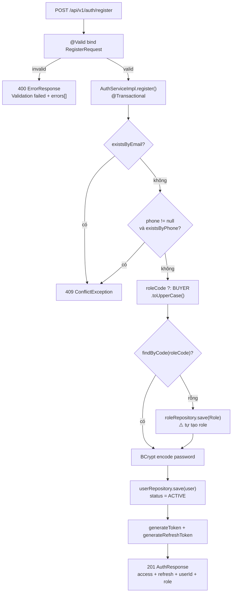

## 26.2 Login

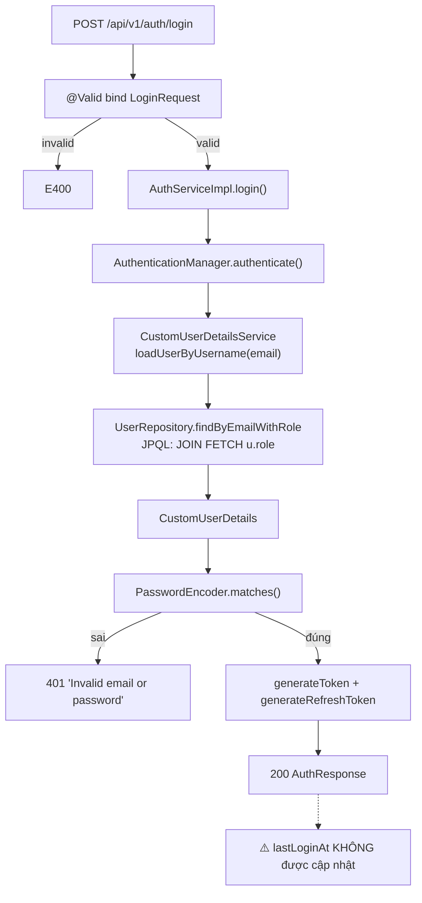

## 26.3 Refresh Token

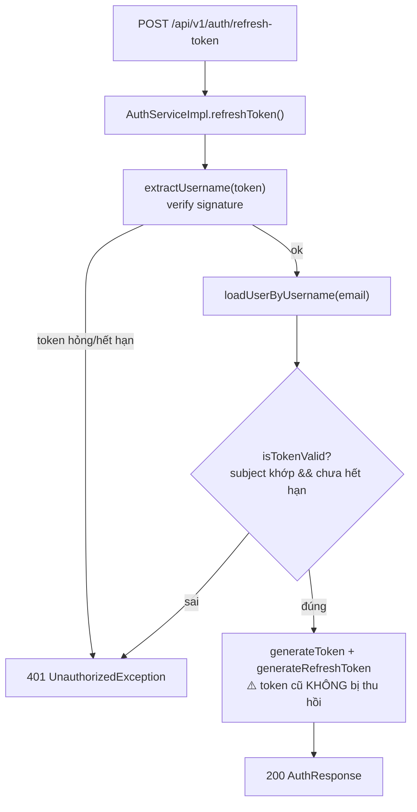

## 26.4 Truy cập endpoint có auth

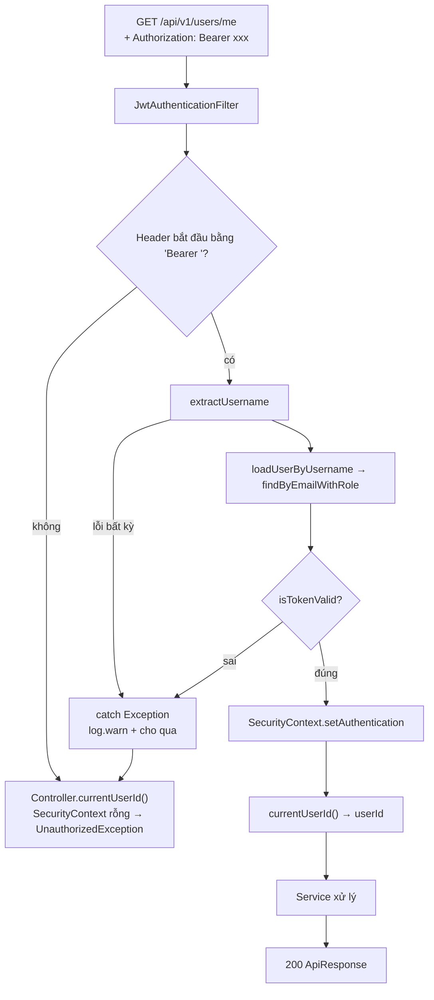

## 26.5 Product Search

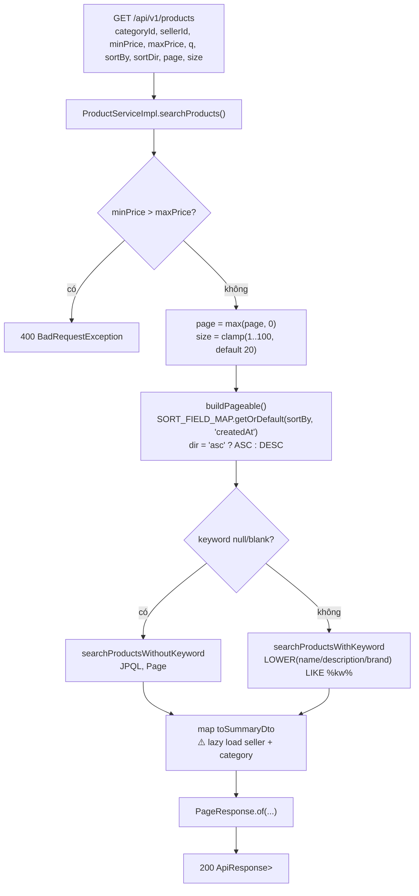

## 26.6 Product Detail

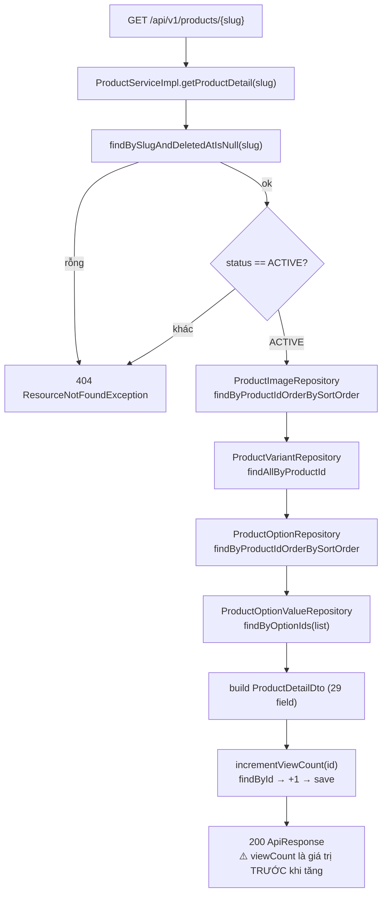

## 26.7 Address CRUD

```mermaid
flowchart TD
    subgraph CREATE["POST /api/v1/users/addresses"]
        A1["currentUserId()"] --> A2["countByUserId(userId) == 0<br/>|| isDefault == true ?"]
        A2 -->|có| A3["clearAllDefaults(userId)<br/>JPQL bulk UPDATE"]
        A2 -->|không| A4["save address"]
        A3 --> A4
        A4 --> A5["201 ApiResponse.created()"]
    end
    subgraph UPDATE["PUT /api/v1/users/addresses/{id}"]
        B1["currentUserId()"] --> B2["findByIdAndUserId(id, userId)"]
        B2 -->|"rỗng"| B3["404"]
        B2 -->|ok| B4["set TẤT CẢ field (kể cả null)"]
        B4 --> B5{"isDefault == true?"}
        B5 -->|có| B6["clearDefaultExcept(userId, id)"]
        B5 -->|không| B7["save"]
        B6 --> B7
        B7 --> B8["200 ApiResponse"]
    end
    subgraph DELETE["DELETE /api/v1/users/addresses/{id}"]
        C1["findByIdAndUserId"] --> C2["wasDefault = isDefault"]
        C2 --> C3["delete + flush"]
        C3 --> C4{"wasDefault?"}
        C4 -->|có và còn địa chỉ| C5["đặt địa chỉ mới nhất<br/>làm mặc định"]
        C4 -->|không| C6["200 'Address deleted'"]
        C5 --> C6
    end
```

## 26.8 AI Chat

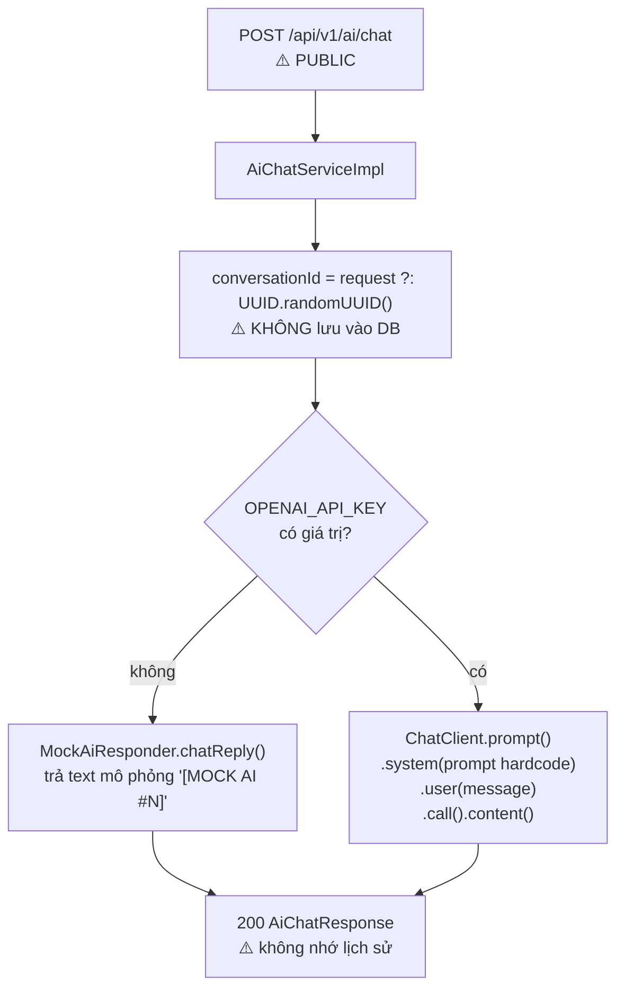

**Flow KHÔNG tồn tại** (ghi rõ để tránh hiểu nhầm): checkout, tạo đơn, thanh toán, chat buyer↔seller, upload ảnh, gửi notification, realtime.

---

# 27. FRONTEND INTEGRATION REQUIREMENTS

## 27.1 Kết nối cơ bản

| Mục | Giá trị |
|-----|---------|
| Base URL (dev) | `http://localhost:8080` |
| API prefix | `/api/v1` |
| Content-Type | `application/json` (UTF-8) |
| Format ngày | ISO-8601 local date-time, VD `2026-09-28T23:30:00.123456` — **không có timezone** |
| Format tiền | `BigDecimal` → JSON number, VD `25000000.00` |
| Enum | Trả về **string** (`@Enumerated(STRING)`), VD `"ACTIVE"`, `"HOME"` |
| ID | `Long` → JSON number. ⚠️ Nếu JS parse số 64-bit lớn cần cân nhắc serialize thành string |

## 27.2 Authentication

| Mục | Chi tiết |
|-----|----------|
| Cơ chế | Bearer token trong header |
| Header | `Authorization: Bearer <accessToken>` |
| Lấy token | `POST /api/v1/auth/login` hoặc `POST /api/v1/auth/register` |
| Hạn access token | **24 giờ** |
| Hạn refresh token | **7 ngày** |
| Làm mới | `POST /api/v1/auth/refresh-token` → trả cả token mới |
| ⚠️ Lưu ý | Refresh token cũ **vẫn dùng được**. Client nên lưu cả 2 và refresh khi 401 |
| Endpoint không cần token | Toàn bộ `/api/v1/products/**` (GET), `/api/v1/categories/**` (GET), `/api/v1/auth/**`, `/api/v1/ai/**` |

**Luồng đăng nhập đề xuất:**
```
1. POST /api/v1/auth/login → lưu accessToken + refreshToken
2. Mọi request sau gắn Authorization header
3. Nhận 401 → POST /api/v1/auth/refresh-token với refreshToken
4. Thành công → lưu token mới, retry request
5. Refresh thất bại → xoá token, đưa về trang login
```

## 27.3 Format response

**Thành công:**
```json
{ "code": 200, "message": "Success", "data": <payload>, "timestamp": "2026-09-28T23:30:00" }
```

**Lỗi:**
```json
{ "code": 400, "message": "Validation failed", "errors": [{ "field": "email", "message": "..." }], "timestamp": "...", "path": "/api/v1/auth/register" }
```

**Phân trang** (`data`):
```json
{ "content": [], "page": 0, "size": 20, "totalElements": 0, "totalPages": 0, "first": true, "last": true }
```

**Frontend cần lưu ý:**
- ⚠️ `ApiResponse` và `ErrorResponse` **khác shape** (`data` vs `errors`+`path`)
- ⚠️ `code` trong `ApiResponse` là hằng số theo factory, **không** phản ánh HTTP status thực tế → nên dùng HTTP status để quyết định logic
- ⚠️ 2 endpoint trả JSON thô không bọc envelope: `POST /api/v1/ai/generate-description` → `{ "description": "..." }`, `GET /api/v1/__debug/bcrypt` → `{ "password", "hash", "verify" }`
- ⚠️ Có thể response 401 từ Spring Security **không** theo format `ErrorResponse` (chưa kiểm chứng runtime) → nên parse phòng thủ

## 27.4 Danh sách endpoint cho Frontend

**Không cần token:**
| Method | Endpoint | Mục đích |
|--------|----------|----------|
| POST | `/api/v1/auth/register` | Đăng ký |
| POST | `/api/v1/auth/login` | Đăng nhập |
| POST | `/api/v1/auth/refresh-token` | Làm mới token |
| GET | `/api/v1/products` | Tìm kiếm sản phẩm |
| GET | `/api/v1/products/featured` | Sản phẩm nổi bật |
| GET | `/api/v1/products/seller/{sellerId}` | Sản phẩm theo shop |
| GET | `/api/v1/products/{slug}` | Chi tiết sản phẩm |
| GET | `/api/v1/categories` | Danh mục phẳng |
| GET | `/api/v1/categories/roots` | Danh mục cấp 1 |
| GET | `/api/v1/categories/tree` | Cây danh mục |
| GET | `/api/v1/categories/{slug}` | Chi tiết danh mục |
| POST | `/api/v1/ai/chat` | Chat AI |
| POST | `/api/v1/ai/generate-description` | Sinh mô tả sản phẩm |

**Cần token:**
| Method | Endpoint | Mục đích |
|--------|----------|----------|
| GET | `/api/v1/users/me` | Hồ sơ |
| PUT | `/api/v1/users/me` | Sửa hồ sơ |
| POST | `/api/v1/users/change-password` | Đổi mật khẩu |
| GET | `/api/v1/users/addresses` | Danh sách địa chỉ |
| POST | `/api/v1/users/addresses` | Tạo địa chỉ |
| GET | `/api/v1/users/addresses/{id}` | Chi tiết địa chỉ |
| PUT | `/api/v1/users/addresses/{id}` | Sửa địa chỉ |
| DELETE | `/api/v1/users/addresses/{id}` | Xoá địa chỉ |
| PUT | `/api/v1/users/addresses/{id}/default` | Đặt mặc định |

## 27.5 CORS

```
Allowed origins: * (mọi origin)
Methods: GET, POST, PUT, PATCH, DELETE, OPTIONS
Headers: *
Credentials: true
Max age: 3600s
```

Frontend có thể gọi từ bất kỳ domain nào. Cần siết lại trước production.

## 27.6 Upload

❌ **Chưa có API upload.** Mọi trường ảnh (`avatarUrl`, `thumbnailUrl`, `imageUrl`) đều nhận **URL dạng string**. Frontend phải tự upload ảnh lên dịch vụ lưu trữ khác rồi gửi URL.

## 27.7 WebSocket

❌ **Chưa có.** Không cấu hình endpoint nào.

## 27.8 Điểm Frontend cần tự xử lý

| Vấn đề | Hướng xử lý |
|--------|-------------|
| Giỏ hàng, đơn hàng, thanh toán | ❌ Chưa có API — phải chờ backend hoặc tự quản lý tạm (không khuyến nghị) |
| Chọn biến thể sản phẩm | ⚠️ Backend không trả mapping option→variant. Phải ghép thủ công từ `variantName` hoặc chờ API bổ sung |
| Upload ảnh | ❌ Tự upload lên nơi khác rồi gửi URL |
| Thông báo realtime | ❌ Chưa có |
| Đánh giá sản phẩm | ❌ Chưa có |
| Theo dõi shop (follow) | ❌ Chưa có |
| Coupon | ❌ Chưa có |
| So sánh sản phẩm | ⚠️ Phải tự lưu danh sách slug rồi gọi N lần `/products/{slug}` |
| Lọc theo tồn kho | ❌ Không có API lọc tồn kho |
| Lọc theo brand | ⚠️ Chỉ qua `q` keyword |

---

# 28. AI HANDOFF SUMMARY

Tài liệu này dành cho một AI coding assistant khác tiếp tục phát triển project B2C.

## 28.1 Kiến trúc

- **Loại:** Spring Boot 4.1.1 monolith, tổ chức theo **package-per-module** (`com.example.B2C.modules.<domain>`), **không** tách Gradle module.
- **Layer:** Controller → Service (interface + Impl) → Repository → Entity → PostgreSQL
- **Chỉ 4 module có nghiệp vụ thật:** `auth`, `user`, `catalog`, `ai`. 8 module còn lại chỉ có entity.
- **DI:** constructor injection qua Lombok `@RequiredArgsConstructor` + field `final`. **Không** dùng `@Autowired`.
- **Mapping:** viết tay bằng `XxxDto.builder()`. **Không** dùng MapStruct.

## 28.2 Convention bắt buộc theo

| Concern | Quy ước đang dùng |
|---------|-------------------|
| Đặt tên package | `modules.<domain>.{controller,service,repository,entity,dto}` |
| Service | Interface `XxxService` + `XxxServiceImpl` (`@Service`, `@RequiredArgsConstructor`) |
| Response envelope | **Bắt buộc** bọc `ApiResponse.success(data)` — trừ khi có lý do đặc biệt (xem 2 ngoại lệ ở 27.3) |
| Lỗi | Throw `ResourceNotFoundException` / `BadRequestException` / `UnauthorizedException` / `ConflictException` / `ForbiddenException` — **không** tự build response |
| Entity | `@Getter @Setter @NoArgsConstructor @AllArgsConstructor @Builder`; extends `BaseEntity` nếu cần audit |
| Column naming | `snake_case` tường minh qua `@Column(name=...)` |
| Enum | `@Enumerated(EnumType.STRING)`, giá trị khớp `CHECK` constraint trong SQL |
| ID | `Long` + `@GeneratedValue(strategy = GenerationType.IDENTITY)` |
| Repository | Đặt tên `XxxRepository`, query bằng `@Query` JPQL hoặc derived method |
| Query param | Dùng `@Parameter` để mô tả (đã làm ở `ProductController`) |
| OpenAPI | `@Tag` ở controller, `@Operation` + `@ApiResponses` ở method |
| DTO | `@Data @Builder @NoArgsConstructor @AllArgsConstructor`, có static factory `from(Entity)` khi tiện |

## 28.3 Response format chuẩn

```java
return ResponseEntity.ok(ApiResponse.success(data));
return ResponseEntity.ok(ApiResponse.success("Message", data));
return ResponseEntity.status(HttpStatus.CREATED).body(ApiResponse.created(data));
```
Lỗi: throw exception → `GlobalExceptionHandler` tự trả `ErrorResponse`.

## 28.4 Authentication

- JWT HS256, stateless, filter trước `UsernamePasswordAuthenticationFilter`
- Access 24h, refresh 7 ngày, secret qua biến `JWT_SECRET_KEY`
- Authority: `ROLE_<code>` lấy từ `user.role.code`
- Cấu hình tập trung tại `security/SecurityConfig.java` — thêm endpoint public phải sửa file này

## 28.5 Những phần ĐÃ hoàn thiện (không cần làm lại)

✅ Register / Login / Refresh token (với hạn chế về thu hồi token)
✅ User profile: đọc, sửa, đổi mật khẩu
✅ Address: CRUD đầy đủ + auto-default + ownership enforced
✅ Product: search/filter/sort/phân trang + chi tiết + view count
✅ Category: phẳng / gốc / cây / chi tiết
✅ AI chat + AI content generation (có fallback mock khi thiếu API key)
✅ Hạ tầng: Flyway migration, exception handler, pagination wrapper, OpenAPI, CORS, test profile

## 28.6 Những phần ĐANG làm dở

🔶 **Product/Category write** — entity + repository đủ, repository kế thừa `JpaRepository` nên có `save`/`delete` sẵn, nhưng **chưa có service method nào gọi**. Thiếu nhánh seller/admin.
🔶 **Authorization** — `@EnableMethodSecurity` đã bật nhưng **0 `@PreAuthorize`**. Authority được nạp nhưng không dùng.
🔶 **Search** — `LIKE` cơ bản, chưa có index hỗ trợ, chưa escape ký tự đặc biệt.
🔶 **AI** — chạy được nhưng stateless, không đọc DB, endpoint public.
🔶 **Variant selection** — đọc được variant/option nhưng không có logic map "tổ hợp option value → variant".
🔶 **Test** — chỉ phủ `catalog`; auth/user/AI chưa có test.
🔶 **Swagger** — thiếu security scheme nên không test được endpoint auth.

## 28.7 Những phần CHƯA làm

❌ Cart, Order, Checkout, Payment, Shipment, Inventory, Promotion, Review, Seller management
❌ Chat buyer↔seller, Notification
❌ File/Image upload
❌ WebSocket / realtime
❌ Full-text search (pg_trgm / tsvector)
❌ Email verification, password reset, OAuth2 login
❌ Admin API, Dashboard/thống kê, Wishlist
❌ Rate limiting, audit log

## 28.8 Vấn đề cần chú ý TRƯỚC khi viết code mới

| # | Vấn đề | Tác động khi phát triển tiếp |
|---|--------|------------------------------|
| 1 | **HIGH-4**: `RegisterRequest.roleCode` cho tự tạo role `ADMIN` | Sửa ngay trước khi thêm bất kỳ endpoint admin nào, nếu không sẽ thành lỗ hổng toàn quyền |
| 2 | **HIGH-1**: `/api/v1/__debug/bcrypt` public | Xoá trước khi deploy |
| 3 | **HIGH-3**: JWT secret fallback hardcode | Không được để production chạy với fallback |
| 4 | **Không có `@Version`** | Khi làm order/inventory, **phải** thêm `@Version` hoặc atomic update, nếu không sẽ mất tồn kho |
| 5 | **N+1 ở catalog** | Đã tồn tại, sẽ nặng hơn khi có thêm entity. Cân nhắc `JOIN FETCH` khi mở rộng |
| 6 | **`variant_option_value` không ai đọc** | Khi làm seller product API, phải quyết định có dùng bảng này để map variant-option hay bỏ |
| 7 | **`product.min_price`/`max_price` denormalized** | Khi thêm API sửa variant price, phải cập nhật cả product, nếu không listing hiển thị sai |
| 8 | **`updateAddress` ghi đè toàn bộ field** | Nếu thêm field mới vào `AddressRequest`, cân nhắc đổi sang partial update cho nhất quán với `updateProfile` |
| 9 | **Soft delete chưa có hiệu lực** | Thêm API xoá user → phải tự lọc `deletedAt` ở mọi query, hoặc bật `@Where` |
| 10 | **Response 401 có thể không đúng format** | Nếu Frontest parse `ErrorResponse` mà gặp 401 từ Spring Security, cần xử lý phòng thủ |

## 28.9 File nên đọc TRƯỚC khi sửa code

| Khi làm gì | Đọc file này trước |
|-----------|-------------------|
| Thêm API mới | `common/response/ApiResponse.java`, `common/exception/GlobalExceptionHandler.java`, một controller hiện có (vd `ProductController.java`) |
| Thêm endpoint public | `security/SecurityConfig.java` |
| Thêm entity/bảng mới | `common/entity/BaseEntity.java`, `db/migration/V1__init_schema.sql`, một entity hiện có |
| Sửa logic auth | `security/JwtTokenProvider.java`, `security/CustomUserDetails.java`, `modules/auth/service/AuthServiceImpl.java` |
| Sửa search/filter | `modules/catalog/repository/ProductRepository.java`, `ProductServiceImpl.java` |
| Làm cart/order | `db/migration/V1__init_schema.sql` (mục 12-16), `modules/order/entity/Order.java` |
| Làm seller API | `modules/seller/entity/Seller.java`, `modules/catalog/entity/Product.java` |
| Thêm test | `src/test/.../ProductControllerTest.java`, `ProductServiceImplTest.java` |
| Đổi config | `src/main/resources/application.properties` |

## 28.10 Dữ liệu demo (Flyway V2)

| Loại | Giá trị |
|------|---------|
| Buyer | `demo.buyer@example.com` / `password123` |
| Seller | `demo.seller@example.com` / `password123` |
| Shop | "Demo Shop", slug `demo-shop` |
| Category | Electronics, Fashion, Home & Living + 4 subcategory |
| Product | iPhone 15 Pro, MacBook Pro M3, Samsung Galaxy S24 Ultra (đều `ACTIVE`) |

⚠️ Mật khẩu demo là `password123` — chỉ dùng cho môi trường dev, phải xoá trước production.

---

# 29. IMPORTANT FILES

28 file quan trọng nhất của backend.

| # | File | Purpose | Why Important |
|---|------|---------|---------------|
| 1 | `B2C/build.gradle` | Định nghĩa toàn bộ dependency & version | Nguồn sự thật về công nghệ. Thêm dependency mới phải sửa ở đây |
| 2 | `src/main/resources/db/migration/V1__init_schema.sql` | Tạo 21 bảng + 22 index | **Schema chuẩn của toàn DB.** Đọc file này là biết hết cấu trúc dữ liệu |
| 3 | `src/main/resources/application.properties` | Config chính: DB, JPA, Flyway, JWT, AI | Mọi cấu hình runtime. Chứa 3 biến môi trường |
| 4 | `src/main/java/.../security/SecurityConfig.java` | FilterChain, CORS, phân quyền | **Quyết định endpoint nào public.** Sửa sai → mở lỗ hổng hoặc chặn nhầm |
| 5 | `src/main/java/.../security/JwtTokenProvider.java` | Sinh & verify JWT | Logic xác thực cốt lõi. Thêm claim mới phải sửa ở đây |
| 6 | `src/main/java/.../security/JwtAuthenticationFilter.java` | Đọc Bearer token, set SecurityContext | Mọi request có auth đều đi qua đây |
| 7 | `src/main/java/.../security/CustomUserDetails.java` | Map User → UserDetails + authority | Quy tắc prefix `ROLE_` nằm ở đây |
| 8 | `src/main/java/.../common/exception/GlobalExceptionHandler.java` | Map 13 exception → HTTP status | Quyết định **mọi** response lỗi của API |
| 9 | `src/main/java/.../common/response/ApiResponse.java` | Envelope thành công | Mọi controller mới đều phải dùng |
| 10 | `src/main/java/.../common/response/ErrorResponse.java` | Envelope lỗi | Frontend parse format này |
| 11 | `src/main/java/.../common/response/PageResponse.java` | Wrapper phân trang | Chuẩn phân trang cho toàn hệ thống |
| 12 | `src/main/java/.../common/entity/BaseEntity.java` | Audit field dùng chung | Mọi entity mới nên extends |
| 13 | `src/main/java/.../modules/auth/service/AuthServiceImpl.java` | Register/login/refresh logic | Chứa lỗ hổng HIGH-4. Core auth |
| 14 | `src/main/java/.../modules/user/entity/User.java` | Entity người dùng | Cột `deleted_at` chưa có hiệu lực. Thêm field ở đây |
| 15 | `src/main/java/.../modules/user/controller/UserController.java` | 8 endpoint user + address | Mẫu tham chiếu cho endpoint cần auth |
| 16 | `src/main/java/.../modules/catalog/controller/ProductController.java` | 4 endpoint product | Mẫu tham chiếu **tốt nhất** — có `@Tag`, `@Operation`, `@ApiResponses` đầy đủ |
| 17 | `src/main/java/.../modules/catalog/service/ProductServiceImpl.java` | Logic search/filter/sort + mapping DTO | Chứa `SORT_FIELD_MAP`, `clampSize`, `validatePriceRange`, và 83 dòng mapping DTO |
| 18 | `src/main/java/.../modules/catalog/repository/ProductRepository.java` | 4 query JPQL search | Nơi cần thêm `JOIN FETCH` để fix N+1 |
| 19 | `src/main/java/.../modules/catalog/entity/Product.java` | Entity sản phẩm | `min_price`/`max_price` denormalized cần đồng bộ |
| 20 | `src/main/java/.../modules/catalog/entity/ProductVariant.java` | Entity biến thể | Nơi lưu `stock_quantity`/`reserved_quantity` — tồn kho |
| 21 | `src/main/java/.../modules/catalog/service/CategoryServiceImpl.java` | Dựng cây category đệ quy | Có N+1. Mẫu cho cây phân cấp |
| 22 | `src/main/java/.../modules/ai/config/SpringAiConfig.java` | Cấu hình ChatClient có điều kiện | Hiểu cơ chế fallback mock/real |
| 23 | `src/main/java/.../modules/ai/service/AiChatServiceImpl.java` | Logic chat AI | Chứa system prompt; cần mở rộng khi thêm RAG |
| 24 | `src/main/java/.../common/controller/DebugController.java` | Endpoint debug | ⚠️ Cần xoá. Đọc để hiểu vấn đề HIGH-1 |
| 25 | `src/main/java/.../config/OpenApiConfig.java` | Config OpenAPI | Cần thêm `SecurityScheme` Bearer |
| 26 | `src/main/resources/db/migration/V2__seed_sample_data.sql` | Dữ liệu demo | Biết tài khoản + dữ liệu test nào tồn tại |
| 27 | `run-local.ps1` | Script chạy local | Cách chạy đúng: nạp `.env` rồi `bootRun` |
| 28 | `src/test/java/.../modules/catalog/service/ProductServiceImplTest.java` | 11 unit test mẫu | Mẫu viết test service (Mockito + `ReflectionTestUtils`) |

---

# 30. FINAL BACKEND STATUS

## Implemented — đã thực sự hoàn thành

1. **Xác thực JWT** — register, login, refresh token; BCrypt password; stateless; filter đúng chuẩn
2. **Hồ sơ người dùng** — đọc, cập nhật (kèm check SĐT trùng), đổi mật khẩu (có verify mật khẩu cũ)
3. **Quản lý địa chỉ** — CRUD đầy đủ 5 endpoint, tự đặt mặc định, ownership enforced tầng query, tự chuyển default khi xoá
4. **Danh mục sản phẩm (read-only)** — search JPQL có keyword, lọc category/seller/khoảng giá, 5 kiểu sort, phân trang có clamp, chi tiết đầy đủ 29 field, tăng view count
5. **Cây danh mục** — phẳng / gốc / đệ quy / chi tiết theo slug
6. **AI assistant** — chat + sinh mô tả sản phẩm, tự fallback về mock khi thiếu `OPENAI_API_KEY` (app không bao giờ crash vì thiếu key)
7. **Hạ tầng nền** — Flyway migration (21 bảng), global exception handler (13 loại), envelope response thống nhất, pagination wrapper, OpenAPI/Swagger, 3 profile config, 16 unit test

## Partially Implemented — đang làm dở

1. **Phân quyền** — `@EnableMethodSecurity` bật, authority nạp đúng dạng `ROLE_X`, nhưng **0 `@PreAuthorize`** nên chưa có tác dụng thực tế
2. **Search** — `LIKE` trên 3 cột, chưa có index, chưa escape `%`/`_`, chưa có API search riêng, chưa full-text
3. **AI** — chạy được nhưng stateless, **không đọc dữ liệu catalog**, không RAG, không lưu hội thoại, endpoint public không rate limit
4. **Mô hình biến thể** — đọc được variant + option + value, nhưng **không có logic chọn variant theo tổ hợp option value**; bảng `variant_option_value` không ai đọc
5. **Refresh token** — hoạt động đúng chức năng nhưng **không thu hồi được token cũ**, không có `jti`
6. **Module catalog** — đầy đủ entity + repository nhưng **read-only**, chưa có nhánh ghi (seller/admin)
7. **Test coverage** — chỉ phủ `catalog`; auth, user, address, AI, security **chưa có test**
8. **Soft delete** — có cột `deleted_at` trên `users`/`product` nhưng **không có `@SQLDelete`/`@Where`** nên không có tác dụng
9. **Swagger** — chạy nhưng thiếu security scheme; 3 controller chưa có `@Tag`
10. **Hiệu năng query** — 3 điểm N+1 đã xác định (product list, category tree, address list)

## Not Implemented — chưa có gì

1. **Giỏ hàng** (Cart) — chỉ có 2 entity + 2 bảng
2. **Đơn hàng & Checkout** (Order) — chỉ có 2 entity + 2 bảng; không có state machine, không có logic tính tiền
3. **Thanh toán** (Payment) — chỉ có 1 entity + 1 bảng; không có cổng, không có webhook
4. **Vận chuyển** (Shipment) — chỉ có 1 entity + 1 bảng
5. **Quản lý tồn kho** (Inventory) — chỉ 2 field, không có API, không chống race
6. **Khuyến mãi** (Promotion) — chỉ có 1 entity + 1 bảng
7. **Đánh giá** (Review) — chỉ có 1 entity + 1 bảng
8. **Quản lý Seller** — chỉ có 1 entity + 1 bảng; module catalog chỉ đọc
9. **Chat buyer↔seller** — chỉ có 2 entity + 2 bảng
10. **Notification** — **không cả entity lẫn bảng DB**
11. **WebSocket / realtime** — không có gì
12. **Upload ảnh** — không có; chỉ lưu URL
13. **Wishlist** — không có bảng DB
14. **Admin API / Dashboard / Thống kê** — không có
15. **Xác thực email / SMS** — cột `email_verified_at` tồn tại nhưng không bao giờ được ghi
16. **Quên mật khẩu** — không có
17. **OAuth2 login** — dependency có, config không
18. **Rate limiting** — không có
19. **Full-text search** — chưa implement
20. **File `200`, `401`** ở gốc project — file rác sinh từ curl, nên xoá

## Unknown — không xác định từ source code

1. **Trạng thái deploy thực tế** — không có file Dockerfile, docker-compose, CI/CD, k8s manifest
2. **Database có đang chạy đúng schema không** — chỉ thấy config; chưa có integration test hay Testcontainers để xác minh
3. **Response 401/403 thực tế từ Spring Security có đúng format `ErrorResponse` không** — handler được khai báo nhưng exception phát sinh ở tầng filter; cần kiểm chứng runtime
4. **`B2C.postman_collection.json` / `B2C.postman_environment.json` ở `d:\b2c-srouse\`** — chưa đối chiếu với API hiện tại; có thể đã lỗi thời
5. **Kế hoạch mở rộng cho `variant_option_value`** — schema có, không có repository, không có comment nào cho biết ý đồ
6. **Có dùng `B2C-fe` thực sự gọi đủ API không** — ngoài phạm vi audit backend
7. **Yêu cầu nghiệp vụ cụ thể** (chính sách đổi trả hàng, quy tắc tính phí ship, thuế) — schema có cột nhưng không có logic
8. **Ai là chủ sở hữu `supabase` project** — chỉ thấy host trong config

## Recommended Next Development Areas

Ưu tiên theo thứ tự đề xuất dựa trên trạng thái hiện tại:

**Ưu tiên 0 — Sửa lỗ hổng đã có (làm trước khi viết tính năng mới)**
1. Xoá hoặc `@Profile("!prod")` cho `DebugController` (HIGH-1)
2. Bỏ `roleCode` khỏi `RegisterRequest`, hardcode `BUYER` (HIGH-4) — **quan trọng nhất** vì sẽ khai thác được ngay khi có endpoint admin
3. Bỏ fallback hardcode cho `JWT_SECRET_KEY` (HIGH-3)
4. Siết CORS về danh sách domain cụ thể (HIGH-2)

**Ưu tiên 1 — Nền tảng cho luồng mua hàng (giá trị nghiệp vụ cao nhất)**
5. Module `seller` — API đăng ký shop, duyệt, sửa hồ sơ (hiện tại mọi `product.seller_id` đều trỏ vào dữ liệu seed)
6. Module `product` write — CRUD + quyết định cách dùng `variant_option_value`
7. Module `cart` — thêm/sửa/xoá, **kèm kiểm tra tồn kho**
8. Module `order` — checkout, tính tổng, state machine, **bắt buộc thêm `@Version`**
9. Module `payment` — chọn 1 cổng (MoMo/VNPay), webhook, verify chữ ký
10. Module `review` — schema đã hỗ trợ sẵn "chỉ review sau khi mua", cần tự tính lại `rating_avg`

**Ưu tiên 2 — Chất lượng & hiệu năng**
11. Thêm `@PreAuthorize` cho các endpoint ghi
12. Fix N+1: `JOIN FETCH` trong `ProductRepository`, load 1 lần dựng cây category, `JOIN FETCH` address
13. Thêm integration test (Testcontainers + PostgreSQL) để xác minh entity ↔ schema
14. Bổ sung test cho auth/user/AI
15. Bật `@Where` cho soft delete trên `User` và `Product`
16. Thêm `SecurityScheme` cho Swagger; bổ sung `@Tag`/`@Operation` cho 3 controller còn thiếu

**Ưu tiên 3 — Tính năng bổ sung (khi nền tảng đã vững)**
17. Full-text search — `pg_trgm` + GIN index trên `name`/`brand` (rẻ hơn tsvector, đủ dùng)
18. Upload ảnh — Cloudinary hoặc Supabase Storage
19. Chat + WebSocket — schema đã chuẩn bị tốt (unread counter, read flag, 4 index)
20. Notification — cần tạo bảng mới
21. RAG cho AI — đây là cách biến AI hiện tại từ "text generator" thành trợ lý tư vấn thật; có thể dùng pgvector trên chính Supabase hiện tại

**Ghi chú kiến trúc khi mở rộng:** schema đã thiết kế sẵn cho đa số nghiệp vụ, nên phần lớn việc là **viết repository + service + controller theo đúng pattern hiện có**, không cần thiết kế lại DB. Ngoại lệ cần lưu ý:
- `product.min_price`/`max_price` phải được đồng bộ khi sửa giá variant
- `review` phụ thuộc `order_item` → phải làm order trước
- `chat` phụ thuộc `seller` → phải làm seller trước

---

## PHỤ LỤC — Chỉ số nhanh

| Chỉ số | Giá trị |
|--------|---------|
| Tổng file trong project (không tính `build/`, `.gradle/`, `.idea/`) | 136 |
| File Java trong `src/main` | 112 |
| File Java trong `src/test` | 3 |
| File SQL migration | 3 |
| File properties (main + test) | 3 |
| Controller | 7 |
| Endpoint | 22 (+1 debug) |
| Service (interface + impl) | 7 cặp |
| Repository cụ thể | 9 (+1 `BaseRepository` marker) |
| JPA Entity (`@Entity`) | 21 |
| Hỗ trợ entity | 1 `@MappedSuperclass` (`BaseEntity`) + 1 `@Embeddable` (`VariantOptionValueId`) |
| DTO / Request / Response | 20 |
| Exception tự định nghĩa | 5 |
| Enum | 18 |
| Test method | 17 (16 nghiệp vụ + 1 context) |
| Bảng database | 21 |
| Index database | 22 |
| Module nghiệp vụ | 13 (4 có nghiệp vụ thật, 8 chỉ có entity, 1 hỗn hợp) |

**Xác nhận tính nhất quán:** 21 bảng ↔ 21 entity (`@Entity`) — khớp 1:1, không thừa bảng nào cũng không thừa entity nào. Trong đó **9 bảng đang có nghiệp vụ** (`role`, `users`, `address`, `category`, `product`, `product_variant`, `product_option`, `product_option_value`, `product_image`) và **12 bảng schema-only** (`seller`, `cart`, `cart_item`, `orders`, `order_item`, `payment`, `shipment`, `promotion`, `review`, `conversation`, `message`, `variant_option_value`).

